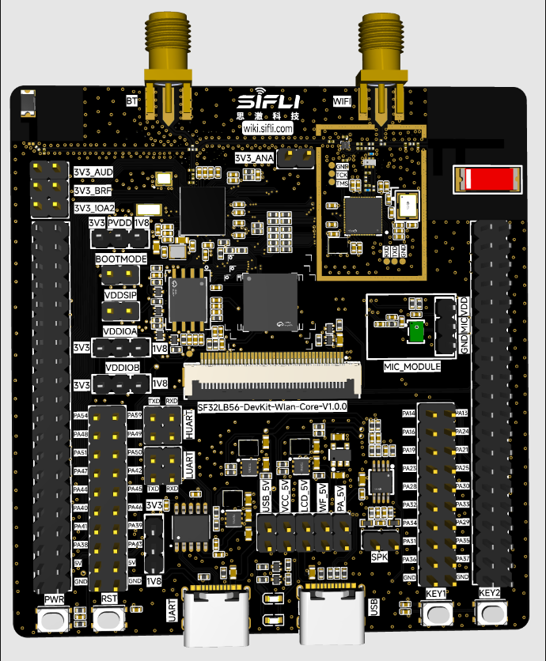

# SF32LB56-WLAN_CORE_N16R12N1
`sf32lb56-Wlan_Core_n16r12n1` board is based on SF32LB56-DevKit-Wlan-Core board and 
has module [SF32LB56-MOD-N16R12N1]http://10.21.10.172:6600/devkits/sf32lb56x/SF32LB56V-DevKit-Wlan-Core.html) on the board.

