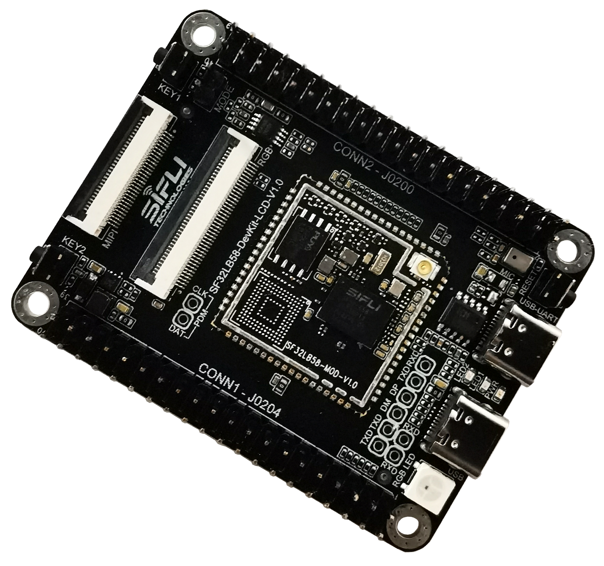

# SF32LB58-LCD_N16R16N1_QSPI
`sf32lb58-lcd_n16r16n1_qspi` board is based on [SF32LB58-DevKit-LCD](https://wiki.sifli.com/board/sf32lb58x/SF32LB58-DevKit-LCD.html) board and 
has chip SF32LB583VCC36 on the board. 
## External Flash
NOR Flash 16MB on MPI4 

## Display
`1.85 rect QSPI Single-Screen LCD(LCD_1P85_390*450_DevKit_Adapter_V1.0.0)` with QSPI interface is used as default display.

