# Dump Crash Debugging Guide

This section describes how to export the crash scene and restore it after a crash occurs. The primary tool used is Trace32.

## Dump Memory Method

:::{only} SF32LB52X or SF32LB56X or SF32LB57X

### Export Memory Scene

Run `AssertDump.exe` in the `SIFLI-SDK\tools\AssertDump` directory. Follow the prompts to select the save path, memory configuration, chip model, and export method, then click Export to save the memory as bin files.

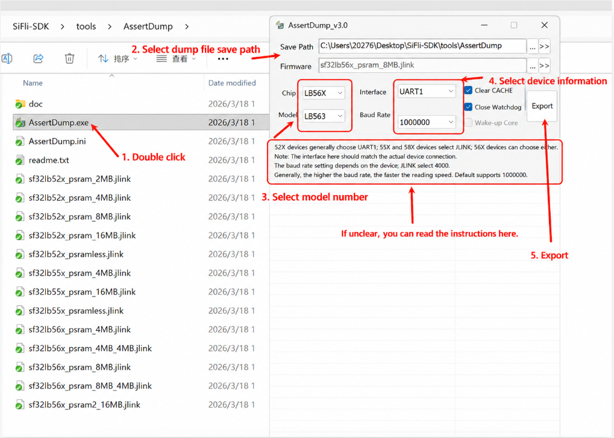

After successful export, place all generated `*.bin`, `*.txt` files and the compiled `*.axf` file in the same directory at the save path, then use Trace32 for analysis.

You can also use the SDK command line to export an AssertDump-compatible directory. Example:

```bash
sdk.py crash-dump capture-live \
  --transport uart \
  --chip SF32LB52 \
  --chip-model LB525 \
  --output /tmp/live-crash \
  --elf build_sf32lb52-lcd_n16r8_hcpu/main.elf
```

To export PSRAM as well, add `--include-psram`, or use `--psram-size 8MB` to select the PSRAM size manually. The command prints per-file export progress. The output directory contains `*.bin`, `hcpu.axf`, `log.txt`, and an AssertDump-compatible `manifest.json` for Trace32/AssertDump by default. The full SDK/AI metadata is saved as `sdk_manifest.json`.

When using SifliUsartServer with J-Link over IP, use `--transport jlink --jlink-ip 127.0.0.1:19025`. To export a single core only, add `--core hcpu` or `--core lcpu`. Example:

```bash
sdk.py crash-dump capture-live \
  --transport jlink \
  --jlink-ip 127.0.0.1:19025 \
  --core hcpu \
  --chip SF32LB52 \
  --chip-model LB525 \
  --output /tmp/live-crash \
  --elf build_sf32lb52-lcd_n16r8_hcpu/main.elf
```

The SDK keeps the IP connection in the `.jlink` script instead of rewriting it to USB J-Link. `--core hcpu` filters out LCPU/LPSYS dump items and removes core-switch commands from the generated script.

To create a GDB-compatible core ELF from the exported package, run:

```bash
sdk.py crash-dump readcore \
  --package /tmp/live-crash \
  --elf build_sf32lb52-lcd_n16r8_hcpu/main.elf \
  --output /tmp/live-crash/coredump.elf
```

Then analyze the captured core ELF with the matching firmware ELF:

```bash
sdk.py crash-dump analyze \
  --core /tmp/live-crash/coredump.elf \
  --elf build_sf32lb52-lcd_n16r8_hcpu/main.elf
```
:::

## Trace32 Restoration and Analysis

### Restoring HCPU Crash Scene with Trace32

1. Following the export method described above, place the exported memory files and the corresponding axf in the same directory. For more detailed crash scene saving methods, see [Save Crash Scene Method](../../app_note/crash_analysis.md).
2. Run the tool `SIFLI-SDK/tools/crash_dump_analyser/simarm/t32marm.exe`. As shown below:


3. After opening the tool, select HCPU assertion (HA) to restore. If certain bin files do not exist (e.g., no PSRAM2), uncheck the corresponding files.

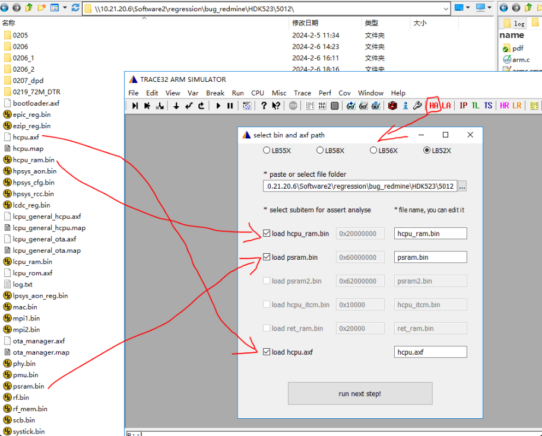

4. Click "run_next_step" to load. After loading is complete, the crash scene information will be displayed:

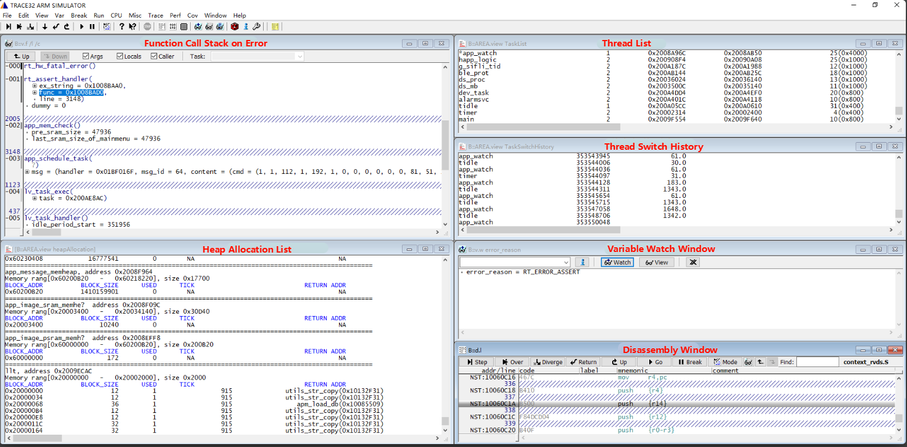

:::{only} SF32LB52X or SF32LB57X
5. If the memory-to-address mapping is established successfully, you can refer to the chip manual's Memory address space to view the scene. If restoration fails, check whether the bin files are valid, or modify the jlink/dump script to add or remove address spaces to dump (e.g., `sf32lb52x_uart.jlink` / `sf32lb57x_uart.jlink`).
:::

:::{only} SF32LB56X
5. If the memory-to-address mapping is established successfully, you can refer to the chip manual's Memory address space to view the scene. If restoration fails, check whether the bin files are valid, or modify the jlink/dump script to add or remove address spaces to dump (e.g., `sf32lb56x_uart.jlink`).
:::

:::{only} SF32LB58X
5. If the memory-to-address mapping is established successfully, you can refer to the chip manual's Memory address space to view the scene. If restoration fails, check whether the bin files are valid, or modify the jlink/dump script to add or remove address spaces to dump (e.g., `sf32lb58x.jlink`).
:::

:::{only} SF32LB55X
5. If the memory-to-address mapping is established successfully, you can refer to the chip manual's Memory address space to view the scene. If restoration fails, check whether the bin files are valid, or modify the jlink/dump script to add or remove address spaces to dump (e.g., `sf32lb55x.jlink`).
:::

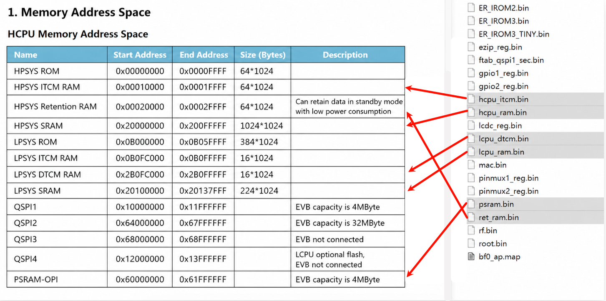

6. You can switch between different display windows in the Window menu.

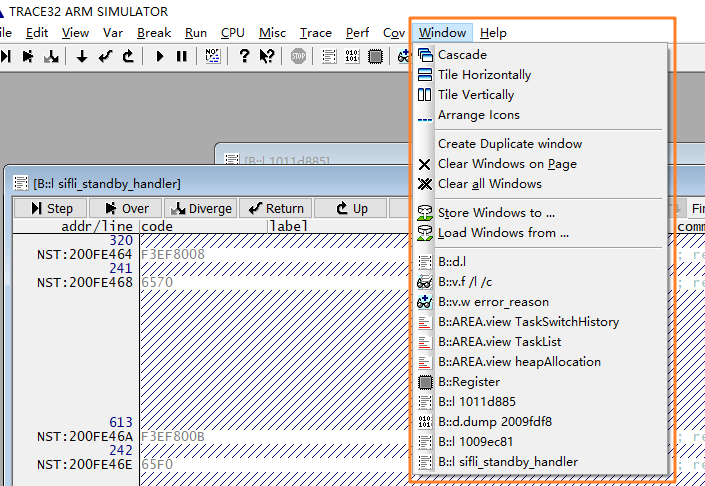

The `B::v.f /l /c` window shows the function call stack at the crash scene.

The heapAllocation window displays the allocation status of all heap pools in the system, including the system heap and each `memheap_pool`:

- system heap: The pool used by `rt_malloc` and `lv_mem_alloc`
- Each `memheap_pool`: Created by `rt_memheap_init`, allocated/freed using `rt_memheap_alloc` / `rt_memheap_free`

Allocation information field meanings:

```
BLOCK_ADDR: Starting address of the allocated memory block, including the management header
BLOCK_SIZE: Requested memory size, excluding the management header length
USED: Whether allocated, 1 means allocated, 0 means free
TICK: Allocation time, in OS ticks (typically 1 ms)
RETURN ADDR: Caller address
```

### Handling When the Scene Does Not Show the Exception Stack

If the crash call stack cannot be displayed, it may be because the registers were not saved in the dump or were saved incorrectly. Try the following methods:

1. Load the scene registers from J-Link halt log information (HR / HCPU Registers). Click the corresponding button, select the exported `log.txt`, and the tool will restore the HCPU registers from it into Trace32.

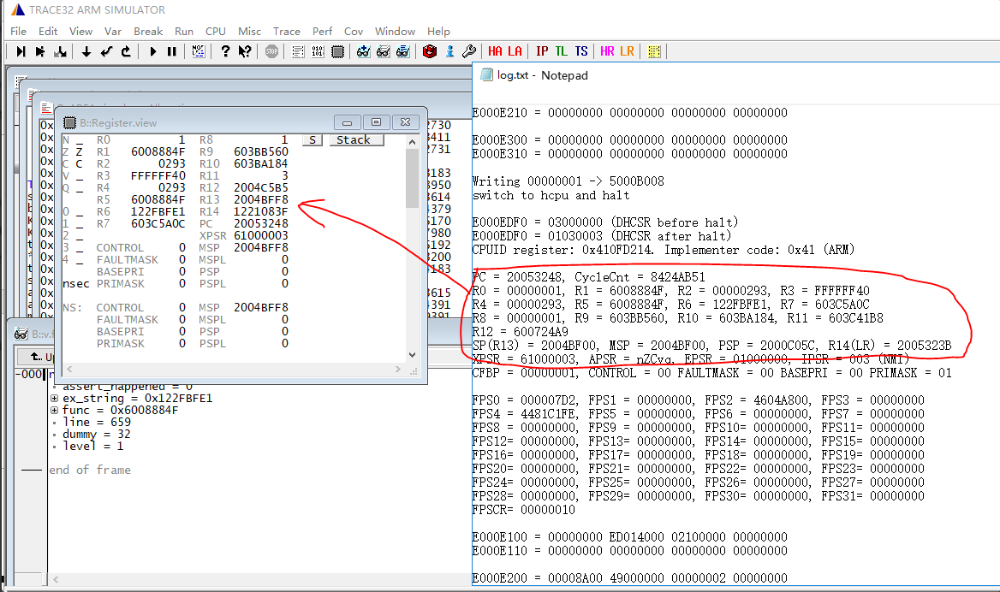

2. Manually enter the 16 register values printed in the log into the Trace32 register window (ARM register correspondence: SP <-> R13, LR <-> R14, PC <-> R15).

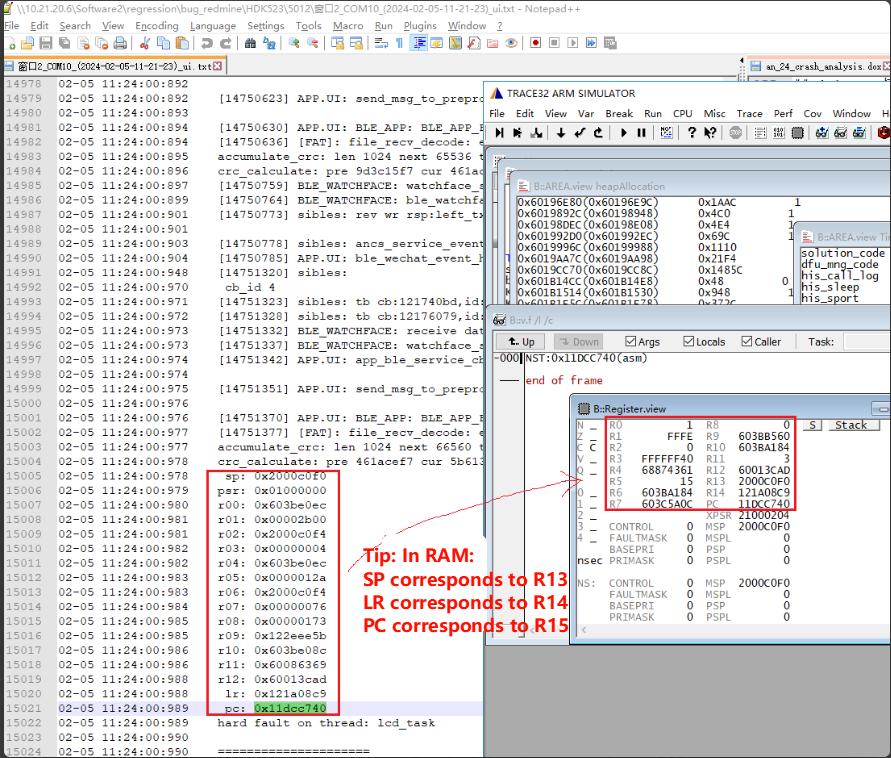

For GCC-compiled binaries, you can try changing the PC to the same value as R14.

3. When automatic scene restoration is unsuccessful, you can also manually restore based on the hardfault scene. Restore the interrupt function at the time the interrupt occurred (hardfault is also an interrupt) in the crash scene:

```
HardFault_Handler->rt_hw_hard_fault_exception->handle_exception
```

The function pushes registers R0-R4, R12, R14(LR), and PC onto the stack into the `saved_stack_frame` and `saved_stack_pointer` variables.

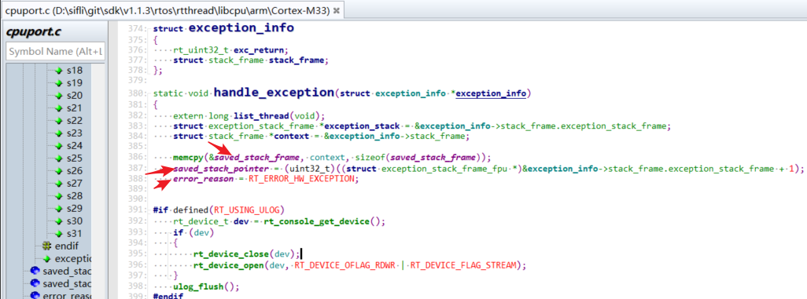

The pushed registers can be seen in figure 2 below. In the crash scene shown in figure 1, address 0x20054998 contains R0, address 0x200549AC contains LR, and address 0x200549B0 contains PC: 0x10CD6602.

- Register PC: Stores the program PC pointer before the crash.
- Register LR: Stores the program pointer to return to after execution completes.
- Global variable `saved_stack_pointer` stores the base address of the pushed stack.
- Global variable `saved_stack_frame` stores the pushed data.

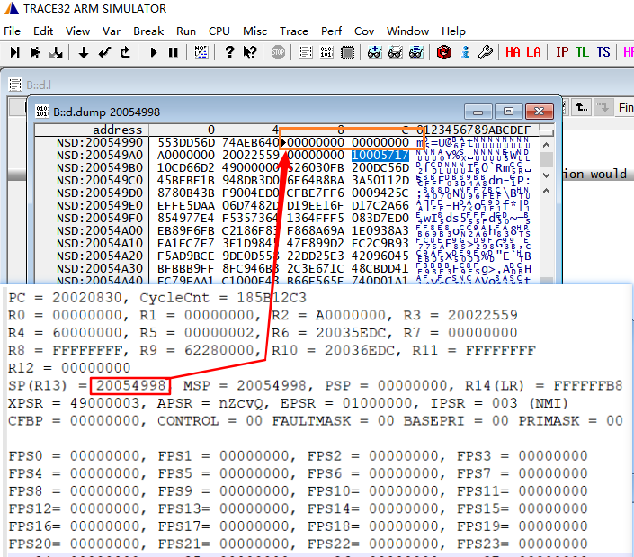
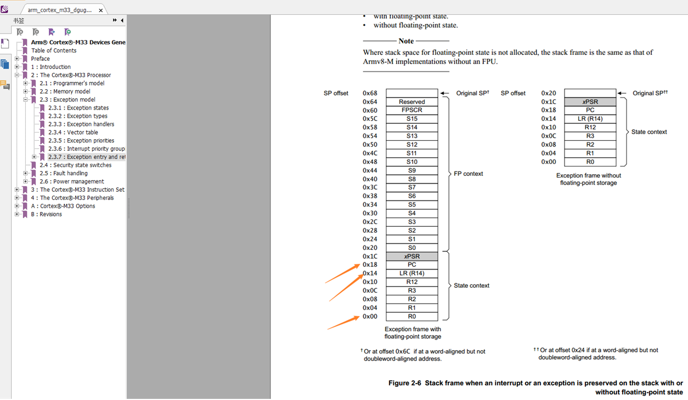

4. In the case of a hardfault `RT_ERROR_HW_EXCEPTION` crash, pay special attention to the assembly instruction at the problematic PC, and consider whether an abnormal address or abnormal instruction occurred, as shown below:

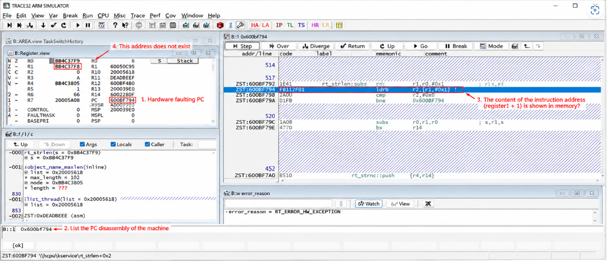

### Restoring LCPU Crash Scene with Trace32

LCPU restoration is similar to HCPU. You need to copy `lcpu.axf` and the corresponding `rom_axf` file to the script directory:

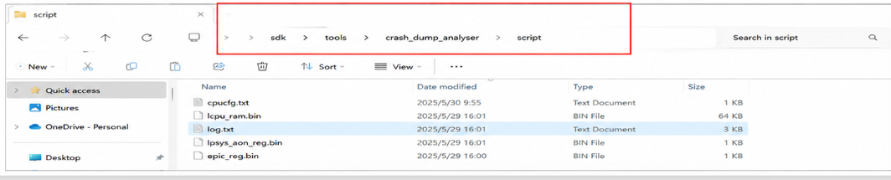

Notes:

- Keil-compiled LCPU files have the `.axf` extension, while GCC-compiled files have the `.elf` extension.
:::{only} SF32LB52X
- When selecting `rom_axf`, choose the correct file based on the board model (numeric series uses `lcpu_rom_micro`, letter series uses `rev7`).
:::

:::{only} SF32LB55X or SF32LB56X or SF32LB58X
- When selecting `rom_axf`, choose the correct file based on the board model.
:::

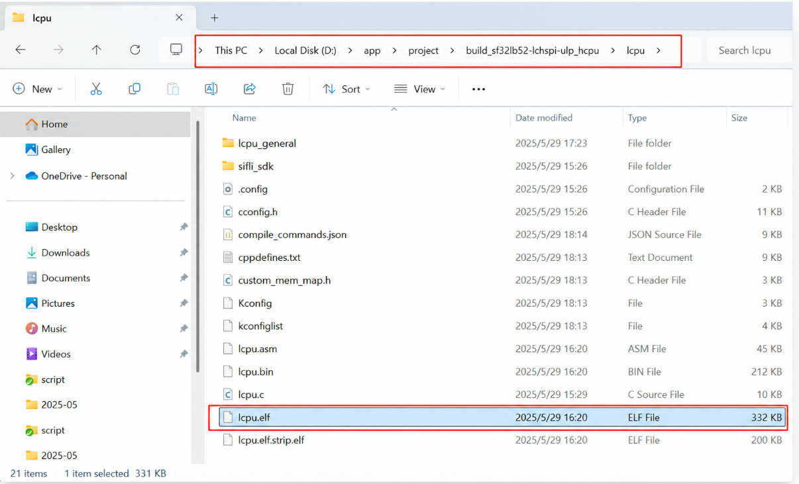

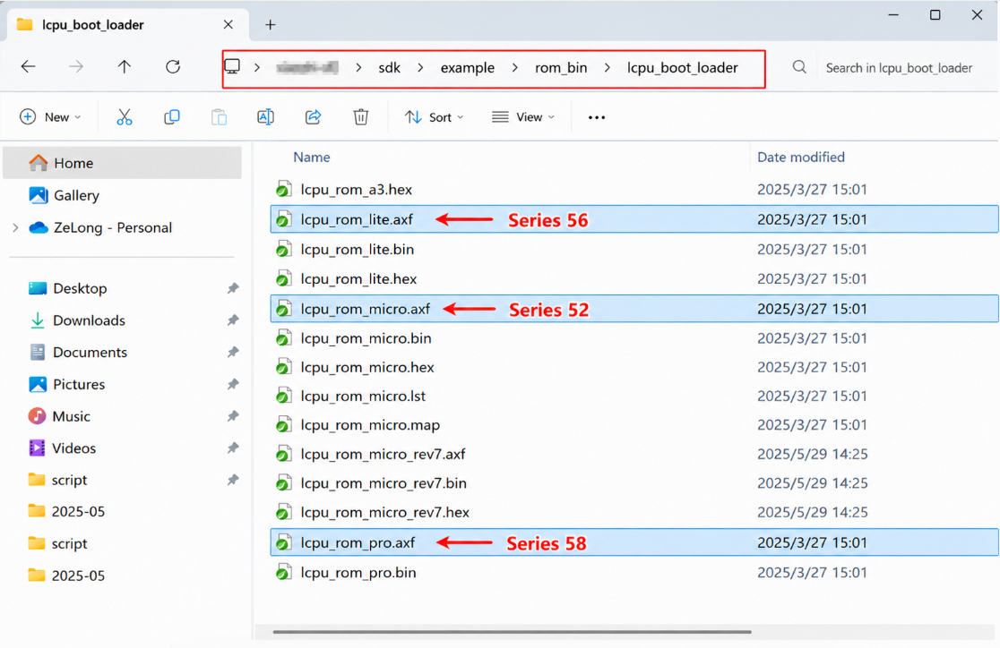


Open Trace32 and select LA (LCPU assertion) to execute the corresponding configuration:

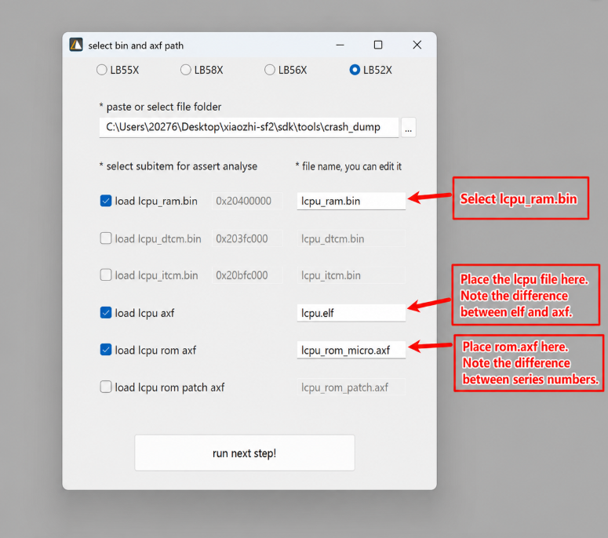

## Trace32 Common Scripts and Commands

Common viewing commands:

- `L <addr>`: e.g., `L 0x10063c`, view source code or disassembly at a PC address.
- `v.v *`: Open the variable window, supports wildcard searching of global variables.
- `data.dump <addr>`: View memory at an address.
- `frame /locals /caller`: View the call stack and local variables.
- In the console, type `(struct rt_pm *)0x101fa2b9` to parse memory in struct format.

System state built-in scripts (run with `do`):

- `do show_tasks`: Display all threads in the system with their status, stack address, and priority.
- `do switch_to 0x200A2F7C`: Force context switch between different thread stacks.
- `do show_timer` / `do show_switch_history`: View the timer queue and thread switch history.

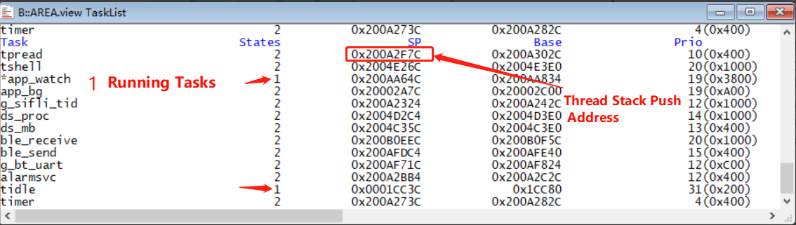

---

## Heap Analysis Example

The figure below shows a scene where a heap leak was detected: the callstack window shows the call stack at the assertion point, and the heapAllocation window's system heap list shows memory blocks allocated by `rt_malloc`. RETURN ADDR is the function address that called `rt_malloc`, and TICK is the allocation time (`rt_tick_get`).


System heap management header structure: The first uint16 is a special marker 0x1EA0 — if modified, it indicates illegal overwriting. The second uint16 is the used flag: 1 means allocated, 0 means free, any other value means the memory entry is corrupted.


For example, the memory block at address `0x200A27EC` was allocated by an instruction before `rt_serial_open`, with a requested size of 4108 bytes. The system heap management header length is 28 bytes, so the actual usable address is `block_addr + 28`.

When memory leaks occur, you can combine the caller address with the allocation time to locate the code that failed to free memory.


