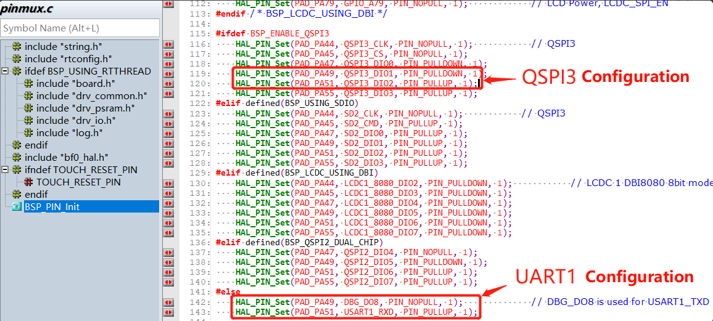
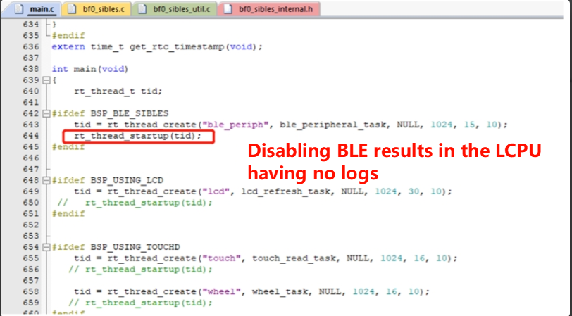

# Log-Based Crash Debugging Guide

This section describes how to locate and debug crashes using log output.

## 1. Log Patterns During Crashes

### Case 1: Notification of Remote Core Crash

:::{only} SF32LB55X
The following log indicates that HCPU received a crash notification from LCPU and triggered an active assert. You need to investigate the LCPU crash cause.

```
07-11 10:31:55:616    [351767] E/mw.sys ISR: LCPU crash
07-11 10:31:55:617    Assertion failed at function:debug_queue_rx_ind, line number:221 ,(0)
07-11 10:31:55:617    Previous ISR enable 0
```
:::

:::{only} SF32LB58X or SF32LB56X or SF32LB57X
The following log indicates that HCPU received a crash notification from LCPU and triggered an active assert. You need to investigate the LCPU crash cause.

```
07-11 10:31:55:616    [351767] E/mw.sys ISR: LCPU Crash triggered, please check LCPU log for details.
07-11 10:31:55:617    Assertion failed at function:DBG_Trigger_IRQHandler, line number:377 ,(0)
07-11 10:31:55:617    Previous ISR enable 0
```
:::
**Explanation**: In dual-core development, when one CPU has crashed, the state of the other CPU is unknown — it may continue running for a long time, making problems difficult to discover. The current software design is: when one CPU encounters a known assert or hardfault, it notifies the other core, which then triggers its own assert upon receiving the notification, making it easier to investigate issues.

### Case 2: Assert Line Number Indication

The following log indicates that an Assert occurred at line 517 of the drv_io.c file.

```
07-10 16:41:16:382    [572392] I/drv.lcd lcd_task: HW close
07-10 16:41:16:385    HAL assertion failed in file:drv_io.c, line number:517
07-10 16:41:16:388    Assertion failed at function:HAL_AssertFailed, line number:616 ,(0)
07-10 16:41:16:389    Previous ISR enable 1
```

Line 517 of drv_io.c is shown in the figure below. `RT_ASSERT(0);` or `HAL_ASSERT(s_lcd_power > 0);` triggers a crash when the value inside the parentheses is 0 (False). This crash means `s_lcd_power > 0` is false (s_lcd_power is not greater than 0).


### Case 3: Log Shows Crash PC Pointer Information

In the following log, when a hard fault occurs, the PC pointer has already jumped to the exception interrupt `HardFault_Handler` or `MemManage_Handler` inside the `rt_hw_mem_manage_exception` or `rt_hw_hard_fault_exception` function. The PC pointer seen when connected may no longer be the original crash site. The PC and other addresses printed in the log represent the original crash site and can be used to restore the first crash scene. The example below shows a crash at PC address `0x0007ef00`. You can check the corresponding `*.asm` file generated during compilation to see why this instruction caused a crash — typically it's accessing unreachable memory or addresses, resulting in an exception interrupt crash.

**Explanation**: In the `handle_exception` function, the variables `saved_stack_frame`, `saved_stack_pointer`, and `error_reason` store the crash stack, crash stack address, and crash reason respectively when the above exception occurs. You can analyze the crash reason by comparing with the source code data structure. You can also take the PC address and search for it in the disassembly file under the build firmware directory to locate the specific assembly instruction that triggered the crash.

```
06-24 15:48:41:031     sp: 0x200195c8
06-24 15:48:41:037    psr: 0x80000000
06-24 15:48:41:041    r00: 0x00000000
06-24 15:48:41:042    r01: 0x2001960c
06-24 15:48:41:043    r02: 0x00000010
06-24 15:48:41:044    r03: 0x0007ef00
06-24 15:48:41:045    r04: 0x00000000
06-24 15:48:41:046    r05: 0x00000010
06-24 15:48:41:046    r06: 0x00000000
06-24 15:48:41:047    r07: 0x00000010
06-24 15:48:41:047    r08: 0x2001960c
06-24 15:48:41:048    r09: 0x2001965c
06-24 15:48:41:049    r10: 0x60000000
06-24 15:48:41:049    r11: 0x00000000
06-24 15:48:41:050    r12: 0x200001cd
06-24 15:48:41:051     lr: 0x12064845
06-24 15:48:41:052     pc: 0x0007ef00
06-24 15:48:41:052    hard fault on thread: mbox
06-24 15:48:41:053    
06-24 15:48:41:053    =====================
06-24 15:48:41:054    PSP: 0x20019534, MSP: 0x2001419c
06-24 15:48:41:055    ===================
```

## 2. Common Issues

### HCPU Has No Log Output
1. menuconfig → RTOS → RT-Thread Kernel → Kernel Device Object → configure uart1 as uart1.
2. menuconfig → RTOS → RT-Thread Components → Utilities → Enable ulog.
3. Check whether the UART1 configuration in pinmux.c is correct. A common issue is that BSP_ENABLE_QSPI3 is enabled, as shown below:

TIP: In menuconfig, you can press the "?" key to open the search box for precise configuration searching.



:::{only} SF32LB55X
### LCPU Has No Log Output
If there is still no output after the following configuration:

1. menuconfig → RTOS → RT-Thread Kernel → Kernel Device Object → configure uart3 as uart3.
2. menuconfig → RTOS → RT-Thread Components → Utilities → Enable ulog.
3. Confirm that HCPU's menuconfig → RTOS → RT-Thread Kernel → Kernel Device Object → uart1 is not configured as uart3, otherwise there will be a conflict.
4. Confirm that the UART3 mode configuration in pinmux.c is correct. The default configuration is:

`````c
HAL_PIN_Set(PAD_PB45, USART3_TXD, PIN_NOPULL, 0);           // USART3 TX/SPI3_INT
HAL_PIN_Set(PAD_PB46, USART3_RXD, PIN_PULLUP, 0);           // USART3 RX
`````
Other reason 1: The BLE thread is not enabled, causing the LCPU program to not be loaded.



Solution: Enable the BLE thread or call the function `lcpu_power_on();` separately to start the LCPU code.

Other reason 2:

````
example\multicore\ipc_queue\
example\pm\coremark\
````

These projects require sending the command `lcpu on` in the HCPU console to start LCPU. After successful startup, you can see the boot log on the LCPU console.

Solution: There is a readme.txt file in the corresponding project directory. Refer to its content to send the command to start LCPU.

:::

:::{only} SF32LB58X or SF32LB56X or SF32LB57X
### LCPU Has No Log Output
If there is still no output after the following configuration:
1. menuconfig → RTOS → RT-Thread Kernel → Kernel Device Object → configure uart4 as uart4.
2. menuconfig → RTOS → RT-Thread Components → Utilities → Enable ulog.
3. Confirm that HCPU's menuconfig → RTOS → RT-Thread Kernel → Kernel Device Object → uart1 is not configured as uart4, otherwise there will be a conflict.
4. Confirm that the UART3 mode configuration in pinmux.c is correct. The default configuration is:

`````c
HAL_PIN_Set(PAD_PB17, USART4_TXD, PIN_NOPULL, 0);           // USART4 TX
HAL_PIN_Set(PAD_PB16, USART4_RXD, PIN_PULLUP, 0);           // USART4 RX
`````
Other reason 1: The BLE thread is not enabled, causing the LCPU program to not be loaded.


Solution: Enable the BLE thread or call the function `lcpu_power_on();` separately to start the LCPU code.

Other reason 2:

````
example\multicore\ipc_queue\
example\pm\coremark\
````

These projects require sending the command `lcpu on` in the HCPU console to start LCPU. After successful startup, you can see the boot log on the LCPU console.

Solution: There is a readme.txt file in the corresponding project directory. Refer to its content to send the command to start LCPU.
:::

### How to Read/Write Registers in Code

Direct address read operation:
```c
static uint32_t pinmode19;
pinmode19= *(volatile uint32_t *)0x4004304c; //Read the value of register 0x4004304c
uint32_t reg_printf= *(volatile uint32_t *)0x50016000; //Print the value of register 0x50016000
rt_kprintf("0x50016000:0x%x\n",reg_printf);
```
Direct address write operation:
```c
#define _WWORD(reg,value) \
{ \
    volatile uint32_t * p_reg=(uint32_t *) reg; \
    *p_reg=value; \
}
_WWORD(0x40003050,0x200);  //Write value 0x00000200 to PA01 pinmux register
```
Register definition read operation:
```c
rt_kprintf("hwp_hpsys_rcc->CFGR:0x%x\n",hwp_hpsys_rcc->CFGR);
uint32_t reg_printf= hwp_hpsys_rcc->CFGR; //Print register
rt_kprintf("hwp_hpsys_rcc->CFGR:0x%x\n",reg_printf);
```
Register definition write operation:
```c
hwp_hpsys_rcc->CFGR = 0x40003050;//Direct write value
MODIFY_REG(hwp_pmuc->LPSYS_SWR, PMUC_LPSYS_SWR_PSW_RET_Msk,
			MAKE_REG_VAL(1, PMUC_LPSYS_SWR_PSW_RET_Msk, PMUC_LPSYS_SWR_PSW_RET_Pos)); //Only modify the PMUC_LPSYS_SWR_PSW_RET_Msk value to 1, leave other bits unchanged;

```
