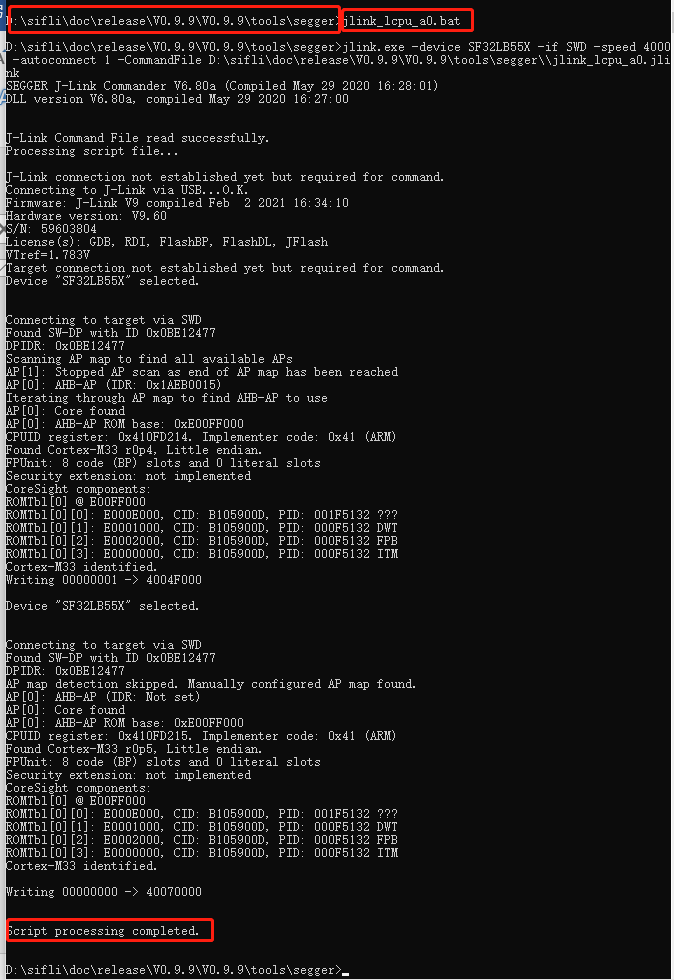
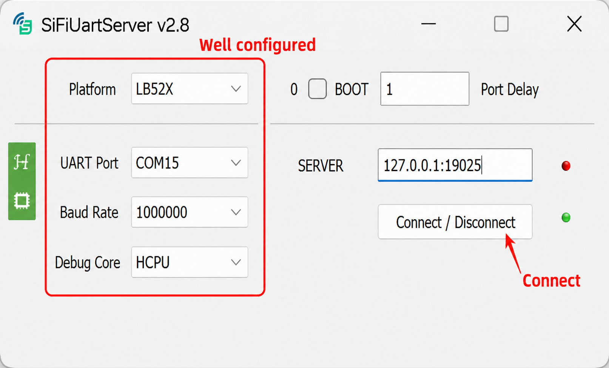
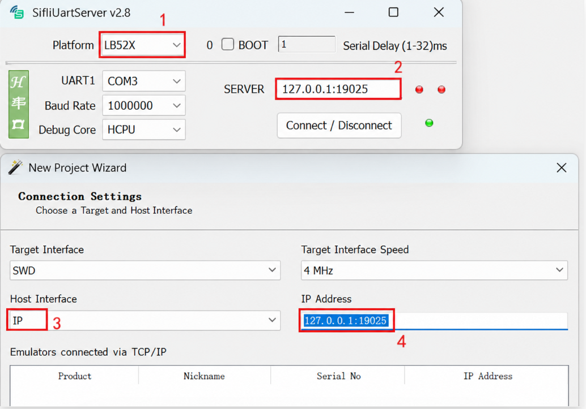
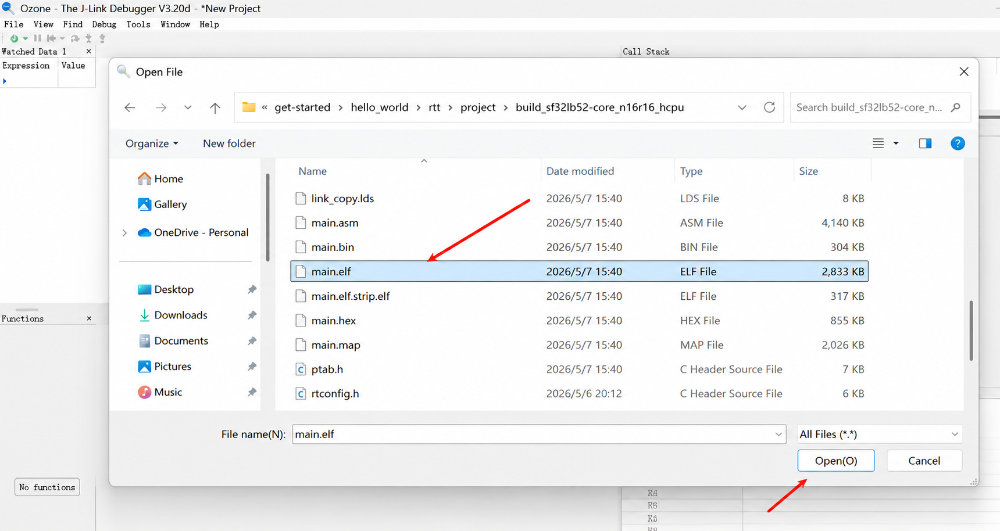
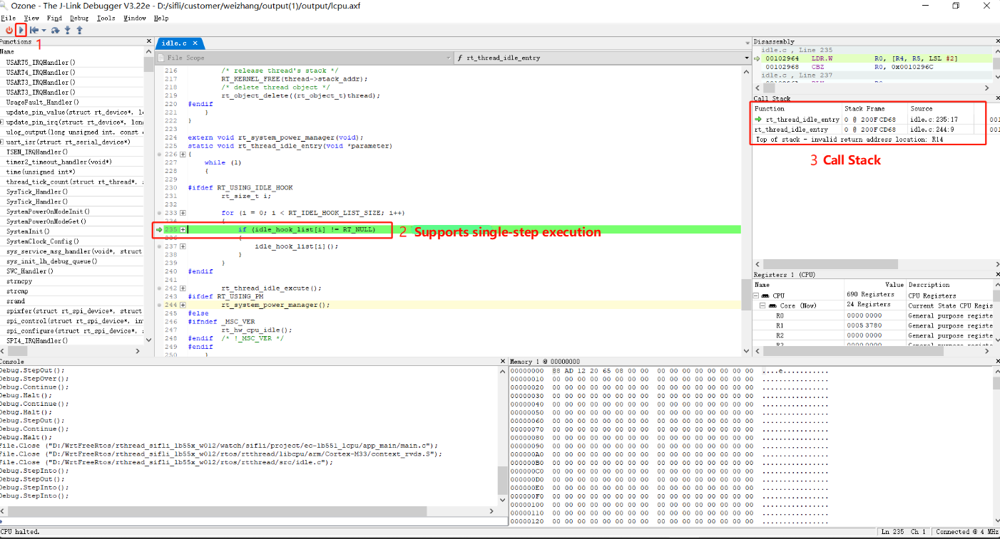
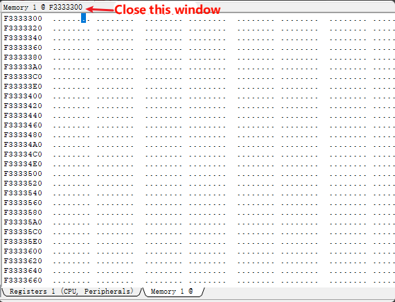
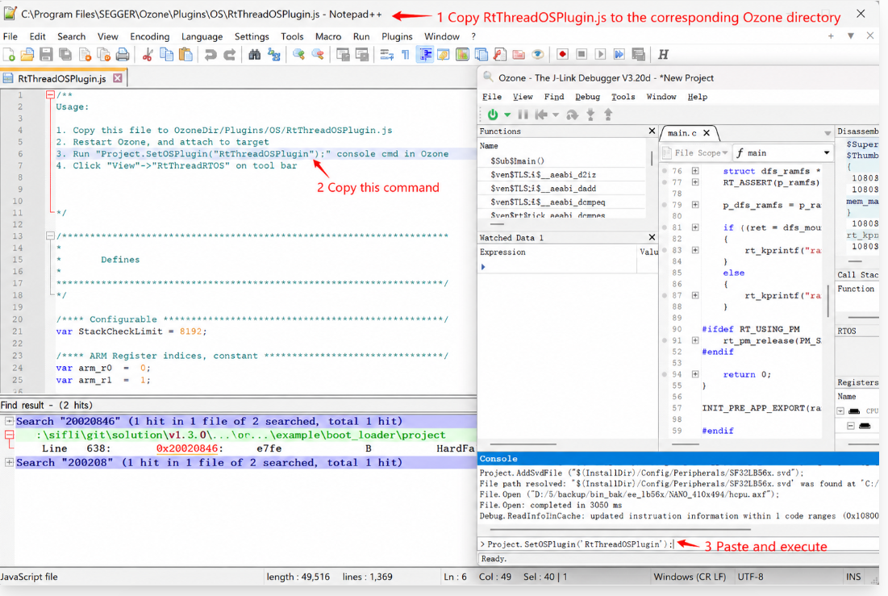
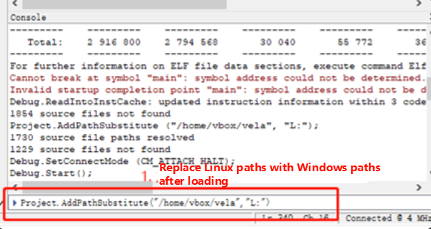

# Ozone Online Breakpoint Debugging Guide

This section describes how to use Ozone for breakpoint and step-by-step debugging.

## 1. Early Crash Breakpoint Setup
If the system crashes during the Bootloader phase, immediately after Bootloader, during early startup initialization (or during sleep wake-up), attaching J-Link directly is often too late. You can set breakpoints directly in the code.

- **Assembly level setup**: Add a `B .` infinite loop in the `Reset_Handler` of `drivers/cmsis/sf32lb5xx/Templates/arm/startup_bf0_hcpu.S` (replace with the corresponding chip model).

**Note:** The path for `startup_bf0_hcpu.S` when compiling with GCC differs from Keil. The GCC path is: `drivers/cmsis/sf32lb5xx/Templates/gcc/startup_bf0_hcpu.S`

```assembly
Reset_Handler   PROC
                B        . ; // First instruction executed after MCU reset, add breakpoint
```

- **C language level setup**: Add an assembly-level breakpoint at the beginning of `SystemInit()` or `rtthread_startup()`.

```c
__asm("B ."); // Set breakpoint
```

Or:

```c
HAL_sw_breakpoint(); // Set breakpoint
```

```{note}
Do not use `while(1);` as a breakpoint, because compiler optimizations may discard all statements after it.
```

After setting this, the system will halt at that instruction. After connecting J-Link and Ozone, **use the command `setpc PC+2` to advance the PC register by 2 bytes to skip the breakpoint**, then you can start step-by-step tracing.

## 2. Ozone Debugging Guide
Ozone is SEGGER's official full-featured debugger, which is more stable than Keil for crash investigation and multi-core debugging.

````{only} SF32LB55X or SF32LB58X or SF32LB56X or SF32LB57X
J-Link connects to HCPU by default. If debugging HCPU, this step can be skipped.
If you need to debug LCPU, execute the corresponding batch script in a Windows CMD window, such as `SIFLI-SDK\tools\segger\jlink_lcpu_a0.bat` (55 series), `jlink_lcpu_pro.bat` (58 series), or `jlink_lcpu_56x.bat` (56 series).
This batch file executes a few low-level commands. You can also enter these two commands directly in the J-Link window to manually switch to LCPU:

```bash
w4 0x4004f000 1
connect
w4 0x40070000 0
exit
```

(Note: You can also switch SWD to LCPU debugging by writing registers directly in code.)


````

### 2.1 Creating an Ozone Project and Connecting

```{only} SF32LB52X
The 52 series MCU does not have an SWD interface. To use Ozone for debugging, you can use the SiFliUsartServer.exe tool. Configure it as shown below:


```

```{only} SF32LB55X
Using the 55 series as an example to demonstrate LCPU step-by-step execution.
```

**Create a new project**: Open Ozone and create a new project.

:::{only} SF32LB55X

:::

:::{only} SF32LB52X or SF32LB56X or SF32LB57X or SF32LB58X

:::


**Select the debug chip**: Navigate to the `SIFLI-SDK\tools\svd_external` path and select the corresponding chip model directory to open and select the SVD file.


:::{only} SF32LB55X or SF32LB56X or SF32LB58X

**Select connection interface**: Select J-Link (SWD/JTAG). If not found, check the connection and power supply.


:::


:::{only} SF32LB52X
**Select connection interface**: Enter the IP virtualized by SiFliUsartServer as shown.


:::

**Select firmware**: Select the compiled `*.axf` or `*.elf` file. Note the file extension difference: Keil-compiled files have the .axf extension, while GCC-compiled files have the .elf extension.

:::{only} SF32LB55X
For example, the LCPU axf path for the `watch_demo` project is `\release\example\rom_bin\lcpu_general_ble_img\lcpu_general_551.axf`.


:::

:::{only} SF32LB52X or SF32LB56X or SF32LB57X or SF32LB58X
In Ozone, select File then Open, and find the firmware you want to import.



:::


**Attach to program**:
- **Attach & Halt Program**: Connect J-Link to the CPU and halt at the current PC pointer (recommended for crash investigation).
- **Attach & Run Program**: Connect to the CPU and continue running from the current PC.


**Start debugging**: After clicking the run program arrow icon, the CPU can be stepped through. You can add breakpoints, view call stack information, and register states.



### 2.2 Common Ozone Debugging Issues

**Issue 1: Target Connection Lost - Frequent Disconnections After Connecting**

The following disconnection dialog frequently appears shortly after connecting, interrupting the debugging session:


**Cause and Solution**:
This occurs because when connecting to Ozone for debugging, the `Memory` window is enabled by default and reads uninitialized (such as PSRAM) or non-existent memory addresses, causing read failures and disconnections. **Before connecting for debugging, make sure to close Ozone's Memory window and other unused windows.**



**Issue 2: Enabling RT-Thread RTOS Thread Awareness in Ozone**

To view system threads in Ozone, copy the plugin `\tools\segger\RtThreadOSPlugin.js` from the SDK to the `Plugins\OS\` directory under the Ozone installation path. Reopen the project and enable `Project.SetOSPlugin("RtThreadOSPlugin");` to switch and debug RT-Thread threads online.




**Issue 3: Ozone Shows "File not found" (Redefining Source Code Path)**

When the flashed binary was not compiled locally (e.g., investigating a crash scene sent by someone else), Ozone shows `File not found` and cannot locate the C source code for step-by-step tracing.


**Solution**:
- **Single file not found**: Right-click the file, select `Locate File`, and navigate to the corresponding local C source file.
- **Batch file base address mismatch**: Enter the `Project.AddPathSubstitute` command in the Ozone command window to relocate the path. For example, replace the Linux compilation path in the ELF with the local Windows path.



**Issue 4: Ozone Debug Connection Fails**

Error shown:


Solution: You need to add the flash driver and XML configuration file just like for J-Link, so that Ozone is supported.

```xml
C:\Program Files\SEGGER\Ozone\Devices\SiFli\SF32LB55X****.elf
C:\Program Files\SEGGER\Ozone\JLinkDevices.xml
# Different J-Link or Ozone versions may have the following paths:
C:\Users\yourname\AppData\Roaming\SEGGER\JLinkDevices.xml
C:\Users\yourname\AppData\Roaming\SEGGER\JLinkDevices\Devices\SF32LB55X****.elf
```
:::{only} SF32LB58X or SF32LB56X or SF32LB55X or SF32LB57X
**Issue 5: How to Debug LCPU with Ozone**

J-Link connects to HCPU by default for debugging.

Solution: To debug LCPU, execute the batch file in a Windows CMD command window: SIFLI-\tools\segger\jlink_lcpu_a0.bat (55), jlink_lcpu_pro.bat (58), jlink_lcpu_56x.bat (56). The batch file executes the commands in \tools\segger\jlink_lcpu_xxx.jlink:

```
w4 0x4004f000 1
connect
w4 0x40070000 0
exit
```

You can also enter these two commands directly in the J-Link window to switch to LCPU.


:::
