# Debugging Tools Environment Configuration Guide

This section describes how to download and configure the debugging tools.

## 1 Trace32
### 1.1 Trace32 Download and Configuration
#### 1.1.1 Download Trace32
You can download it directly from the Lauterbach official website, as shown below. Select the ARM version [simarm.zip](https://repo.lauterbach.com/download_demo.html). The free version has limitations on online debugging and script length. SiFli's full MCU series currently only uses the offline debugging functionality.

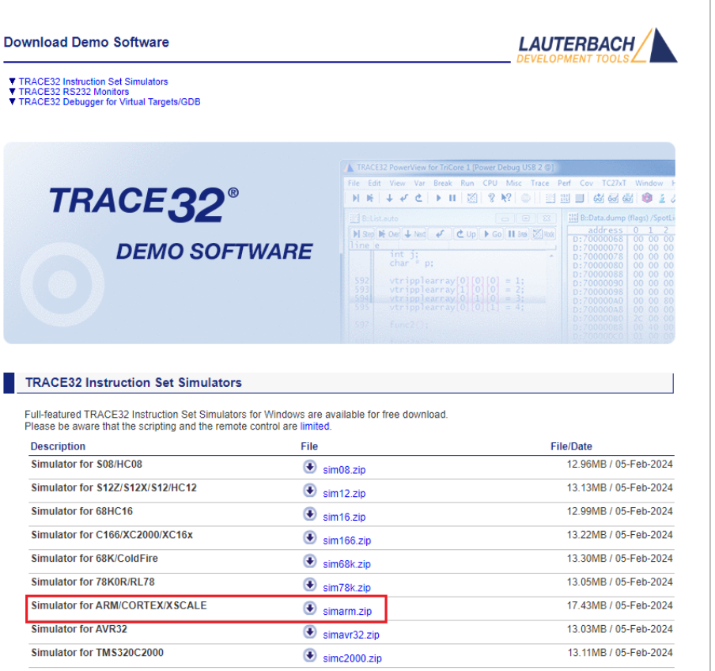

Lauterbach offline debugging tool download link:
[Simulator for ARM/CORTEX/XSCALE simarm.zip](https://repo.lauterbach.com/download_demo.html)

#### 1.1.2 Configuration

Extract the downloaded archive to the `SiFli-SDK\tools\crash_dump_analyser\` directory, then copy the contents of the `patch` folder in this directory into the extracted `simarm` directory, as shown below:

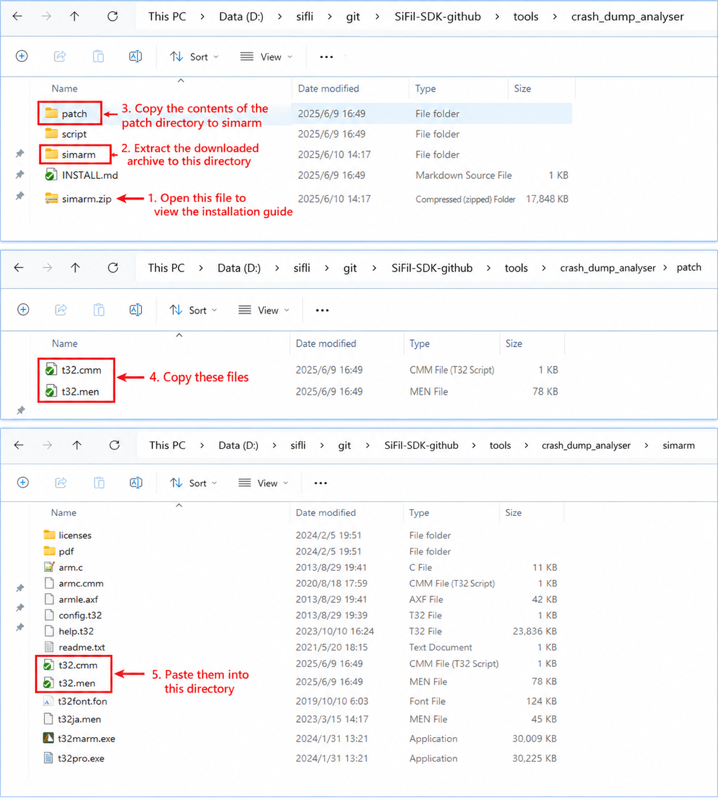

### 1.1.3 Running Trace32
This software requires no installation. Double-click the `t32marm.exe` executable in the `simarm` directory to open Trace32.

## 2 Ozone
### 2.1 Ozone Download and Configuration
#### 2.1.1 Download Ozone
You can download it directly from the SEGGER official website. For Windows systems, select the Windows version.

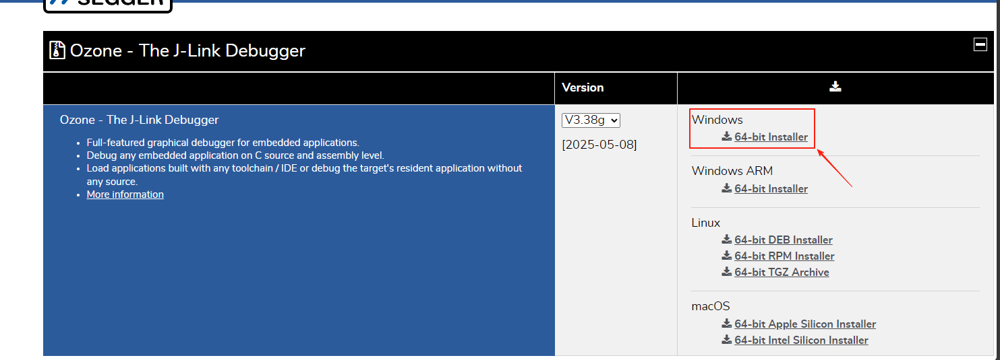

SEGGER online debugging tool download link:
[Ozone - The J-Link Debugger Windows 64-bit Installer](https://www.segger.cn/downloads/jlink/#Ozone)

**Note:** Ozone and J-Link versions above V7.6 will check for counterfeit J-Link debuggers. For learning purposes, you can use [Ozone_Windows_V320d_x64.exe](https://www.segger.cn/downloads/jlink/Ozone_Windows_V320d_x64.exe) and [JLink_Windows_V758a_x86_64.exe](https://www.segger.cn/downloads/jlink/JLink_Windows_V758a_x86_64.exe).

#### 2.1.2 Configure Device, MCU Peripheral Registers, and RT-Thread OS Script
A. Replace the Ozone configuration file `C:\Users\yourname\AppData\Roaming\SEGGER\JLinkDevices\JLinkDevices.xml` with `SiFli-SDK\tools\flash\jlink_drv\JLinkDevices.xml`. Additionally, create a `SiFli` directory under `C:\Users\yourname\AppData\Roaming\SEGGER\JLinkDevices\Devices\`, and copy all contents from the subdirectories of `SiFli-SDK-i\tools\flash\jlink_drv` into the created SiFli folder. The corresponding directories and files are as follows:

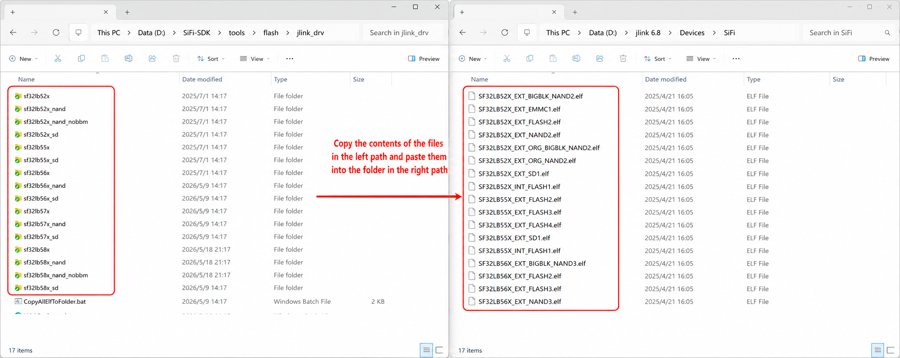

The J-Link flash driver correspondence can be found in the JLinkDevices.xml file:

```xml
<Device>
    <ChipInfo Vendor="SiFli" Name="SF32LB52X_NOR" Core="JLINK_CORE_CORTEX_M33" WorkRAMAddr="0x20000000" WorkRAMSize="0x60000" />
    <FlashBankInfo Name="Internal Flash1" BaseAddr="0x10000000" MaxSize="0x8000000"  Loader="Devices/SiFli/SF32LB52X_INT_FLASH1.elf" LoaderType="FLASH_ALGO_TYPE_OPEN" AlwaysPresent="1"/>
    <FlashBankInfo Name="External Flash2" BaseAddr="0x12000000" MaxSize="0x8000000" Loader="Devices/SiFli/SF32LB52X_EXT_FLASH2.elf" LoaderType="FLASH_ALGO_TYPE_OPEN" AlwaysPresent="1"/>
</Device>
```

B. Copy all contents from the subdirectories of `SiFli-SDK\tools\svd_external` to `C:\Program Files\SEGGER\Ozone\Config\Peripherals`.

C. Copy `SiFli-SDK\tools\segger\RtThreadOSPlugin.js` to `C:\Program Files\SEGGER\Ozone\Plugins\OS\`. The corresponding directories and files are as follows:

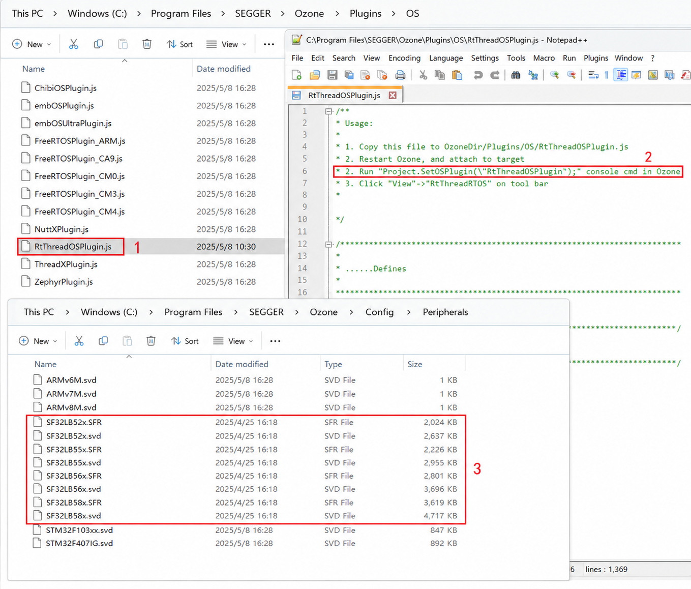

After configuring items A/B/C, open Ozone and you will be able to select the desired Devices and MCU peripheral registers:

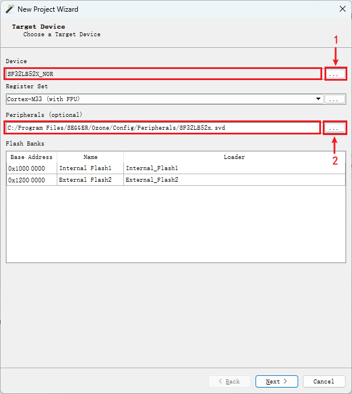

After configuring the MCU peripheral registers and RT-Thread OS script, enter the Ozone interface to view the corresponding MCU peripheral registers and OS threads:

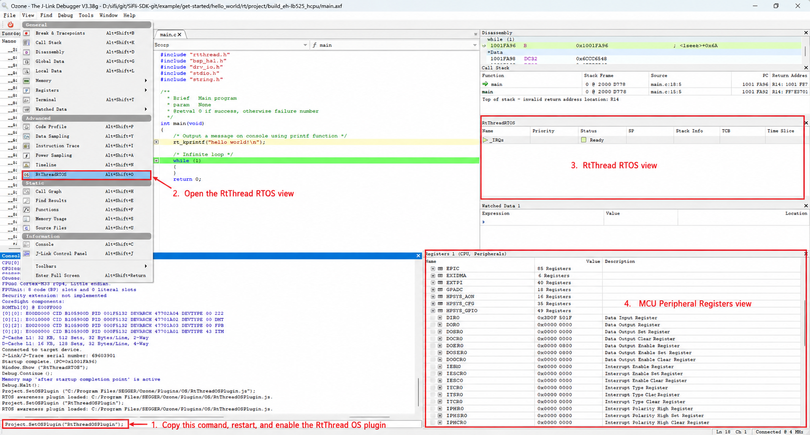

## 3 J-Link
J-Link can be downloaded from the official website. Please use JLink V7.62 or later. After installation, create a SiFli folder under the `jlink\Devices\` directory:

`D:\jlink 6.8\Devices\SiFli`

Copy the entire contents of `tools/flash/jlink_drv` from the SDK into this directory. After copying, the directory should contain at least `JLinkDevices.xml` and subdirectories such as `sf32lb55x`.

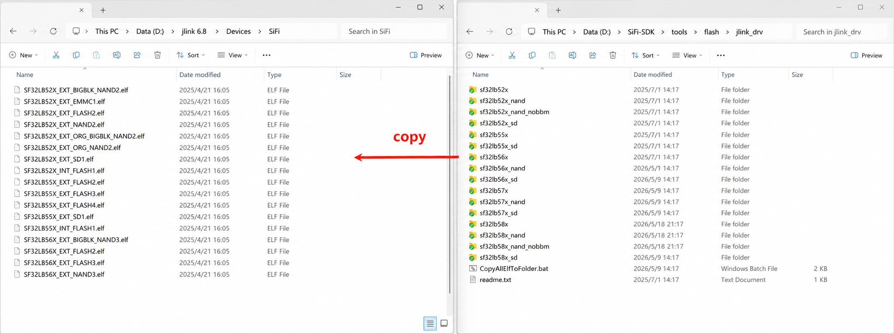

Notes:
1. `tools/flash/jlink_drv` is the complete J-Link Device Support Kit (DSK) package. The `JLinkDevices.xml` in the root directory describes devices and flash banks, and the elf files in subdirectories are the corresponding Open Flashloader algorithms.
2. Starting from J-Link V7.62, it recursively scans all `*.xml` files under the `JLinkDevices` directory. Therefore, there is no need to modify the `JLinkDevices.xml` in the J-Link installation directory, nor to manually flatten-copy elf files to the `Devices\SiFli` directory.
3. Loader paths in the XML are resolved relative to `JLinkDevices.xml`, so the entire `tools/flash/jlink_drv` directory contents must be copied together.

### 3.1 J-Link Connection
:::{only} SF32LB55X or SF32LB58X or SF32LB56X or SF32LB57X
Open J-Link Commander, type `connect` to connect, and type a question mark to select the SiFli device:
:::
:::{only} SF32LB52X
Open the SiFliUsartServer tool, located at `SiFli-SDK\tools\SifliTrace\UsartServer`. Then open J-Link Commander and follow the steps shown below to connect the device:

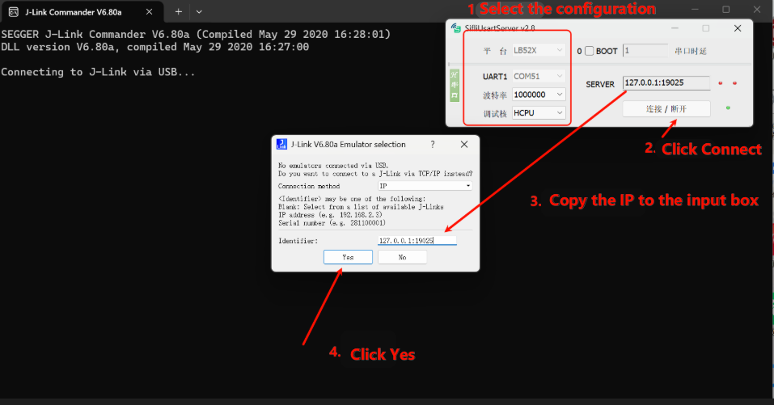
:::

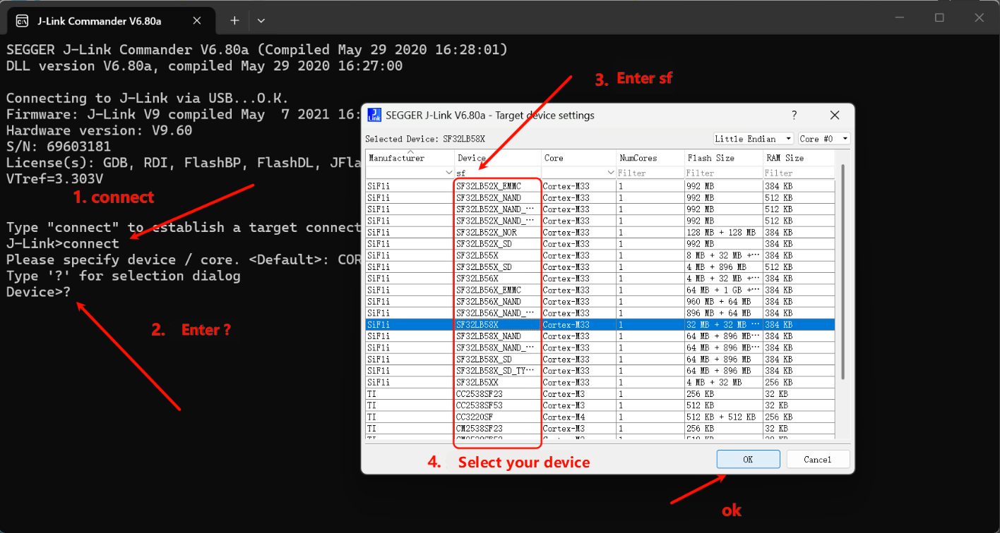

Select the SWD interface and configure the speed:

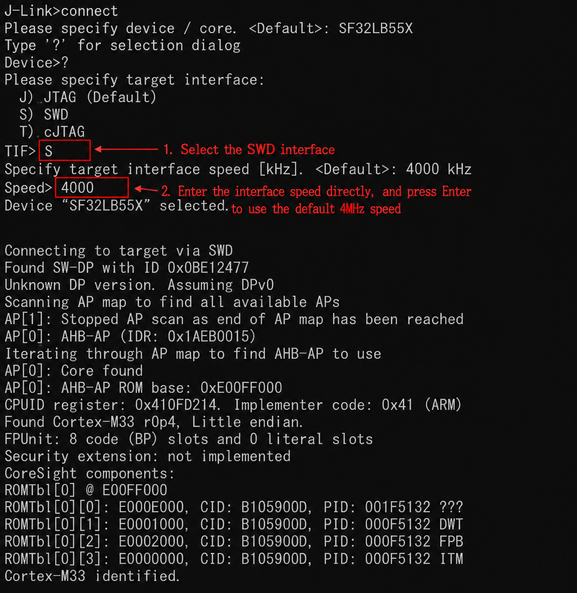


### 3.2 J-Link Usage Issues

:::{only} SF32LB55X or SF32LB58X or SF32LB56X or SF32LB57X
#### How to Print Log Information Using JLINK RTT
:::

:::{only} SF32LB55X
By default, the HCPU log outputs from UART1 and the LCPU log outputs from UART3. If only UART3 is routed out or UART1 is occupied, you can use menuconfig to switch log output to SWD.
:::

:::{only} SF32LB58X or SF32LB56X
By default, the HCPU log outputs from UART1 and the LCPU log outputs from UART4. If only UART4 is routed out or UART1 is occupied, you can use menuconfig to switch log output to SWD.
:::

:::{only} SF32LB55X or SF32LB58X or SF32LB56X or SF32LB57X
How to modify HCPU log output to J-Link SWD:
1. Navigate to the project directory and open menuconfig.

2. menuconfig -> Third party packages -> Select "Segger RTT package".

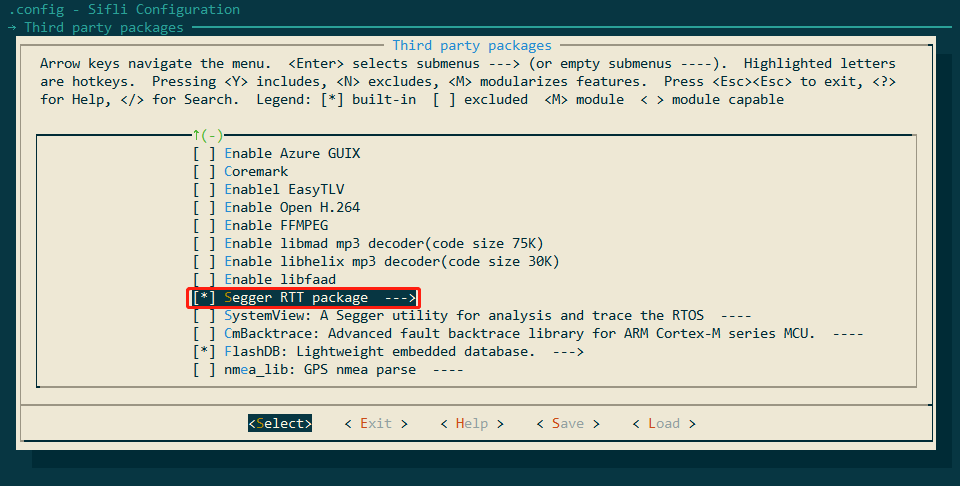

3. menuconfig -> RTOS -> RT-Thread Kernel -> Kernel Device Object -> the devices name for console, change to `segger`.

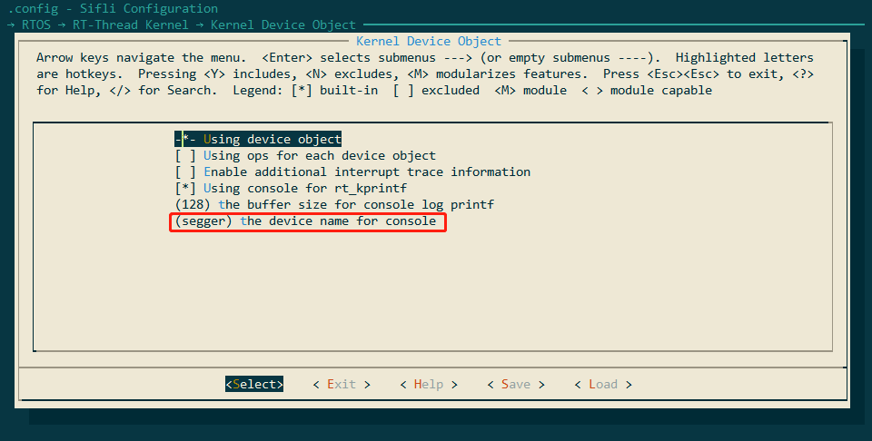
:::

#### HCPU Log Cannot Be Printed via Jlink Segger
Root cause: In newer SDK versions, to optimize memory usage, the J-Link Control block address variable `_SEGGER_RTT` was moved from HPSYS SRAM `0x20000000` to memory region HPSYS ITCM RAM `0x00010000 - 0x0001FFFF` (64 * 1024), as shown below:

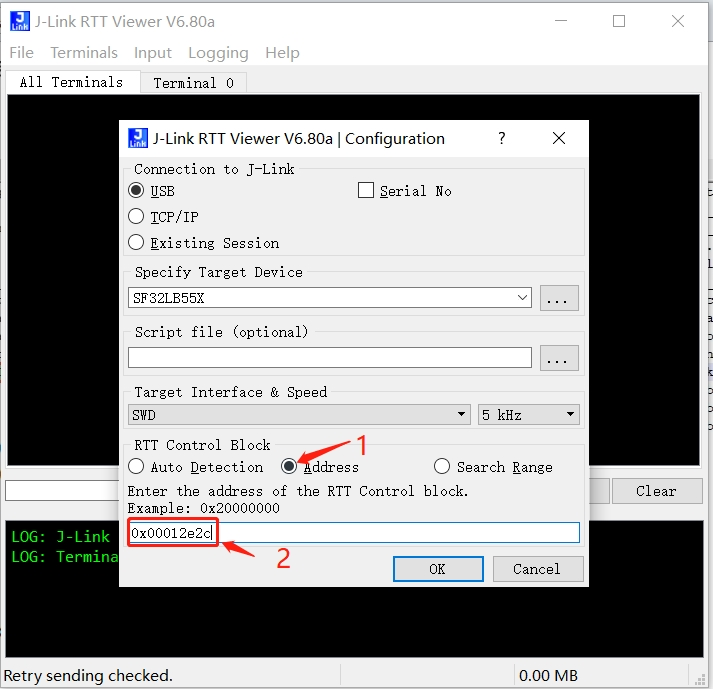

J-Link searches memory starting from `0x20000000` by default, so it cannot find the variable and connection fails. Older SDK version 0.9.7 compiled the address after `0x20000000`, which J-Link could automatically find.

Solution 1: Specify the address in J-Link RTT Viewer.exe. This address can be found by searching the map file, as shown below:

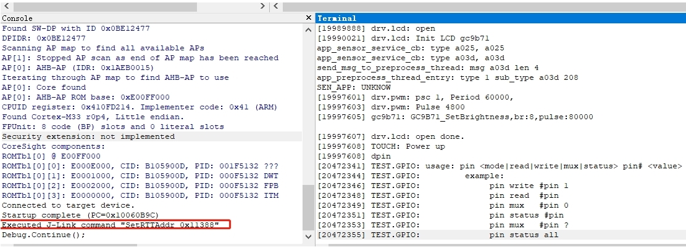

Solution 2: Use Ozone.exe instead. Ozone.exe can find this address through the axf file. As shown below, there is a SetRTTAddr command:


Solution 3: Create a JLinkScript command that will automatically be called when J-Link starts, to set up or search the Control block address range. See the commands below (you can modify as needed):

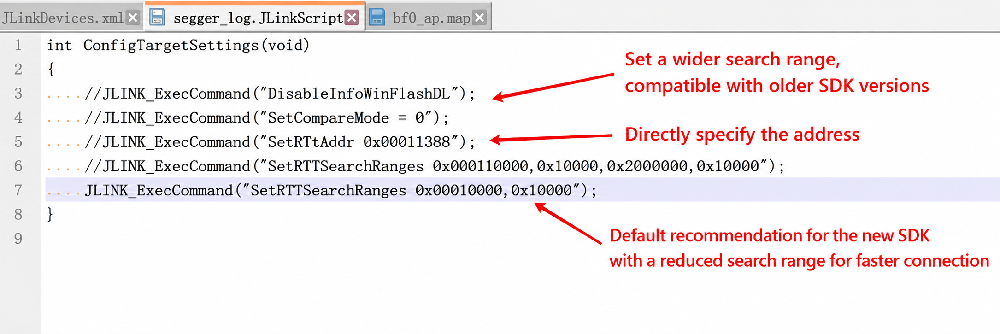

Corresponding XML file modification:

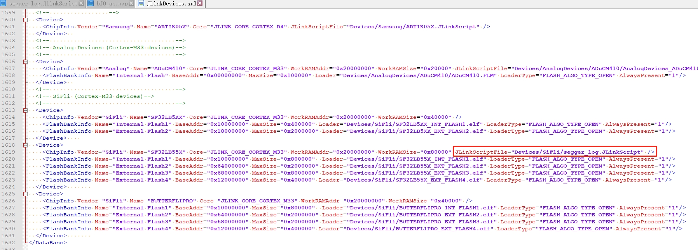

JLink.exe and J-Link RTT Viewer.exe will then automatically connect as before, which is much more convenient. It is recommended to use rttview.exe and `telnet 127.0.0.1` to view logs. The patch file is attached; copy it to the corresponding J-Link installation directory:

`Program Files (x86).7z`

#### How to Read/Write Flash Content with Jlink
1) After J-Link connection is successful, use `mem32` to read, `w4` to write, and `erase` to erase:

```
mem32 0x40014000 1 #Read one 32-bit register value
mem32 0x64000000 10 #Read 10 bytes starting from flash2 address 0x64000000
w4 0x64000000 0x2f 0x2f 0x2f 0x2f 0x2f 0x2f #Write memory or register values, starting from flash2 address 0x64000000, writing the subsequent data
```

2) Use J-Flash to read/write: In the same directory as jlink.exe, there is a jflash tool. Use the menu shown below to read flash content:

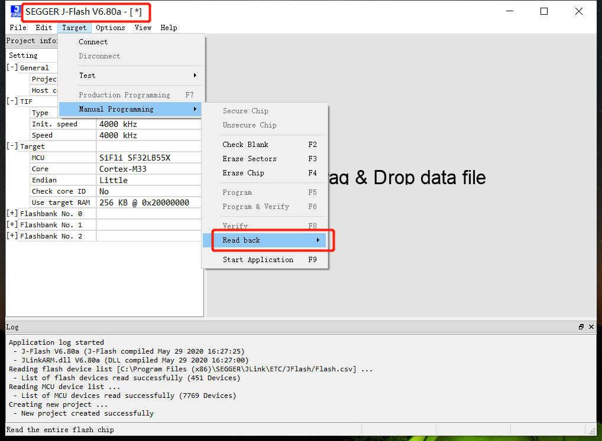

3) `savebin` command for reading:

```
savebin d:\1.bin 0x101b4000 0x100000
```

Above, `0x101b4000` is the memory address and `0x100000` is the read/write memory size (in bytes). To write the saved bin file back:

```
loadbin d:\1.bin 0x101b4000
```

#### Other Common Jlink Commands
1) `halt` and `go` commands: Type `h` to halt the CPU and check the current PC pointer position; type `g` to resume CPU execution.

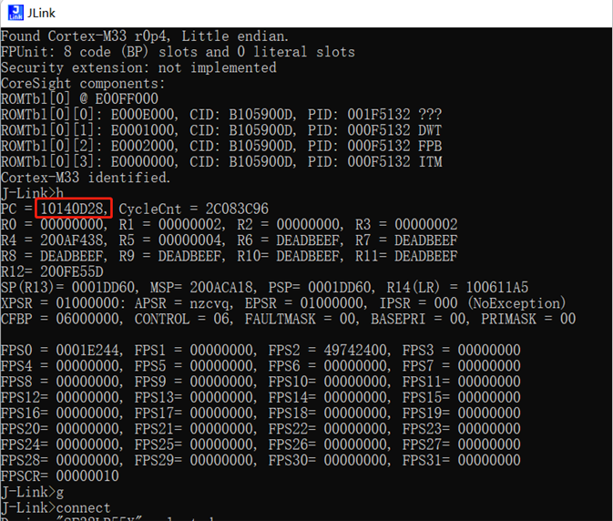

2) Set PC pointer: Commonly used with the `__asm("B .");` instruction. When code execution reaches this instruction, it will halt. As shown above, if the PC pointer is at `0x10140D28`, add 2 to the PC pointer by typing `setpc 0x10140D2A` to skip the `__asm("B .");` instruction and continue execution.

3) Other commands:

```
erase 0x00000000.0x0000FFFF
loadbin <filename> <address> -- Download filename to address
usb -- Connect to the target board
r -- Reset the target board
halt -- Stop the running program on CPU
loadbin -- Load executable binary file
g -- Jump to code segment address and execute
s -- Single step execution (for debugging)
setpc -- Set the PC register value (for debugging)
setbp -- Set breakpoint, after breakpoint halt, use g to continue execution
Regs -- Read register set
wreg -- Write register
mem -- Read memory
w4 -- Write memory
```
