# Crash Analysis Guide

## 1. Introduction

The SDK integrates tools for analyzing crash issues caused by assertions or hardfaults. To facilitate memory leak analysis, enable "Enable memory trace" under `RTOS->RT-Thread Kernel->Memory Management`.


Below is the log information printed when an ASSERT occurs, showing the function and line number where the ASSERT happened, along with thread, message queue, and heap information.
```
16:21:48:257        Assertion failed at function:wait_power_on_anim_done, line number:32 ,(RT_EOK == err)
16:21:48:258        ===================
16:21:48:258        Thread Info        
16:21:48:259        ===================
16:21:48:260        thread          pri  status      sp      top     stack size max used left tick  error
16:21:48:260        --------------- ---  ------- ---------- ---------- ----------  ------  ---------- ---
16:21:48:261        power_on_thread  18  suspend 0x200a342c 0x200a3520 0x00002800    05%   0x00000013 000
16:21:48:262        tpread           10  suspend 0x20003acc 0x20003bfc 0x00000800    25%   0x00000008 000
16:21:48:262        tshell           20  suspend 0x200a04fc 0x200a0670 0x00001000    09%   0x0000000a 000
16:21:48:263        app_bg           19  suspend 0x200042d4 0x200043fc 0x00000800    48%   0x00000001 000
16:21:48:264        app_watch        19  ready   0x2008f9e4 0x2008faec 0x00004000    06%   0x00000003 000
16:21:48:264        ds_proc          14  suspend 0x20037e14 0x20037f30 0x00001000    26%   0x00000002 000
16:21:48:265        ds_mb            13  suspend 0x20036e24 0x20036f30 0x00001000    51%   0x00000001 000
16:21:48:266        nvds_srv         20  suspend 0x20002ee4 0x20002ffc 0x00000800    33%   0x00000005 000
16:21:48:266        alarmsvc         12  suspend 0x200993f4 0x20099464 0x00000800    06%   0x00000005 000
16:21:48:267        tidle            31  ready   0x20096914 0x20096954 0x00000400    06%   0x0000001a 000
16:21:48:268        timer             4  suspend 0x200033bc 0x200033fc 0x00000400    06%   0x00000009 000
16:21:48:268        main             10  suspend 0x20002714 0x200027fc 0x00000800    34%   0x0000000f 000
16:21:48:269        ===================
16:21:48:269        Mailbox Info       
16:21:48:270        ===================
16:21:48:271        mailbox entry size suspend thread
16:21:48:271        ------- ----  ---- --------------
16:21:48:272        ===================
16:21:48:273        MessageQueue Info  
16:21:48:274        ===================
16:21:48:274        msgqueue             entry suspend thread
16:21:48:275        -------------------- ----  --------------
16:21:48:276        mq_guiapp            0001  0
16:21:48:276        app_preprocess_queue 0000  1:app_bg
16:21:48:277        application_lv_mq    0000  0
16:21:48:277        data_mb_mq           0000  1:ds_mb
16:21:48:278        dserv                0000  1:ds_proc
16:21:48:279        nvds_srv             0000  1:nvds_srv
16:21:48:279        ===================
16:21:48:280        Mutex Info         
16:21:48:281        ===================
16:21:48:281        mutex          owner  hold suspend thread
16:21:48:282        ------------ -------- ---- --------------
16:21:48:282        app_db       (NULL)   0000 0
16:21:48:283        app_db       (NULL)   0000 0
16:21:48:284        tplck        (NULL)   0000 0
16:21:48:284        hw_alarm     (NULL)   0000 0
16:21:48:285        ui_pm        (NULL)   0000 0
16:21:48:286        fat1         (NULL)   0000 0
16:21:48:286        fat0         (NULL)   0000 0
16:21:48:287        ds_ipc       (NULL)   0000 0
16:21:48:288        dserv        (NULL)   0000 0
16:21:48:288        flash_mutex  (NULL)   0000 0
16:21:48:289        alarmsvc     (NULL)   0000 0
16:21:48:290        ulog lock    (NULL)   0000 0
16:21:48:291        fslock       (NULL)   0000 0
16:21:48:291        i2c_bus_lock (NULL)   0000 0
16:21:48:292        ===================
16:21:48:293        Semaphore Info     
16:21:48:293        ===================
16:21:48:294        semaphore           v   suspend thread
16:21:48:295        ------------------- --- --------------
16:21:48:296        lv_data             001 0
16:21:48:297        power_on_anim       000 0
16:21:48:298        dfu_gui_epic        000 0
16:21:48:299        lv_lcd              001 0
16:21:48:300        drv_lcd             000 0
16:21:48:301        ui_pm               000 0
16:21:48:301        shrx                000 0
16:21:48:302        message_falsh       001 0
16:21:48:303        poweron             000 0
16:21:48:304        llt                 001 0
16:21:48:305        app_ft_memheap      001 0
16:21:48:305        app_message_memheap 001 0
16:21:48:311        ft3168              000 1:tpread
16:21:48:311        lv_copy             000 0
16:21:48:311        epic                001 0
16:21:48:312        flash1              001 0
16:21:48:312        heap                001 0
16:21:48:313        ===================
16:21:48:313        Memory Info     
16:21:48:313        ===================
16:21:48:314        total memory: 409740 used memory : 73808 maximum allocated memory: 83516
16:21:48:314        ===================
16:21:48:314        MemoryHeap Info     
16:21:48:315        ===================
16:21:48:315        memheap              pool size  max used size available size
16:21:48:316        ------------------- ---------- ------------- --------------
16:21:48:316        llt                 8192       2332          5860 
16:21:48:317        app_ft_memheap      160000     9052          150948
16:21:48:317        app_message_memheap 18000      80            17920
16:21:48:317        =====================
16:21:48:318        PSP: 0x2008fa50, MSP: 0x20090ad0
16:21:48:318        =====================
16:21:48:318         sp: 0x2008fab0
16:21:48:319        psr: 0x40000000
16:21:48:319        r00: 0x00000000
16:21:48:319        r01: 0x40002000
16:21:48:320        r02: 0x00000000
16:21:48:320        r03: 0x00000000
16:21:48:320        r12: 0x10106ab9
16:21:48:320         lr: 0x1010012d
16:21:48:321         pc: 0x10060c1a
16:21:48:321        =====================
16:21:48:321        fatal error on thread: app_watch
```

When a hardfault occurs, the following information is printed, and finally the type of hardfault is printed, such as busfault, mem manage fault, etc.,
The following example shows a crash due to mem manage fault. `DACCVIOL SCB->MMAR: 00000000` indicates that the MPU found an illegal access to address 0, and the instruction address of the access is recorded by the pc register, which is 0x100c6426

```
00:48:26:197         sp: 0x200a00d8
00:48:26:199        psr: 0x41000000
00:48:26:203        r00: 0x00000001
00:48:26:206        r01: 0x000000ff
00:48:26:208        r02: 0x00000000
00:48:26:212        r03: 0x00000000
00:48:26:215        r04: 0x00000008
00:48:26:217        r05: 0x00000000
00:48:26:221        r06: 0x00000000
00:48:26:224        r07: 0x00000000
00:48:26:226        r08: 0x000000ff
00:48:26:231        r09: 0x0000000c
00:48:26:233        r10: 0x00000000
00:48:26:236        r11: 0x6020641c
00:48:26:238        r12: 0x10137332
00:48:26:240         lr: 0x00000000
00:48:26:244         pc: 0x100c6426
00:48:26:247        hard fault on thread: app_watch
00:48:26:250        
00:48:26:252        =====================
00:48:26:256        PSP: 0x200a0048, MSP: 0x200a1544
00:48:26:259        ===================
00:48:26:264        Thread Info        
00:48:26:265        ===================
00:48:26:269        thread      pri  status      sp      top     stack size max used left tick  error
00:48:26:272        ----------- ---  ------- ---------- ---------- ----------  ------  ---------- ---
00:48:26:275        tpread       10  suspend 0x20002acc 0x20002bfc 0x00000800    17%   0x00000001 000
00:48:26:277        tshell       20  suspend 0x200bd824 0x200bd994 0x00001000    11%   0x00000008 000
00:48:26:282        app_bg       19  suspend 0x200032d4 0x200033fc 0x00000800    35%   0x00000001 000
00:48:26:285        app_watch    19  ready   0x200a0374 0x200a0578 0x00004000    52%   0x00000007 -02
00:48:26:288        g_sifli_tid  12  suspend 0x200b3534 0x200b363c 0x00001000    16%   0x00000003 000
00:48:26:290        ds_proc      14  suspend 0x200052e4 0x200053fc 0x00001000    17%   0x0000000a 000
00:48:26:295        ds_mb        13  suspend 0x200042f4 0x200043fc 0x00001000    06%   0x00000005 000
00:48:26:297        alarmsvc     12  suspend 0x200b5d14 0x200b5d88 0x00000800    05%   0x00000005 000
00:48:26:303        tidle        31  ready   0x200b1fcc 0x200b2094 0x00000200    80%   0x0000001e 000
00:48:26:305        timer         4  suspend 0x200023bc 0x200023fc 0x00000400    17%   0x00000009 000
00:48:26:312        main         10  suspend 0x200b1a14 0x200b1afc 0x00000800    11%   0x0000000f 000
00:48:26:314        ===================
00:48:26:319        Mailbox Info       
00:48:26:321        ===================
00:48:26:325        mailbox        entry size suspend thread
00:48:26:328        -------------- ----  ---- --------------
00:48:26:331        g_bf0_sible_mb 0000  0016 0
00:48:26:333        ===================
00:48:26:336        MessageQueue Info  
00:48:26:339        ===================
00:48:26:343        msgqueue             entry suspend thread
00:48:26:347        -------------------- ----  --------------
00:48:26:351        mq_guiapp            0000  0
00:48:26:353        app_preprocess_queue 0000  1:app_bg
00:48:26:356        application_lv_mq    0000  0
00:48:26:359        data_mb_mq           0000  1:ds_mb
00:48:26:361        dserv                0000  1:ds_proc
00:48:26:365        ===================
00:48:26:368        Mutex Info         
00:48:26:370        ===================
00:48:26:372        mutex          owner  hold suspend thread
00:48:26:376        ------------ -------- ---- --------------
00:48:26:378        app_db       (NULL)   0000 0
00:48:26:383        app_db       (NULL)   0000 0
00:48:26:385        tplck        (NULL)   0000 0
00:48:26:390        hw_alarm     (NULL)   0000 0
00:48:26:393        ui_pm        (NULL)   0000 0
00:48:26:396        fat1         (NULL)   0000 0
00:48:26:398        fat0         (NULL)   0000 0
00:48:26:402        ds_ipc       (NULL)   0000 0
00:48:26:405        dserv        (NULL)   0000 0
00:48:26:408        flash_mutex  (NULL)   0000 0
00:48:26:410        alarmsvc     (NULL)   0000 0
00:48:26:415        ulog lock    (NULL)   0000 0
00:48:26:418        fslock       (NULL)   0000 0
00:48:26:421        i2c_bus_lock (NULL)   0000 0
00:48:26:422        ===================
00:48:26:426        Semaphore Info     
00:48:26:428        ===================
00:48:26:431        semaphore            v   suspend thread
00:48:26:434        -------------------- --- --------------
00:48:26:437        flash2               001 0
00:48:26:442        flash1               001 0
00:48:26:445        app_trans            000 0
00:48:26:448        lv_data              001 0
00:48:26:449        lv_lcd               001 0
00:48:26:454        cfbdma               000 0
00:48:26:456        drv_lcd              001 0
00:48:26:459        ui_pm                000 0
00:48:26:461        shrx                 000 0
00:48:26:465        message_falsh        001 0
00:48:26:470        poweron              000 0
00:48:26:472        btn                  001 0
00:48:26:476        g_sifli_sem          000 0
00:48:26:479        llt                  001 0
00:48:26:483        app_ft_memheap       001 0
00:48:26:485        app_message_memheap  001 0
00:48:26:489        app_image_psram_memh 001 0
00:48:26:492        it7259e              000 1:tpread
00:48:26:494        lv_copy              000 0
00:48:26:499        epic                 001 0
00:48:26:502        heap                 001 0
00:48:26:504        ===================
00:48:26:507        Memory Info     
00:48:26:510        ===================
00:48:26:513        total memory: 292712 used memory : 258480 maximum allocated memory: 292324
00:48:26:515        ===================
00:48:26:519        MemoryHeap Info     
00:48:26:521        ===================
00:48:26:524        memheap               pool size  max used size available size
00:48:26:526        -------------------- ---------- ------------- --------------
00:48:26:531        llt                  8192       2732          5760 
00:48:26:538        app_ft_memheap       400000     305016        213016
00:48:26:541        app_message_memheap  96000      80            95920
00:48:26:544        app_image_psram_memh 1100000    801444        430952
00:48:26:546        FPU active!
00:48:26:550        mem manage fault:
00:48:26:553        SCB_CFSR_MFSR:0x82 DACCVIOL SCB->MMAR:00000000
```

## 2. Preparation Work
For ASSERT type crashes, the log provides a rough idea of where the issue occurred. However, for hardfaults or more complex crashes, this information may not be enough, and additional tools are needed. One method is to use a debugger to attach to the target device to inspect global variables and memory (if it's a hardfault, after attaching, you need to modify the registers with the printed SP/LR/PC to view the function call stack. For ASSERT, the function call stack can be seen without modifying the registers). However, this approach locks the target device and isn't ideal for multi-person analysis. The SDK provides the `crash_dump_analyser` tool to save and restore the crash context, enabling developers to analyze the problem on a PC without connecting to the target device.

Required tools:
- J-Link debugger and software package. For installation details, see [J-Link](https://wiki.sifli.com/faq/tools/jlink.html).
- `_SDK_ROOT/tools/crash_dump_analyser/script_`: Scripts to save and restore the context
- `_SDK_ROOT/tools/crash_dump_analyser/simarm/t32marm.exe_`: Trace32 software tool to execute the recovery script. For details, see [Trace32](https://wiki.sifli.com/faq/tools/trace32.html).
- Sifli_Trace: Includes the context-export tools. Download it from [SiFli Tools](https://wiki.sifli.com/tools/index.html).

## 3. Saving the Context

```{only} SF32LB52X or SF32LB57X
### 3.1 Saving the Context over UART

#### 3.1.1 Method 1: SifliUsartServer

Use _SifliUsartServer.exe_, _save_ram_uart_52x.bat_, and the J-Link software package.

- _SifliUsartServer.exe_ is included in the Sifli_Trace package.
- Open _SifliUsartServer.exe_ and click Connect. Only the serial connection is required on the hardware side.


- Run _save_ram_uart_52x.bat_ to invoke JLink.exe. Wait for the command window to close; the exported binary files are written to the script directory.


The batch file invokes _sf32lb52x_uart.jlink_ through `-ip 127.0.0.1:19025`, using the server address provided by _SifliUsartServer.exe_, and writes the command log to _script/log.txt_.


#### 3.1.2 Method 2: AssertDumpUart

- _AssertDumpUart.exe_ is included in the Sifli_Trace package.
- Select UART1 for HCPU or UART4 for LCPU, and choose the J-Link script that matches the chip's PSRAM configuration. Selecting the wrong script can cause the PSRAM export to fail.


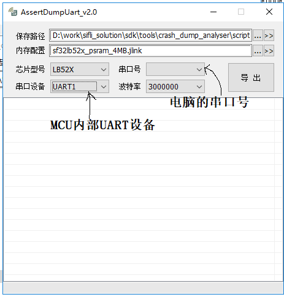


After export, the output directory contains the binary files and the command log in _log.txt_.


```

```{only} SF32LB55X
<!-- SF32LB55X uses J-Link to save the context by default. -->

### 3.1 Saving the Context over J-Link SWD

#### 3.1.1 Method 1: BAT and J-Link Script

Use a hardware J-Link debugger, _save_ram_55x.bat_, and the J-Link software package.

- Connect the debugger to the target's SWD pins.
- Run _save_ram_55x.bat_ and wait for the command window to close.


The batch file invokes _sf32lb55x.jlink_ and writes the command log to _script/log.txt_. The script contains the USB connection and `savebin` commands and can be adjusted when necessary.


#### 3.1.2 Method 2: AssertDumpUart with J-Link

- Open _AssertDumpUart.exe_, select JLINK mode, and confirm that the required debugger is detected.
- Choose the J-Link script that matches the chip's PSRAM configuration. Selecting the wrong script can cause the PSRAM export to fail.


After export, the output directory contains the binary files and the command log in _log.txt_.


```

```{only} SF32LB56X
### 3.1 Saving the Context over UART

#### 3.1.1 Method 1: SifliUsartServer

Use _SifliUsartServer.exe_, _save_ram_uart_56x.bat_, and the J-Link software package.

- _SifliUsartServer.exe_ is included in the Sifli_Trace package.
- SF32LB56 boards expose two debug serial ports: UART1 for HCPU and UART4 for LCPU. To identify UART4, enter boot mode and reset the board; the port that prints the boot log is UART4. For pin information, see [J-Link SWD](https://wiki.sifli.com/board/sf32lb56x/SF32LB56-DevKit-LCD.html#jlink-swd).
- Open _SifliUsartServer.exe_ and click Connect, then run _save_ram_uart_56x.bat_. It invokes JLink.exe with `-ip 127.0.0.1:19025`.


- Wait for the command window to close; the exported binary files are written to the script directory.


The batch file invokes _sf32lb56x_uart.jlink_ and writes the command log to _script/log.txt_. The script contains the IP connection and `savebin` commands and can be adjusted when necessary.


#### 3.1.2 Method 2: AssertDumpUart

- Select UART1 for HCPU or UART4 for LCPU, and choose the J-Link script that matches the chip's PSRAM configuration.


After export, the output directory contains the binary files and the command log in _log.txt_.


### 3.2 Saving the Context over J-Link SWD

#### 3.2.1 Method 1: BAT and J-Link Script

- Connect the debugger to the target's [SWD pins](https://wiki.sifli.com/board/sf32lb56x/SF32LB56-DevKit-LCD.html#jlink-swd).
- Run _save_ram_56x.bat_ and wait for the command window to close.


The batch file invokes _sf32lb56x.jlink_ and writes the command log to _script/log.txt_. The script contains the USB connection and `savebin` commands and can be adjusted when necessary.


#### 3.2.2 Method 2: AssertDumpUart with J-Link

- Open _AssertDumpUart.exe_, select JLINK mode, and confirm that the required debugger is detected.
- Connect the debugger to the target's [SWD pins](https://wiki.sifli.com/board/sf32lb56x/SF32LB56-DevKit-LCD.html#jlink-swd).
- Choose the J-Link script that matches the chip's PSRAM configuration.


After export, the output directory contains the binary files and the command log in _log.txt_.


```

```{only} SF32LB58X
<!-- SF32LB58X uses J-Link to save the context by default. -->

### 3.1 Saving the Context over J-Link SWD

#### 3.1.1 Method 1: BAT and J-Link Script

Use a hardware J-Link debugger, _save_ram_58x.bat_, and the J-Link software package.

- Connect the debugger to the target's [SWD pins](https://wiki.sifli.com/board/sf32lb58x/SF32LB58-DevKit-LCD.html#jlink-swd).
- Run _save_ram_58x.bat_ and wait for the command window to close.


The batch file invokes _sf32lb58x.jlink_ and writes the command log to _script/log.txt_. The script contains the USB connection and `savebin` commands and can be adjusted when necessary.


#### 3.1.2 Method 2: AssertDumpUart with J-Link

- Open _AssertDumpUart.exe_, select JLINK mode, and confirm that the required debugger is detected.
- Connect the debugger to the target's [SWD pins](https://wiki.sifli.com/board/sf32lb58x/SF32LB58-DevKit-LCD.html#jlink-swd).
- Choose the J-Link script that matches the chip's PSRAM configuration.


After export, the output directory contains the binary files and the command log in _log.txt_.


```

**Possible causes of context-export failure:**

- The selected connection method does not match the J-Link script. Both UART-server and hardware J-Link workflows invoke JLink.exe; `ip` selects the UART-server connection, while `usb` selects the hardware debugger. Check the BAT file and its referenced J-Link script before exporting.


- The script switches to a secondary core that the application did not start. For example, _sf32lb55x.jlink_ contains `w4 0x4004f000 1 //Switch to LCPU`. Comment out secondary-core commands when the application does not use that core.


The generated files depend on the corresponding _sf32lbxxx.jlink_ script and can include:

- _hcpu_ram.bin_: HCPU RAM data
- _psram.bin_: PSRAM data
- _ret_ram.bin_: retention RAM data
- _hcpu_itcm.bin_: HCPU ITCM data
- _epic_reg.bin_: EPIC registers
- _ezip_reg.bin_: EZIP registers
- _dsi_host_reg.bin_: DSI host registers
- _dsi_phy_reg.bin_: DSI PHY registers
- _gpio1_reg.bin_: GPIO1 registers
- _gpio2_reg.bin_: GPIO2 registers
- _lcpu_ram.bin_: LCPU RAM data
- _lcpu_dtcm.bin_: LCPU DTCM data

```{only} SF32LB52X or SF32LB55X or SF32LB58X or SF32LB57X
### 3.2 Save an AssertDump-compatible scene using sdk.py
```

```{only} SF32LB56X
### 3.3 Save an AssertDump-compatible scene using sdk.py
```

After building the project and generating the matching ELF/AXF file, use `sdk.py crash-dump capture-live` to export a Trace32/AssertDump-compatible directory. Example:

```bash
sdk.py crash-dump capture-live \
  --transport uart \
  --probe /dev/ttyUSB0 \
  --chip SF32LB52 \
  --chip-model LB525 \
  --output /tmp/live-crash \
  --elf build_sf32lb52-lcd_n16r8_hcpu/main.elf
```

`--probe` selects the serial port that exposes the UART DEBUG IP. Use the actual device path, such as `/dev/ttyUSB0` on Linux or `/dev/cu.*` on macOS.

To export PSRAM as well, add `--include-psram`, or use `--psram-size 8MB` to select the PSRAM script manually. The command prints per-file export progress.

When using SifliUsartServer with J-Link over IP, use `--transport jlink --jlink-ip 127.0.0.1:19025`. To export a single core only, add `--core hcpu` or `--core lcpu`. Example:

```bash
sdk.py crash-dump capture-live \
  --transport jlink \
  --jlink-ip 127.0.0.1:19025 \
  --core hcpu \
  --chip SF32LB52 \
  --chip-model LB525 \
  --output /tmp/live-crash \
  --elf build_sf32lb52-lcd_n16r8_hcpu/main.elf
```

The SDK keeps the IP connection in the `.jlink` script instead of rewriting it to USB J-Link. `--core hcpu` filters out LCPU/LPSYS dump items and removes core-switch commands from the generated script.

The output directory contains `*.bin`, `hcpu.axf`, `log.txt`, and an AssertDump-compatible `manifest.json` for Trace32/AssertDump by default. The full SDK/AI metadata is saved as `sdk_manifest.json`.

To use a GDB-compatible core file, first convert the exported package:

```bash
sdk.py crash-dump readcore \
  --package /tmp/live-crash \
  --elf build_sf32lb52-lcd_n16r8_hcpu/main.elf \
  --output /tmp/live-crash/coredump.elf
```

Then analyze the captured core ELF with the matching firmware ELF:

```bash
sdk.py crash-dump analyze \
  --core /tmp/live-crash/coredump.elf \
  --elf build_sf32lb52-lcd_n16r8_hcpu/main.elf
```

## 4. Restoring Context
### 4.1 Restoring HCPU Context
#### Double-click to run t32marm.exe, as shown below:

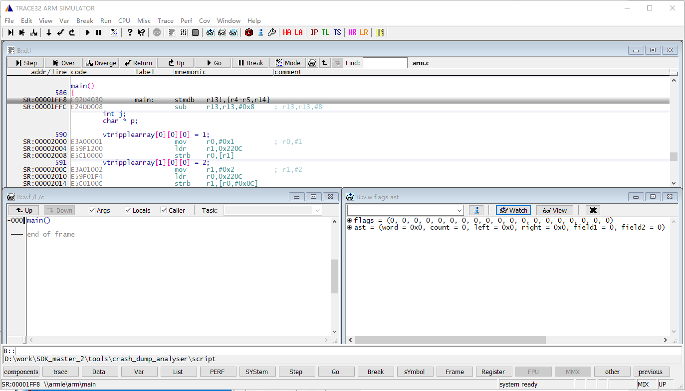

#### Click the HA button (HCPU assertion)
- Select the current chip and set the path where the exported bin files are located (ensure the path does not end with a slash), and manually place the AXF file to view the HCPU crash context.
- If some bins are missing (e.g., if some dumps don't have PSRAM), you can uncheck those.

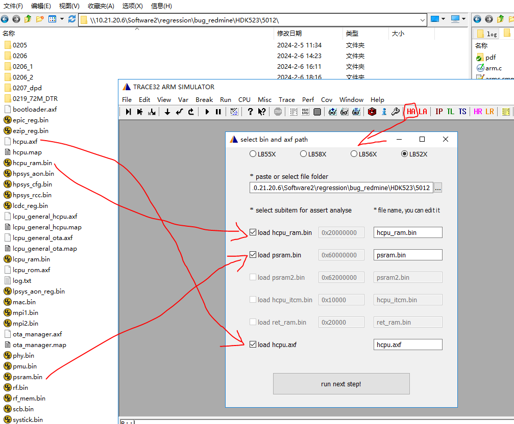

#### Click the "run_next_step" button to load
Once loaded successfully, the following crash context information is displayed:

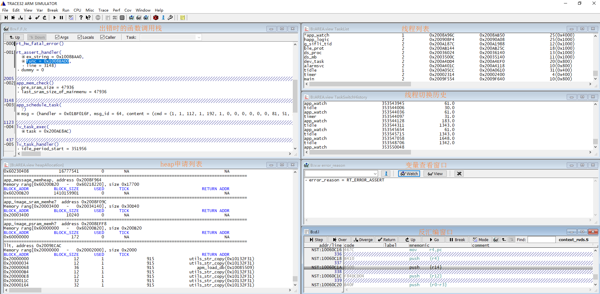

You can switch between different windows from the Window menu.

If the window is accidentally closed, you can also enter the command below "B::" to run the wake-up process.

For example: From the information in the following picture, we can see the heapAllocation window, whose full name is _B::AREA.view heapAllocation_. We can input this command to open the corresponding window, or we can directly input _AREA.view heapAllocation_.

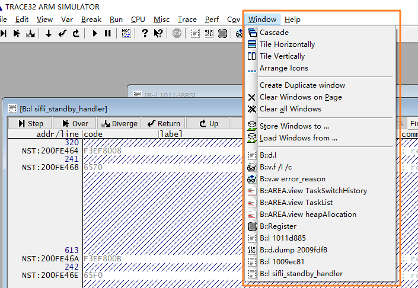

`B::v.f /l /c `The window is the function call stack of the crash site.

The heapAllocation window displays the allocation status of all heap pools in the system, including the system heap and memheap_pool:
- system heap: Pool used by `rt_malloc` and `lv_mem_alloc`.
- Various memheap_pools: Pools created with `rt_memheap_init`, allocation, and release are handled by `rt_memheap_alloc` and `rt_memheap_free`.

The fields in the allocation information list represent:
- BLOCK_ADDR: The starting address of the allocated memory block, including the management item.
- BLOCK_SIZE: The size of the allocated memory, excluding the length of the management item.
- USED: Whether it is allocated, 1 means allocated, 0 means not allocated.
- TICK: The time when the allocation occurred, in OS ticks (1 ms).
- RETURN ADDR: The address of the caller.

#### Handling Missing Crash Stack
After completing the previous 3 steps, sometimes the crash scene stack will not be displayed, possibly because the dump content was not saved or was saved incorrectly. You can try the following methods:
- 1. Load the scene stack from Jlink halt log information
  The HR (HCPU Registers) button is used to restore CPU registers that did not reach the exception handler.
  After clicking the button, select the exported _log.txt_ file, which will fill the 16 HCPU registers back into Trace32.

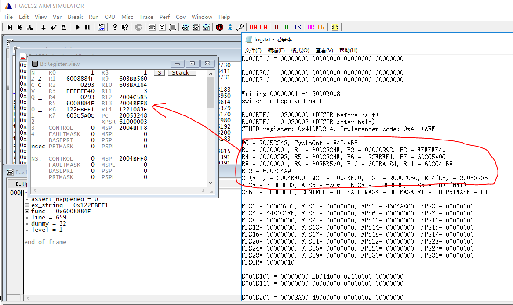


- 2. From the 16 registers printed in the log, refill them into the register window of trace32

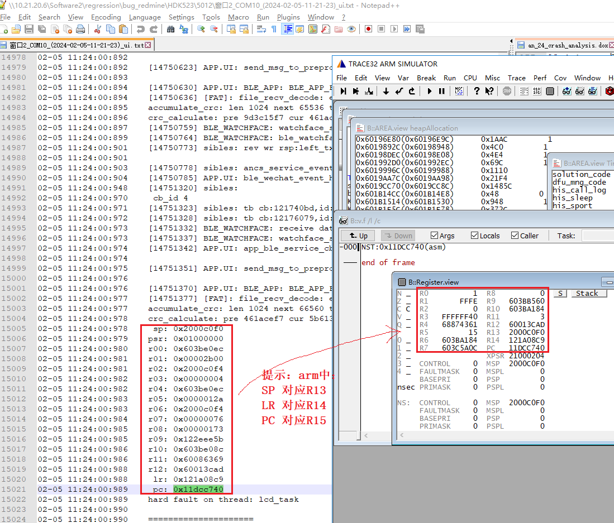


- 3. For gcc compilation, you can try modifying PC to be the same value as r14

### 4.2 Restoring LCPU Context

Restoring LCPU context is similar to HCPU, but first, you need to copy the required files (lcpu.axf and rom_axf files) to the script directory.


The required file paths are as shown below, choose the correct `rom_axf` file for your model. The lcpu file depends on whether it was compiled with Keil or GCC.
#### Important Notes:
- LCPU files compiled with Keil have an `.axf` extension, while those compiled with GCC have an `.elf` extension. Make sure to distinguish between them.
- When choosing the `rom_axf` file, ensure you select the correct one based on the board model.


Next, open Trace32 and select the LA button. In the pop-up window, configure as shown below:


## 5. Common Trace32 Commands

In addition to the windows that are already opened, you can use the View menu to open new windows, as shown below:
- Registers: View the CPU registers.
- Dump: View data at a specific address.
- List Source: View the assembly code.
- Watch: View variables.

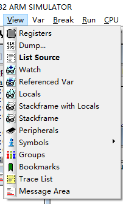

The variable window supports wildcards. For example, input `*error*rea*` and press Enter. It will suggest `error_reason`, which can then be selected and added to the watch window.

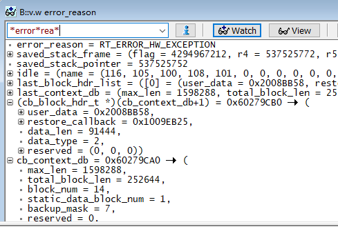

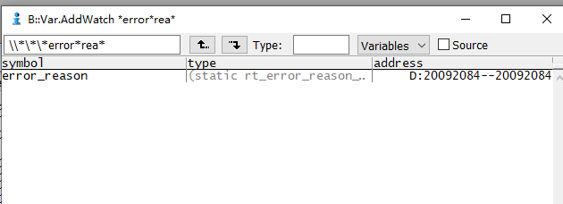

You can also type commands in the command window below (commands are case-insensitive) to open debugging windows.

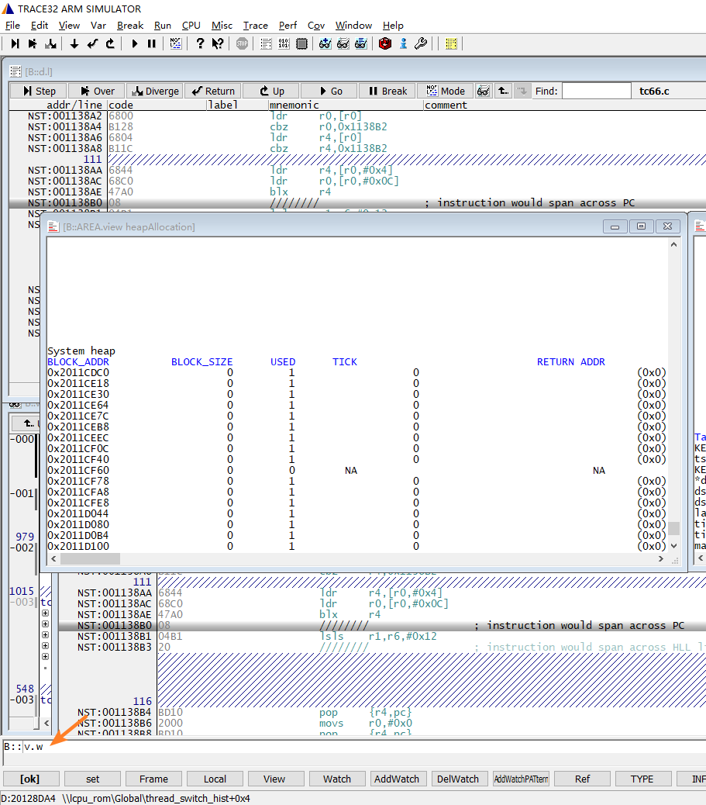

Examples:
- `V.W`: Open the watch window.
- `D.DUMP address`: View data at a specified address, for example, `D.DUMP 20000000` will show data starting at address `0x20000000`.
- `L address/symbol`: View assembly at a specified address, for example, `L 1011D888` will open the assembly window showing code starting at `0x1011D888`. `L rt_thread_stack_restore` will show the assembly code for the `rt_thread_stack_restore` function.

## 6. HEAP Analysis Example

The image below shows a scenario where heap memory leak is detected. The callstack window shows the function call stack for the assertion, and the heapAllocation window's system heap list shows the memory blocks allocated by `rt_malloc`. The `RETURN ADDR` shows the function name that called `rt_malloc`, and `TICK` shows the `rt_tick_get` time at the time of allocation.

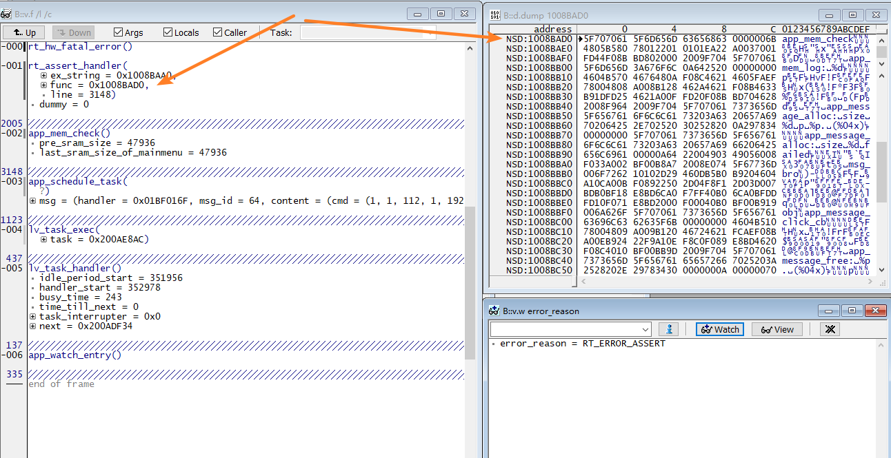

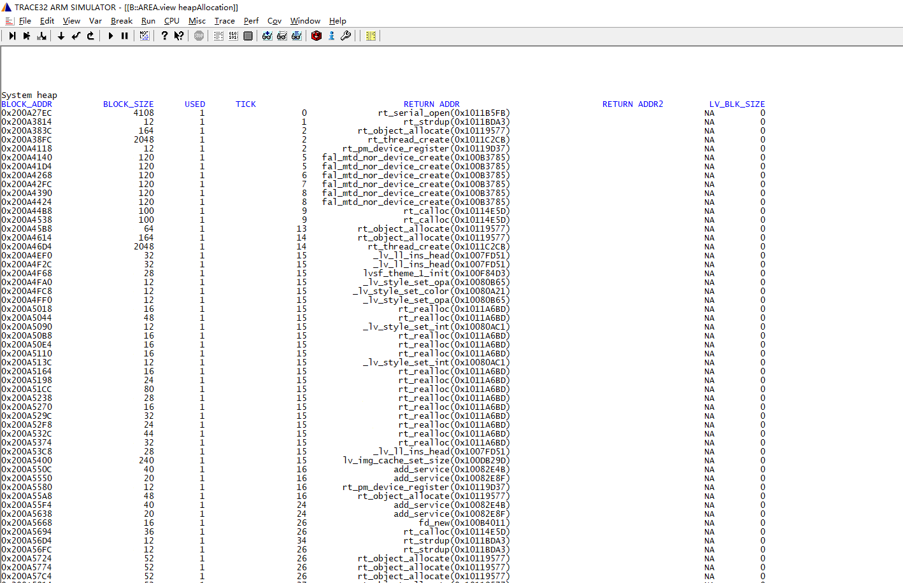

The structure of a system heap memory management item is shown below. The first `uint16` is a special word `0x1EA0`, which is the value for all memory management items. If this value is not `0x1EA0`, the item has been illegally modified. The second `uint16` is a `used` flag: 1 means allocated, and 0 means not allocated. If values other than 0 or 1 appear, it indicates illegal modification, which could also lead to memory allocation failures.

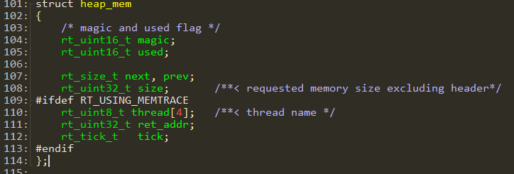

For example, in the HEAP window, the first row with an address of `0x200A27EC` shows a memory block allocated by the `rt_serial_open` function at the instruction address `0x1011B5FB`. The memory size allocated is 4108 bytes. According to the `struct heap_mem` structure, the system heap management item length is 28 bytes. Therefore, the memory address used by the caller is 28 bytes offset from the starting address of the memory block. 

In the example, the function `_lv_ll_ins_head` allocated 88 bytes of memory. The starting address of the memory block is `0x200B08E0`. In the variable view window, you can check this variable by using `(lv_obj_t*)(0x200B08E0+28)`. From the LVGL code, we can see that the size of `lv_obj_t` is 88 bytes (plus 8 bytes for the LVGL list link item after `lv_obj_t`). The function address `signal_cb` is shown in the command line window. You can enter the command `L 100DC9A1` to open the disassembly window and see the assembly code for that address, confirming the function is `lv_img_signal`, indicating that the `lv_img` control allocated the memory.

When memory leaks occur, you can use the allocation address and time to analyze where memory was allocated but not freed.

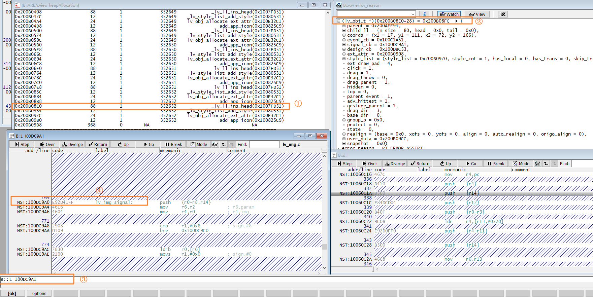
