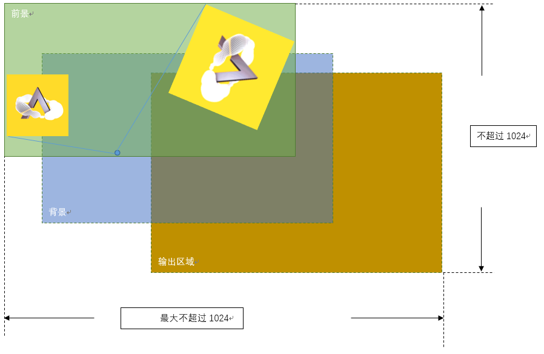
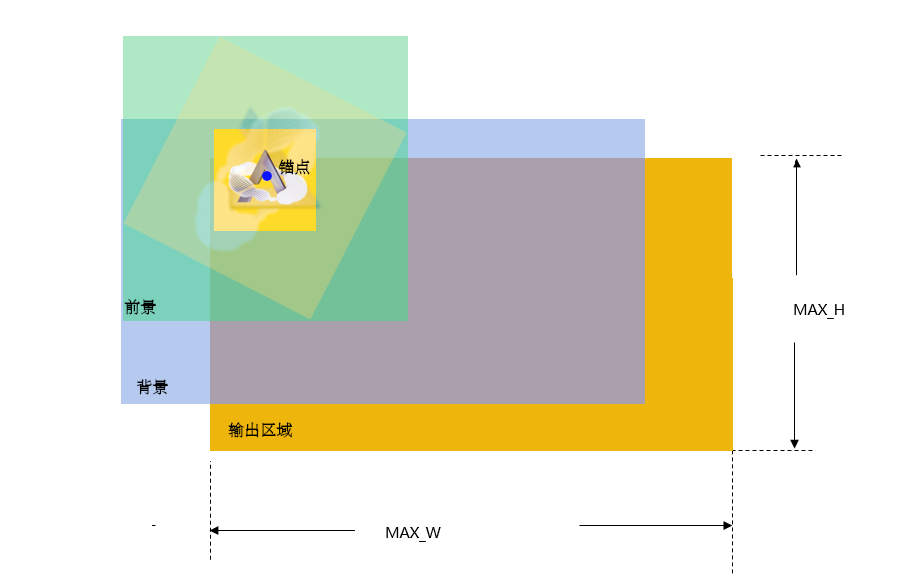
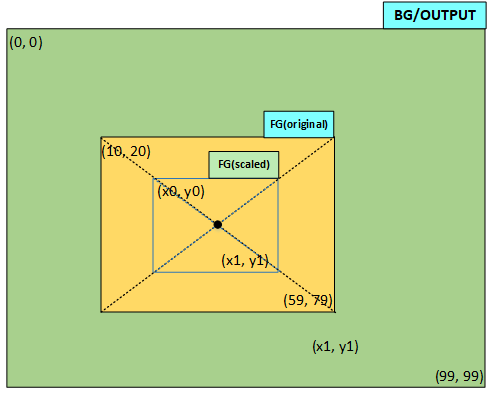

# EPIC

The HAL EPIC module provides an abstract software interface to operate the hardware EPIC module. EPIC is a 2D graphics engine with the following features:

## Main Features

- Alpha blending of two images and saving the result to an output buffer
- Rotating an image (foreground) around any point and blending the rotated image with a background image, saving the blended result to the output buffer
- Scaling (enlarge/reduce) the foreground image, blending the scaled image with the background, and saving the result to the output buffer
- Supports combined rotation and scaling in a single GPU operation without requiring an intermediate buffer
- Filling a given buffer with opaque or semi-transparent colors
- All graphics operations support both polling and interrupt modes
- Automatic color format conversion if input and output color formats differ
- The two images for blending can have different sizes and partially overlap; you can also specify a sub-region of the blended area as the output region
- The background and output images can share the same buffer, e.g., both using the frame buffer
- Supports fractional coordinate blending (not supported on 55X)


## Input/Output Limitations
### Transformation Features
| Feature          | Supported Formats                            |  55X                                                    |  58X                                                                  |  56X        |  52X        |  57X                                                                    |
|------------------|----------------------------------------------|---------------------------------------------------------|-----------------------------------------------------------------------|-------------|-------------|-------------------------------------------------------------------------|
| Scaling          | All color formats supported by the chip      | 3.8, i.e., reduce 8x, enlarge 256x, precision 1/256     | 10.16, i.e., reduce 1024x, enlarge 65536x, precision 1/65536          | Same as 58X | Same as 58X | 13.16, i.e., reduce 8192x, enlarge 65536x, precision 1/65536           |
| Rotation         | Except EZIP, JPG, YUV formats                | [0 ~ 3600], unit is 0.1 degree                         | Same as 55X                                                           | Same as 55X | Same as 55X | Same as 55X                                                             |
| Horizontal Mirror| All color formats supported by the chip      | Supported                                               | Supported                                                             | Supported   | Supported   | Supported                                                               |
| Vertical Mirror  | Except EZIP, JPG formats                     | Not supported                                           | Not supported                                                         | Not supported | Supported | Supported                                                               |
| Transform Matrix | Except EZIP, JPG, YUV formats                | Not supported                                           | Not supported                                                         | Not supported | Not supported | Supported                                                           |

```{note}
- Rotation and scaling can be performed simultaneously with the same anchor point, and arbitrary anchor points are supported.
- Mirroring supports arbitrary anchor points but cannot be performed simultaneously with rotation or scaling.
- Transform matrix is a new feature on 57X, performing affine transformation on the foreground image through a 3x3 matrix, supporting arbitrary linear transformations.
- A4/A8 cannot rotate or use transform matrix when used as mask
```

### Coordinate Range
| Maximum Output Dimensions per Hardware Blend | 55X                      | 58X    |  56X   |  52X    | 57X   |
|:---                                          |:---                      |:---    |:---    |:---     |:---   |
| Scaling/Rotation/Fractional Coordinates/Mirroring | 1024 (including anchor point) | 1024   | 512    | 512     | 512   |
| Normal                                       | 1024                     | 1024   | 1024   | 1024    | 8192  |

The maximum output range for a single software blend is defined by the macro `EPIC_COORDINATES_MAX` in bf0_hal_epic.h, which takes the maximum dimensions for scaling/rotation and subtracts approximately 10 (a common reduction factor). If the reduction factor is larger, `EPIC_COORDINATES_MAX` needs to be further reduced.

```{note}
- The maximum output range here refers to the union of the foreground, background, and output regions, where both the height and width must not exceed this range.
- When the foreground is transformed (scaling/rotation, etc.), the foreground region only includes the area of the transformed image within the output region (on 55X, the anchor point also needs to be included).
```

For example, on the 55X, when the foreground image is rotated and scaled around an anchor point outside the image, the union of the transformed foreground, background, and output regions must not exceed `EPIC_COORDINATES_MAX`.


For non-55X chips, transformations can be converted to use the image center as the anchor point, so only MAX_W and MAX_H need to be considered not to exceed `EPIC_COORDINATES_MAX`.



## Supported Color Formats
| Input Color Format Supported         |  55X   |  58X   |  56X   |  52X   |  57X   |
|--------------------------------------|--------|--------|--------|--------|--------|
| RGB565/ARGB8565/RGB888/ARGB88888     |   Y    |   Y    |   Y    |   Y    |   Y    |
| EZIP                                 |   Y    |   Y    |   Y    |   Y    |   Y    |
| L8                                   |   N    |   Y    |   Y    |   Y    |   Y    |
| A4/A8 (Mask, Overwrite, Fill)        |   N    |   Y    |   Y    |   Y    |   Y    |
| YUV (YUYV/UYVY/iYUV)                 |   N    |   N    |   Y    |   Y    |   Y    |
| A2 (Fill)                            |   N    |   N    |   N    |   Y    |   Y    |
| L4                                   |   N    |   N    |   N    |   N    |   Y    |
| JPEG                                 |   N    |   N    |   N    |   N    |   Y    |


| Output Color Format Supported        |  55X   |  58X   |  56X   |  52X   |  57X   |
|--------------------------------------|--------|--------|--------|--------|--------|
| RGB565/ARGB8565/RGB888/ARGB88888     |   Y    |   Y    |   Y    |   Y    |   Y    |
| A8                                   |   N    |   N    |   N    |   N    |   Y    |
| GRAY8/GRAY4/GRAY2                    |   N    |   N    |   N    |   N    |   Y    |
| F8/F4/F2 (Flexible)                  |   N    |   N    |   N    |   N    |   Y    |


## Special Features Support
| Feature                           |  55X   |  58X   |  56X   |  52X   |  57X   |
|-----------------------------------|--------|--------|--------|--------|--------|
| Color Matrix Transformation       |   N    |   N    |   N    |   N    |   Y    |


## Image Handling Recommendations
- Add a transparent (or background color) border around images to be rotated or scaled to prevent edge clipping and aliasing
- To avoid discontinuity during scaling, the scaling factor difference for continuous scaling should be greater than 1/256 (i.e., scaling precision should not exceed 1/256)
- Although rotation and scaling can be performed simultaneously, it is recommended to perform only one transformation at a time for better output quality

For detailed API documentation, refer to [EPIC](#hal-epic).


## Color Storage Format in SRAM

|                 | bit31~bit24 | bit23~bit16 | bit15~bit8          | bit7~bit0          |
| --------------- | ----------- | ----------- | ------------------- | ------------------ |
| RGB565          |    /        |    /        | R4~R0G5~G3          | G2~G0B4~B0         |
| RGB565_SWAP     |    /        |    /        | G2~G0B4~B0          | R4~R0G5~G3         |
| ARGB8565        |    /        | A7 ~ A0     | R4~R0G5~G3          | G2~G0B4~B0         |
| RGB888          |    /        | R7 ~ R0     | G7 ~ G0             | B7 ~ B0            |
| ARGB8888        | A7 ~ A0     | R7 ~ R0     | G7 ~ G0             | B7 ~ B0            |
| A8              | D7 ~ D0     | C7~C0       | B7~B0               | A7~A0              |
| A4/L4/G4        |    /        |    /        | D3~D0C3~C0          | B3~B0A3~A0         |
| A2/G2           |    /        |    /        | H1H0G1G0F1F0E1E0    | D1D0C1C0B1B0A1A0   |
| (A4/L4/G4)_SWAP |    /        |    /        | C3~C0D3~D0          | A3~A0B3~B0         |
| (A2/G2)_SWAP    |    /        |    /        | E1E0F1F0G1G0H1H0    | A1A0B1B0C1C0D1D0   |

```{note}
Color data is stored tightly packed. In A2/A4/A8/G2/G4/L4 and (A2/A4/G2/G4/L4)_SWAP formats, A–H represent pixel points (displayed from left to right).
```

## Using HAL EPIC

First, call {c:func}`HAL_EPIC_Init` to initialize HAL EPIC. In the {c:type}`EPIC_HandleTypeDef` structure, specify the EPIC instance (i.e., the hardware EPIC module to use). The chip has only one EPIC instance: {c:macro}`hwp_epic`.
After initialization, you can call various graphics operation interfaces to process data.

For example,
```c
static EPIC_HandleTypeDef epic_handle;

void init_epic(void) 
{ 	// Initialize driver and enable EPIC IRQ
    HAL_NVIC_SetPriority(EPIC_IRQn, 3, 0);
    HAL_NVIC_EnableIRQ(EPIC_IRQn);
    
    epic_handle.Instance = hwp_epic;
    HAL_EPIC_Init(&epic_handle);
}

/* EPIC IRQ Handler */
void EPIC_IRQHandler(void)
{
    HAL_EPIC_IRQHandler(&epic_handle);
}

```

{c:func}`HAL_EPIC_BlendStartEx_IT` is used for interrupt mode fill, blend, rotate, and scale operations. You need to call {c:func}`HAL_EPIC_IRQHandler` in the interrupt service routine to handle the interrupt.


### Blending Example
As shown in Figure 1, the `blend_img` example overlays part of an image onto a background:
1. The foreground image region is (10, 20)~(59,79), the background image region is (0,0)~(99,99), and the blend region is (5,10)~(44,59). All coordinates are in the same coordinate system.
2. The foreground image is blended with the background at opacity 100.

After blending, the color values in the region (5,10)~(44,59) are sequentially written to the background buffer. The overlapping part (the crossed area, i.e., [10,20]~[44,59]) contains the blended color, while the non-overlapping part retains the original background color.

Note that all data buffers point to the top-left pixel of the corresponding region. For example, p_fg_img->data points to the color value of the foreground image at (10,20), and output_img.data points to the top-left pixel of the output region, i.e., (5,10).
output_img.width and output_img.total_width: output_img.width is the width of the output region (44-5+1=40), while output_img.total_width is the width of the output buffer (100, since the buffer is 100x100). EPIC will skip the remaining 60 pixels after writing 40 pixels per line and continue to the next line.
fg_img and bg_img width and total_width have the same meaning.


```c
void epic_cplt_callback(EPIC_HandleTypeDef *epic)
{
    /* release the semaphore to indicate epic operation done */
    sema_release(epic_sema);
}

/* blend the foreground with background image using 100 opacity (0 is transparent, 255 is opaque)
 * output buffer is same as background image buffer, usually they're both frame buffer.
 * 
 */
void blend_img(void)
{
    EPIC_LayerConfigTypeDef layers[2];

    EPIC_LayerConfigTypeDef *p_bg_img = &layers[0];
    EPIC_LayerConfigTypeDef *p_fg_img = &layers[1];
    EPIC_LayerConfigTypeDef output_img;
    HAL_StatusTypeDef ret;         
    uint32_t buffer_start_offset;    
    
    /* foreground image, its coordinate (10,20)~(59,79), buffer size is 50*60 */
    HAL_EPIC_LayerConfigInit(p_fg_img);
    p_fg_img->data = fg_img_buf;
    p_fg_img->x_offset = 10;
    p_fg_img->y_offset = 20;
    p_fg_img->width = 50;
    p_fg_img->height = 60;
    p_fg_img->total_width = 50;
    p_fg_img->color_mode = EPIC_COLOR_RGB565;
    p_fg_img->alpha = 100;
    
    /* background image, its coordinate (0,0)~(99,99), buffer size is 100*100 */
    HAL_EPIC_LayerConfigInit(p_bg_img);
    p_bg_img->data = bg_img_buf;
    p_bg_img->x_offset = 0;
    p_bg_img->y_offset = 0;
    p_bg_img->width = 100;
    p_bg_img->height = 100;
    p_bg_img->total_width = 100;
    p_bg_img->color_mode = EPIC_COLOR_RGB565;
    
    /* output image, share the same buffer as bg_img_buf,
       output area is (5,10)~(44,59), buffer size is 100*100 */
    HAL_EPIC_LayerConfigInit(&output_img);
    /* topleft pixel is (5, 10), skip (10*100+5) pixels */
    buffer_start_offset = (10 - 0) * 100 * 2 + (5 - 0) * 2;
    output_img.data = (uint8_t *)((uint32_t)bg_img_buf + buffer_start_offset);
    /* output area topleft coordinate */
    output_img.x_offset = 5;
    output_img.y_offset = 10;
    /* output area width */
    output_img.width = 40;
    /* output area height */
    output_img.height = 50;
    /* output buffer width, it's different from output_img.width */
    output_img.total_width = 100;
    output_img.color_mode = EPIC_COLOR_RGB565;
    
    /* set complete callback, and start EPIC */
    epic_handle.XferCpltCallback = epic_cplt_callback;
    ret = HAL_EPIC_BlendStartEx_IT(&epic_handle, &layers, 2, &output_img);
    /* check ret value if any error happens */
    ...
    /* wait for completion */
    sema_take(epic_sema);
}

```


### Rotation Example

As shown in Figure 2, the `rotate_img` example rotates the foreground image at (10,20)~(59,79) clockwise by 30 degrees around its center, blends it with the background, and updates the corresponding region in the background buffer. Pixels outside the rotated region retain the background color.
Since the bounding rectangle of the rotated image expands ([x0,y0]~[x1,y1]), you can simply set the output region to the maximum; HAL will automatically calculate the bounding rectangle. If the background and output buffers are the same, only the pixels covered by the rotated region are updated.


```c
/* rotate the foreground image by 30 degree (clockwise) and blend it with background using 100 opacity (0 is transparent, 255 is opaque)
 * output data is written back to background image buffer, it can also output to another buffer like blend_img_1.
 * 
 */
void rotate_img(void)
{
    EPIC_LayerConfigTypeDef layers[2];

    EPIC_LayerConfigTypeDef *p_bg_img = &layers[0];
    EPIC_LayerConfigTypeDef *p_fg_img = &layers[1];

    EPIC_LayerConfigTypeDef output_img;
    HAL_StatusTypeDef ret;
    
    /* foreground image, its coordinate (10,20)~(59,79) before rotation, buffer size is 50*60 */
    HAL_EPIC_LayerConfigInit(p_fg_img);
    p_fg_img->data = fg_img_buf;
    p_fg_img->x_offset = 10;
    p_fg_img->y_offset = 20;
    p_fg_img->width = 50;
    p_fg_img->height = 60;
    p_fg_img->total_width = 50;
    p_fg_img->color_mode = EPIC_COLOR_RGB565;
    p_fg_img->alpha = 100;
    /* foreground image is rotated by 30 degree around its center */
    p_fg_img->transform_cfg.angle = 300;
    p_fg_img->transform_cfg.pivot_x = p_fg_img->width / 2;
    p_fg_img->transform_cfg.pivot_y = p_fg_img->height / 2;
    p_fg_img->transform_cfg.scale_x = EPIC_INPUT_SCALE_NONE;
    p_fg_img->transform_cfg.scale_y = EPIC_INPUT_SCALE_NONE;    


    /* background image, its coordinate (0,0)~(99,99), buffer size is 100*100 */
    HAL_EPIC_LayerConfigInit(p_bg_img);
    p_bg_img->data = bg_img_buf;
    p_bg_img->x_offset = 0;
    p_bg_img->y_offset = 0;
    p_bg_img->width = 100;
    p_bg_img->height = 100;
    p_bg_img->total_width = 100;
    p_bg_img->color_mode = EPIC_COLOR_RGB565;
    
    /* output image, its coordinate (0,0)~(99,99), share same buffer as background image */
    HAL_EPIC_LayerConfigInit(&output_img);
    output_img.data = bg_img_buf;
    output_img.x_offset = 0;
    output_img.y_offset = 0;
    output_img.width = 100;
    output_img.height = 100;
    output_img.total_width = 100;
    output_img.color_mode = EPIC_COLOR_RGB565;
    
    
    /* set complete callback, and start EPIC */
    epic_handle.XferCpltCallback = epic_cplt_callback;
    ret = HAL_EPIC_BlendStartEx_IT(&epic_handle, &layers, 2, &output_img);
    /* check ret value if any error happens */
    ...
    /* wait for completion */
    sema_take(epic_sema);
}
```

### Scaling Example

As shown in Figure 3, the `scale_down_img` example scales the foreground image at (10,20)~(59,79) down to 71% of its original size in both horizontal and vertical directions, keeping the center point unchanged.
Similar to rotation, you can set the output region to the maximum. If the output buffer shares the background buffer, HAL will only update the pixels in the scaled region ([x0,y0]~[x1,y1]).




```c

/* scale down the foreground image by 1.4 and blend it with background using 100 opacity (0 is transparent, 255 is opaque)
 * output data is written back to background image buffer, it can also output to another buffer like blend_img_1.
 * 
 */
void scale_down_img(void)
{
    EPIC_LayerConfigTypeDef layers[2];

    EPIC_LayerConfigTypeDef *p_bg_img = &layers[0];
    EPIC_LayerConfigTypeDef *p_fg_img = &layers[1];

    EPIC_LayerConfigTypeDef output_img;
    HAL_StatusTypeDef ret;
    
    /* foreground image, its coordinate (10,20)~(59,79) before scaling */
    HAL_EPIC_LayerConfigInit(p_fg_img);
    p_fg_img->data = fg_img_buf;
    p_fg_img->x_offset = 10;
    p_fg_img->y_offset = 20;
    p_fg_img->width = 50;
    p_fg_img->height = 60;
    p_fg_img->total_width = 50;
    p_fg_img->color_mode = EPIC_COLOR_RGB565;
    p_fg_img->alpha = 100;
    /* no rotation, both X and Y direction are scaled down by 1.4, 
       the image center is in the same position after scaling */
    p_fg_img->transform_cfg.pivot_x = p_fg_img->width / 2;
    p_fg_img->transform_cfg.pivot_y = p_fg_img->height / 2;
    p_fg_img->transform_cfg.scale_x = (EPIC_INPUT_SCALE_NONE*14)/10;
    p_fg_img->transform_cfg.scale_y = p_fg_img->transform_cfg.scale_x;       


    /* background image, its coordinate (0,0)~(99,99) */
    HAL_EPIC_LayerConfigInit(p_bg_img);
    p_bg_img->data = bg_img_buf;
    p_bg_img->x_offset = 0;
    p_bg_img->y_offset = 0;
    p_bg_img->width = 100;
    p_bg_img->height = 100;
    p_bg_img->total_width = 100;
    p_bg_img->color_mode = EPIC_COLOR_RGB565;
    
    /* output image, its coordinate (0,0)~(99,99), share same buffer as background image */
    HAL_EPIC_LayerConfigInit(&output_img);
    output_img.data = bg_img_buf;
    output_img.x_offset = 0;
    output_img.y_offset = 0;
    output_img.width = 100;
    output_img.height = 100;
    output_img.total_width = 100;
    output_img.color_mode = EPIC_COLOR_RGB565;

    
    /* set complete callback, and start EPIC */
    epic_handle.XferCpltCallback = epic_cplt_callback;
    ret = HAL_EPIC_BlendStartEx_IT(&epic_handle, &layers, 2, &output_img);
    /* check ret value if any error happens */
    ...
    /* wait for completion */
    sema_take(epic_sema);
}
```

### Solid Color Fill Example
For a 100x90 buffer, fill the region (20,10)~(39,49) with color RGB(99,107,123). The configured color is in RGB888 format, and the filled color format is RGB565; the hardware will convert the color format.
Opacity is 100; 255 is opaque, 0 is transparent.
Since the first pixel to fill is at (20,10), which is offset from the buffer start, the configured start address should be the offset address. total_width is the total width of the buffer (100), width is the width of the fill region (39-20+1=20).
After filling 20 pixels per line, the remaining 80 pixels are skipped, and the next line is filled, until the specified number of lines is filled.
```c
void fill_color(void)
{
    EPIC_FillingCfgTypeDef param;
    uint32_t start_offset;
    HAL_StatusTypeDef ret; 

    HAL_EPIC_FillDataInit(&param);
    /* topleft pixel offset in the output buffer */
    start_offset = 2 * (10 * 100 + 20);
    param.start = (uint8_t *)((uint32_t)output_buf + start_offset);
    /* filled color format RGB565 */
    param.color_mode = EPIC_COLOR_RGB565;
    /* filling area width */
    param.width = 20;
    /* filling area height */
    param.height = 40;
    /* filling buffer total width */
    param.total_width = 100;
    /* red part of RGB888 */
    param.color_r = 99;
    /* green part of RGB888 */
    param.color_g = 107;
    /* blue part of RGB888 */
    param.color_b = 123;
    /* opacity is 100 */
    param.alpha = 100;

    
    /* check ret if any error happens */
    /* set complete callback, and start EPIC */
    epic_handle.XferCpltCallback = epic_cplt_callback;
    ret = HAL_EPIC_FillStart_IT(&epic_handle, &param);
    /* check ret value if any error happens */
    ...
    /* wait for completion */
    sema_take(epic_sema);
}
```

### Gradient Fill
Gradient fill supports setting the colors of four corners, then interpolating the colors in between. Use the `HAL_EPIC_FillGrad_IT` interface.

### Continuous Blending
The continuous blending interface is generally used for blending small images with the same rendering properties, such as overlaying multiple characters (with the same color, format, etc., only coordinates, size, and data address change).
This set of interfaces is simple and only supports CPU polling mode.

Usage steps:
1. `HAL_EPIC_ContBlendStart`  -- Start continuous blending for the first time
2. `HAL_EPIC_ContBlendRepeat` -- For the subsequent N blends after the first
3. `HAL_EPIC_ContBlendStop`   -- Exit continuous blending mode


### Special Transformation Function
In some scenarios, you may need to change the foreground parameters after blending each small region. The `HAL_EPIC_TransStart` interface provides this capability, offering three parameters: `hor_path`, `ver_path`, and `user_data`, which control the output region stepping and allow changing the foreground image parameters.


## API Reference
[](#hal-epic)