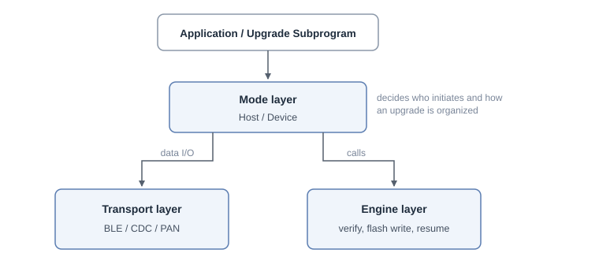
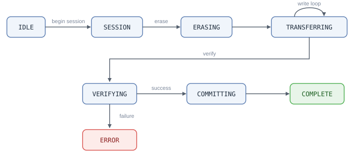

# DFU V2 Firmware Update Middleware

DFU V2 is the next-generation firmware update (Device Firmware Update) subsystem in the SiFli SDK. It downloads new firmware to the device and writes it to flash to complete a version upgrade. It unifies the capabilities that were previously split across the separate BLE DFU and PAN DFU implementations into a single framework, providing a consistent external interface while internally organizing the code as three decoupled layers — Engine, Mode and Transport. This makes it possible to reuse the same upgrade flow across different download channels (phone BLE, PC-side USB, Bluetooth PAN network).

The DFU V2 source code lives in _middleware/dfu_v2_, and its public interface is declared in _dfu_v2.h_. It is disabled by default and must be explicitly enabled in the configuration. It is mutually exclusive with the legacy DFU (`BSP_USING_DFU`) and the legacy PAN DFU (`USING_DFU_PAN`); they cannot be enabled at the same time.

## Overall Architecture

DFU V2 is divided into three layers by responsibility, interacting through well-defined interfaces. The Mode layer is the organizer of the upgrade flow: it exchanges data over the link through the Transport layer while calling the Engine layer to erase, write and verify; the Transport and Engine layers are independent of each other and have no direct dependency:



- **Engine layer**: the core state machine of the whole upgrade flow. It writes received data to the target flash, maintains the CRC check, persists download progress to support resumable transfers, and unifies the differences between NOR and NAND flash. The Engine layer is always compiled in, regardless of which mode or transport is used.
- **Mode layer**: decides who initiates an upgrade and how it is organized. It is split into Host-initiated Mode (the host pushes firmware to the device) and Device-initiated Mode (the device actively pulls firmware from a server).
- **Transport layer**: handles the actual send/receive on a given link. Push transports serve Host Mode and include BLE and USB CDC; pull transports serve Device Mode and currently consist of HTTP download over the Bluetooth PAN network.

The benefit of this layering is that switching to a different download channel only requires replacing the Transport layer — the core upgrade logic (writing flash, verifying, resuming) is written only once in the Engine layer.

## System Composition

The firmware of a product with DFU V2 upgrade capability consists of three cooperating programs:

- **bootloader (secondary boot)**: runs first on every power-on. It reads the firmware-info area; when it finds a valid update flag (the magic plus `needs_update`) and a valid upgrade-subprogram image, it redirects boot to the upgrade subprogram, otherwise it boots the user firmware normally.
- **User firmware**: the product's main program, running in the HCPU code partition. It normally takes no part in the transfer; to upgrade it writes the trigger flag and reboots (the BLE example additionally demonstrates receiving non-self images directly in the user firmware, see the Usage section).
- **Upgrade subprogram (DFU loader)**: a small standalone program flashed in the dedicated `DFU_V2_LOADER` partition; the download and writing happen in its context.

The three are tied together by the **firmware-info (fwinfo) area** on flash, which occupies the last 4KB of the `DFU_V2_LOADER` partition (`DFU_FWINFO_BASE_ADDR`, see _dfu_macro.h_). The user firmware writes the trigger flag or the download list there, the bootloader uses it to pick the boot target, and the boot-time check (`dfu_check_install()`) clears leftover flags so the device does not keep re-entering upgrade mode.

The macros generated from the partition table are part of this interface as well: DFU V2 locates its regions through them, so a project using it must declare the relevant partitions in the board-level partition table (`ptab.json`):

- `DFU_V2_LOADER_START_ADDR` / `DFU_V2_LOADER_SIZE`: generated from the region tagged `DFU_V2_LOADER` in ptab.json. The middleware derives the firmware-info address from them and the bootloader uses them to locate the upgrade subprogram; without this region the two macros fall back to invalid values and the firmware-info functions cannot work properly.
- Target-partition macros such as `HCPU_FLASH_CODE_START_ADDR`, `LCPU_FLASH_CODE_START_ADDR`, `HCPU_FLASH2_FONT_START_ADDR`: referenced directly when the BLE transport maps image IDs to flash addresses (see the Image Types section); an image whose macro is not defined in the project cannot be downloaded.

The examples' ptab.json files can be used as declaration templates (e.g. _example/dfu_v2/ble/app/project/sf32lb52-lcd_n16r8_hcpu/ptab.json_).

## Usage

DFU V2 typically involves two kinds of programs:

- **Upgrade subprogram**: runs in the `DFU_V2_LOADER` partition and is responsible for receiving data and writing flash. It calls `dfu_init()` to initialize the middleware; in Host-initiated Mode it runs a mailbox main loop, while in Device-initiated Mode it makes a blocking `dfu_download()` call instead.
- **User firmware**: responsible for triggering an upgrade at the right moment, or, in Device-initiated Mode, for pre-writing the list of files to download.

The common combinations of the two program kinds with the two modes are:

| Scenario | User firmware | Upgrade subprogram |
|----------|----------------------------|----------------------------------|
| Host-initiated (BLE / CDC) | Call `dfu_enter_dfu_mode()` to reboot into the subprogram (the BLE example can additionally receive non-self images without rebooting, see below) | `dfu_init()` + mailbox main loop to receive firmware pushed by the host |
| Device-initiated (PAN) | Write the list with `dfu_fwinfo_set()`, arm the update flags with `dfu_fwinfo_set_update_flags()`, then reboot | Read the list back and pull-download with `dfu_download()` (blocking) |

### Host-Initiated Mode (BLE / CDC)

#### Upgrade Subprogram: Init and Mailbox Main Loop

The body of an upgrade subprogram is "init + mailbox main loop". `dfu_init()` prepares the engine, transport and mode per the configuration (transports such as BLE and CDC are initialized here too), but it does not create a thread — the main loop is driven by the subprogram itself:

```c
#include "dfu_v2.h"
#include "dfu_app.h"

/* Upgrade event callback, invoked in the main-loop thread context */
static int on_dfu_event(const dfu_event_param_t *param, void *user_data)
{
    switch (param->event)
    {
    case DFU_EVT_PROGRESS:
        LOG_I("progress %d%%", param->progress.percent);
        break;
    case DFU_EVT_ALL_COMPLETE:
        LOG_I("all images written");
        /* The images have been written to flash. Rebooting straight back to the user
         * firmware is just this example's choice — each loader decides
         * whether to reboot immediately (the CDC example only updates
         * its UI) */
        drv_reboot();
        break;
    case DFU_EVT_ERROR:
        LOG_E("upgrade failed, error %d", param->err.error);
        break;
    default:
        break;
    }
    return 0;
}

void dfu_subprogram_main(void)
{
    dfu_config_t cfg = { .callback = on_dfu_event, .user_data = RT_NULL };

    /* Initialize the subsystem: create the mailbox, init engine/transport/mode */
    if (dfu_init(&cfg) != 0)
    {
        LOG_E("dfu_init failed");
        return;
    }

    /* Clear any stale update flags left by a previous session */
    dfu_check_install();

    /* Main loop: take messages from the mailbox */
    rt_mailbox_t mb = dfu_get_mailbox();
    rt_ubase_t   msg;
    while (1)
    {
        if (rt_mb_recv(mb, &msg, RT_WAITING_FOREVER) != RT_EOK)
            continue;

        /* Give it to DFU first: returning 0 means the middleware claimed and
         * handled this message */
        if (dfu_process(msg) == 0)
            continue;

        /* A non-zero return means the middleware does not recognize this
         * message; the subprogram handles it itself (e.g. it also posts
         * BLE stack events to the same mailbox) */
        handle_app_message(msg);
    }
}
```

There are two key points here:

- **The mailbox can be shared.** The subprogram may post its own messages (for example BLE connect/disconnect stack events) to the same mailbox returned by `dfu_get_mailbox()`. `dfu_process()` returns `0` when the message belongs to DFU and has been handled, and non-`0` when the middleware does not recognize it and the subprogram should handle it. This lets a single main loop drive both the upgrade and the subprogram's own logic. A message is simply an `rt_ubase_t` value: the middleware reserves the `dfu_msg_t` codes `0x01`–`0x3F` (data arrival, disconnect, abort request and so on, see _dfu_v2.h_); subprogram-defined messages should use values of `0x100` and above to avoid collisions.
- **Data arrival is not handled in the receive context.** Data arrives in an asynchronous context (a BLE stack callback — neither an ISR nor the DFU thread — or a USB interrupt callback for CDC); the transport only posts a "data arrived" message into the mailbox from there; the actual processing happens in the main-loop thread context, so the callback can safely log, update the UI, or set flags.

#### User Firmware: Trigger an Upgrade

When the user firmware needs to upgrade (for example on receiving an upgrade command), it calls `dfu_enter_dfu_mode()`. This writes the upgrade trigger flag and reboots; after the reboot the bootloader jumps to the upgrade subprogram:

```c
#include "dfu_app.h"

void start_firmware_upgrade(void)
{
    dfu_enter_dfu_mode();   /* writes the trigger flag and reboots, does not return */
}
```

#### Receiving Upgrades Directly in the User Firmware (what the BLE example does)

Besides rebooting into the upgrade subprogram, the user's own program (the main program) can also call `dfu_init()` itself and run the DFU Host Mode alongside its normal operation (the BLE example does exactly this), declaring which image ID it is currently running from with `dfu_mode_host_set_self_img_id()`: user firmware running from the HCPU partition passes `0`; the upgrade subprogram running from the DFU partition passes `6` (the OTA manager). From then on, when Host Mode receives an image with that ID it automatically skips it: it acknowledges the host but creates no engine session and neither erases nor writes; when running this way in the user firmware, the other non-HCPU images (resources, fonts, the DFU loader, etc.) will be written directly to their target partitions. This way resource-type images can be upgraded live while the application is running, without a reboot; only an upgrade of the HCPU itself requires calling `dfu_enter_dfu_mode()` to switch into the upgrade subprogram.

```{note}
With this usage, if the package contains the self image, that image is skipped — the host sees successful acknowledgements, but the data is not written. The self image must be updated through the upgrade-subprogram path.

Overwriting resource or font partitions while the application is running also comes with a usage constraint: the application must not be using the content of those partitions during the upgrade (for example the GUI rendering from the font or resource partition), or it will read half-written data. The middleware does not detect or prevent this; the application must stop using the affected resources for the duration of the upgrade.
```

### Device-Initiated Mode (PAN)

In Device-initiated Mode the download is split into two steps: "the user firmware writes the list" and "the upgrade subprogram pulls the firmware".

#### User Firmware: Write the List of Files to Download

The user firmware first obtains the list of firmware files to download (for example, querying the OTA server over the PAN network and parsing each file's URL, target address, size and CRC from the response or manifest), writes them one by one with `dfu_fwinfo_set()`, then calls `dfu_fwinfo_set_update_flags()` to arm the update trigger flags, and finally reboots into the upgrade subprogram:

```c
#include "dfu_fwinfo.h"

struct dfu_fw_info info = {0};
strncpy(info.name, "hcpu", sizeof(info.name) - 1);
strncpy(info.url,  "http://ota.example.com/hcpu.bin", sizeof(info.url) - 1);
info.addr        = HCPU_FLASH_CODE_START_ADDR;   /* target flash address */
info.size        = fw_size;                       /* file size */
info.crc32       = fw_crc;                         /* expected CRC32 */
info.region_size = HCPU_FLASH_CODE_SIZE;          /* target partition size */
info.file_id     = 0;                             /* image ID */

dfu_fwinfo_set(0, &info);   /* write entry 0; write one entry per file */
/* ...repeat the above for every file... */

/* The critical step: set the update flags (needs_update=1 plus the magic).
 * The call only skips entries whose name starts with '\0' — erased 0xFF
 * entries are stamped too, so the reading side must still filter
 * blank/erased entries; dfu_fwinfo_set() only writes the entry as-is and
 * sets no flags. Without this step the bootloader does not detect the
 * update request and the reboot goes straight back to the user firmware. */
dfu_fwinfo_set_update_flags();

drv_reboot();               /* reboot into the PAN upgrade subprogram */
```

#### Upgrade Subprogram: Pull and Write

After it starts, the upgrade subprogram reads the list back with `dfu_fwinfo_get()`, skips blank entries, turns it into a download request, and hands it to `dfu_download()` to download all files in one blocking call. `dfu_download()` runs the whole flow in the caller's thread: it reads data from the pull transport and hands it to the Engine layer, which verifies it and writes it to flash, returning only after all files are done; progress during the download is reported through the event callback. Note two prerequisites: the project must have `DFU_V2_USE_DEVICE_MODE` and `DFU_V2_USE_PAN_TRANSPORT` enabled, and `dfu_init()` must already have been called — otherwise `dfu_download()` simply returns failure:

```c
#include "dfu_v2.h"
#include "dfu_fwinfo.h"

/* 0. Initialize the middleware first — Device-initiated Mode runs no
 *    mailbox main loop, but dfu_download() requires the subsystem to be
 *    initialized (see earlier sections for the callback definition) */
dfu_config_t cfg = { .callback = on_dfu_event, .user_data = RT_NULL };
if (dfu_init(&cfg) != 0)
    return;

struct dfu_fw_info fw_files[DFU_MAX_FW_FILES];
dfu_file_t         v2_files[DFU_MAX_FW_FILES];
int                count = 0;

/* 1. Read back the list written by the user firmware */
for (int i = 0; i < DFU_MAX_FW_FILES; i++)
{
    if (dfu_fwinfo_get(i, &fw_files[i]) != 0)
        continue;
    /* dfu_fwinfo_get() only reads and does not validate the content:
     * blank or erased entries also return 0, so they must be filtered
     * by the first byte of name */
    if (fw_files[i].name[0] == '\0' || (uint8_t)fw_files[i].name[0] == 0xFF)
        continue;
    v2_files[count].url         = fw_files[i].url;
    v2_files[count].flash_addr  = fw_files[i].addr;
    v2_files[count].file_size   = fw_files[i].size;
    v2_files[count].file_crc    = fw_files[i].crc32;
    v2_files[count].region_size = fw_files[i].region_size;
    v2_files[count].img_id      = (uint8_t)fw_files[i].file_id;
    count++;
}

/* 2. Blocking download of all files */
dfu_download_req_t req = { .files = v2_files, .file_count = count };
if (dfu_download(&req) == 0)
{
    /* Each file is already written to its target partition;
       clear the list and reboot back to the user firmware */
    dfu_fwinfo_clear();
    drv_reboot();
}
```

### Querying Progress and Aborting

In any mode, progress can be queried or an abort requested from another thread:

- `dfu_get_progress(&received, &total)`: get the current received byte count and total byte count, useful for refreshing a progress bar.
- `dfu_abort()`: request an abort of the current upgrade. It posts a `DFU_MSG_ABORT` message to the main-loop mailbox (`rt_mb_send` does not block, so this is safe to call from an ISR); when `dfu_process()` receives the message it calls `dfu_engine_abort()` to set the abort flag, and the actual cleanup happens the next time the engine is called.

### Full Examples

The snippets above show the core calling patterns. For complete, buildable project examples, see the following examples in the SDK and their READMEs:

- BLE channel: _example/dfu_v2/ble_
- USB CDC channel: _example/dfu_v2/cdc_
- Bluetooth PAN network channel: _example/dfu_v2/bt_pan_

## Engine Layer

The Engine interface is defined in _engine/dfu_engine.h_, with its types in _engine/dfu_engine_types.h_. It is an explicit state machine; a single-image upgrade goes through the following states in order:



The corresponding interfaces are:

| Interface | Purpose |
|-----------|---------|
| `dfu_engine_init` / `dfu_engine_deinit` | Initialize / deinitialize the engine; internally sets up the flash abstraction layer and the FlashDB used for progress persistence |
| `dfu_engine_begin_session` | Start an image upgrade session and look up a resumable progress snapshot in FlashDB |
| `dfu_engine_erase` | Erase the target flash region; automatically detects NOR / NAND and aligns erase boundaries; if the target is on NAND, the page cache is initialized here for that address |
| `dfu_engine_write_data` | Write a chunk of firmware data to flash while accumulating the CRC, updating counters, and persisting progress at intervals |
| `dfu_engine_verify` | Verify data integrity after download (CRC32 comparison) |
| `dfu_engine_commit` | Commit the image session: clear the progress record in FlashDB, release the NAND cache, and transition to the completed state (in the direct-write model the data is already at its target address, so no firmware info is written here) |
| `dfu_engine_abort` | Request an abort (only sets a flag, safe to call from an ISR; the actual cleanup happens on the next engine call) |
| `dfu_engine_get_status` | Query the current state, last error code, and progress (callable from any context) |

### Direct-Write Model

After receiving data, the engine calls the flash abstraction layer to **write the data directly to the target partition**. The target address and partition size come from `flash_addr` and `flash_size` in the current image descriptor `dfu_image_info_t`. The precondition for writing is that the target partition is not the currently running code: the write can happen either in the dedicated upgrade subprogram (the DFU loader), which writes images that are not the currently running partition (the HCPU code region, resources, and so on), or in the user firmware itself while it is running, writing only non-self images. The writer's own partition must never be written: Host Mode provides a self-image skip mechanism for this, but it is not on by default — the application must first declare its own image ID with `dfu_mode_host_set_self_img_id()` (the default `0xFF` disables filtering) before that image is skipped (see the Usage section); Device-initiated Mode (PAN) has no equivalent protection — it writes to whatever address the list provides, so the server manifest or the application side must ensure the list does not include the currently running partition.

### Resumable Transfer

The engine uses FlashDB to persist download progress as a snapshot. The snapshot is keyed by the triple `(total_length, total_packets, file_crc)`: when an upgrade is interrupted and a session is started again, if these three values of the new session match a saved snapshot, `dfu_engine_begin_session` returns a resumable flag along with the number of already-completed bytes and packets, and the engine continues writing from that point instead of retransmitting from the beginning. Progress is saved roughly every 4096 bytes written by default, and this interval is configurable.

### Flash Abstraction and NAND Cache

The differences between NOR and NAND in erase granularity and write alignment are encapsulated in _engine/dfu_engine_flash.c_. During erase and write, the engine automatically detects whether the target address is on NOR or NAND: for NAND, it enables a page-aligned cache that buffers partial-page data sequentially and flushes it page by page, padding the page tail with `0xFF` when needed. The upper-layer write logic therefore does not need to care which flash type is underneath.

## Mode Layer

The Mode layer decides who initiates an upgrade and how the engine is driven. It reports upgrade events (started, progress, single image complete, all complete, error, aborted) upward through a callback; the callback type is `dfu_mode_callback_t` in _mode/dfu_mode.h_. Note that this is an internal interface between the Mode layer and the DFU V2 public interface layer: the callback is registered and handled by the public interface layer (_dfu_v2.c_), the "started" event is not forwarded to the application (the public `dfu_event_t` has no such event — the application can observe the session start via `DFU_EVT_STATE_CHANGED`), and the `DFU_EVT_PROGRESS` the application receives comes from the Engine's progress callback. The events the application actually receives are the `dfu_event_cb_t` set described in the "Application Interface and Runtime Model" section.

- **Host-initiated Mode**: the host (a phone app or a PC tool) pushes firmware to the device through protocol frames, and the device receives it passively. This is the mode used by the BLE and CDC channels, and it is enabled by default.
- **Device-initiated Mode**: the device initiates the download itself, pulling firmware from a remote server via a pull transport. This is the mode used by the PAN channel, and it is disabled by default.

A firmware package may contain multiple images (for example HCPU, LCPU, resources, fonts). The Mode layer orchestrates the image order and lets the engine handle one image at a time — normally one `dfu_engine_begin_session` session per image, downloaded, verified and committed one by one. There are two exceptions: on receiving the init request, Host Mode probes several images with `dfu_engine_begin_session` in turn to find a resumable progress snapshot, closing each miss with `dfu_engine_reset_session`; and an image declared as the self image gets no engine session at all (acknowledged but never written).

## Transport Layer

The common Transport interface is defined in _transport/dfu_transport.h_ and is split into two kinds, each a vtable of function pointers:

- **Push transports**: only need to implement a `send` interface that delivers the response messages built by the Mode/Protocol layer to the host. When data arrives, the transport posts a message to the main loop from an asynchronous context (a receive callback or an interrupt). Currently these include:
  - **BLE transport** (_transport/dfu_transport_ble.c_): communicates with the phone over BLE GATT; the on-air protocol stays the legacy BLE DFU protocol, so existing phone OTA apps and packaging tools work unchanged.
  - **USB CDC transport** (_transport/dfu_transport_cdc.c_): enumerates the device as a USB virtual serial port for a PC-side OTA tool to push firmware; response frames are sent as-is. It is built directly on CherryUSB.
- **Pull transports**: implement `open` / `read` / `close`, where `open` takes a byte offset to support resumable transfer (HTTP Range). Currently these include:
  - **PAN HTTP transport** (_transport/dfu_transport_pan.c_): the device downloads firmware from a server over HTTP through the Bluetooth PAN network.

Only one push transport may be selected at a time (BLE and CDC are mutually exclusive).

## Image Types

DFU V2 reuses the image IDs of the legacy protocol and splits them into two layouts by flash type, selected by the configuration options `OTA_55X` (NOR) and `OTA_56X_NAND` (NAND):

- **NOR layout**: HCPU, LCPU, PATCH, resources, fonts, extension, OTA manager, tiny font, resource upgrade, patch staging, control packet, bootloader, etc.
- **NAND layout**: HCPU, LCPU, HCPU patch, resources, LCPU patch, dynamic resources, music, pictures, fonts, ringtones, languages, etc.

Where the target flash address comes from differs per channel: the BLE transport, while translating a legacy control packet, maps the image ID to the flash address of the corresponding partition inside the transport (for example the HCPU code region, LCPU code region, font region — the ID tables of the two layouts above are also defined in the BLE transport); on the CDC channel the flash address and partition size are supplied directly by the PC-side tool in the image descriptors of the init request; in Device-initiated Mode (PAN) they come from the file list passed in by the application. In all cases, the resolved address and size are passed to the engine for writing.

## Upgrade Trigger and Install Flow

DFU V2 adopts a "dedicated upgrade subprogram" install model. When the application actually wants to start an upgrade, it calls `dfu_enter_dfu_mode()` (see _dfu_app.c_): this writes the upgrade trigger flag via `dfu_fwinfo_set_update_flags()` (which internally performs the erase, write and NAND page-cache flush, and works on both NOR and NAND), then calls `drv_reboot()` to reboot. The PAN trigger is equivalent, with one extra step: the user firmware first writes the download list with `dfu_fwinfo_set()`, then calls the same `dfu_fwinfo_set_update_flags()` to arm the update flags before rebooting (see the Usage section).

After the reboot, the bootloader detects the upgrade flag and jumps to the upgrade subprogram in the `DFU_V2_LOADER` partition. The subprogram runs the full download flow in its own context: it receives data through the Transport layer, and the Engine layer verifies it and writes it to the target partitions (which are not the currently running code at that moment); whether to reboot back to the user firmware immediately afterwards is each loader's own decision.

Because DFU V2 writes firmware directly to the target partitions during the download phase, there is no separate "install" step at boot. At startup the subprogram or user firmware can call `dfu_check_install()`: it checks for update flags (`needs_update` and the magic) left by a previous session (completed or interrupted), clears them if present, and then returns. This interface always returns.

## Application Interface and Runtime Model

The DFU V2 public interface is declared in _dfu_v2.h_. The core interfaces are:

| Interface | Purpose |
|-----------|---------|
| `dfu_init` | Initialize the subsystem: create the internal mailbox and initialize the engine, transport(s) and mode(s) per the configuration. Note that it does **not** create a thread |
| `dfu_deinit` | Deinitialize the subsystem |
| `dfu_get_mailbox` | Get the internal mailbox handle; the upgrade subprogram uses it to receive messages in its own main loop |
| `dfu_process` | Process one mailbox message (data arrival, disconnect, abort request, etc.) |
| `dfu_check_install` | Check for and clear update flags (`needs_update` and the magic) left by a previous session; V2 writes directly to the target partitions during download, so this interface performs no installation and always returns |
| `dfu_download` | Blocking download in Device-initiated Mode; completes the download and writing of all files in the caller's thread |
| `dfu_set_install_flag` | Set the flags related to the subsequent boot flow; the concrete action is decided at compile time: with the PAN transport compiled in (`DFU_V2_USE_PAN_TRANSPORT`) it always goes through the PAN middleware's flag mechanism regardless of which channel was actually used, otherwise it sets the firmware-info update flags and writes the RTC backup register |
| `dfu_abort` | Request an abort (safe to call from an ISR) |
| `dfu_get_progress` | Query the current received byte count and total byte count |

### Mailbox-Driven Runtime Model

DFU V2 does not create a thread of its own. In Host-initiated Mode (push transports such as BLE / CDC), the "main loop" is left to the upgrade subprogram that uses it: `dfu_init()` creates an internal mailbox; when the transport receives data in an asynchronous context (a receive callback or an interrupt), it does not process it directly but posts a message to this mailbox (for example "BLE data arrived", "CDC data arrived", "disconnected", "abort requested"). The upgrade subprogram loops on `rt_mb_recv()` in its own thread to receive messages and hands them to `dfu_process()`. This way all the actual upgrade logic runs in the main-loop thread context, and the asynchronous context only does the lightest possible posting. Device-initiated Mode (PAN) does not use this mailbox main loop: the upgrade subprogram simply makes the blocking `dfu_download()` call in its own thread (the PAN example's main loop pumps Bluetooth stack events through its own mailbox).

The application can register an event callback `dfu_event_cb_t` in the configuration to receive events such as state change, progress, single image complete, all complete, error and aborted during the upgrade (see `dfu_event_t` and `dfu_event_param_t` in _dfu_v2.h_). The callback is invoked in the main-loop thread context.

## Configuration

Selecting DFU V2 in the configuration menu enables it (the corresponding option is `USING_DFU_V2`). Once enabled, the following can be further configured:

| Option | Description |
|--------|-------------|
| `OTA_55X` / `OTA_56X_NAND` | Select the NOR / NAND image-ID and partition layout; the default follows each chip's usual flash type, with NOR taking priority |
| `DFU_V2_USE_HOST_MODE` | Enable Host-initiated Mode (on by default) |
| `DFU_V2_USE_DEVICE_MODE` | Enable Device-initiated Mode (off by default) |
| Push Transport | Push transport, choose one: `DFU_V2_USE_CDC_TRANSPORT` (USB CDC) or `DFU_V2_USE_BLE_TRANSPORT` (BLE) |
| `DFU_V2_USE_PAN_TRANSPORT` | Pull transport: HTTP download over Bluetooth PAN (depends on Device Mode and WebClient) |
| `DFU_V2_ENGINE_PROGRESS_INTERVAL` | Byte interval for the progress callback / progress persistence (0 means the default 4096 bytes) |
| `DFU_V2_ENGINE_ERASE_VERIFY` | Read-back verification after erase (reserved option; the engine does not currently read it, so enabling it does not change behavior) |
| `DFU_V2_CDC_RINGBUF_SIZE` | CDC receive ring-buffer size (bytes) |
| `DFU_V2_PAN_RESP_BUFSZ` / `DFU_V2_PAN_TIMEOUT_MS` | PAN HTTP response buffer size and connection timeout |
| `DFU_V2_MB_SIZE` | Internal mailbox capacity (number of messages) |

```{note}
DFU V2 is mutually exclusive with the legacy DFU (`BSP_USING_DFU`) and the legacy PAN DFU (`USING_DFU_PAN`), and is only available on the HCPU (`BF0_HCPU`). Enabling DFU V2 automatically selects FlashDB (`PKG_USING_FLASHDB`) for resumable transfer.
```
