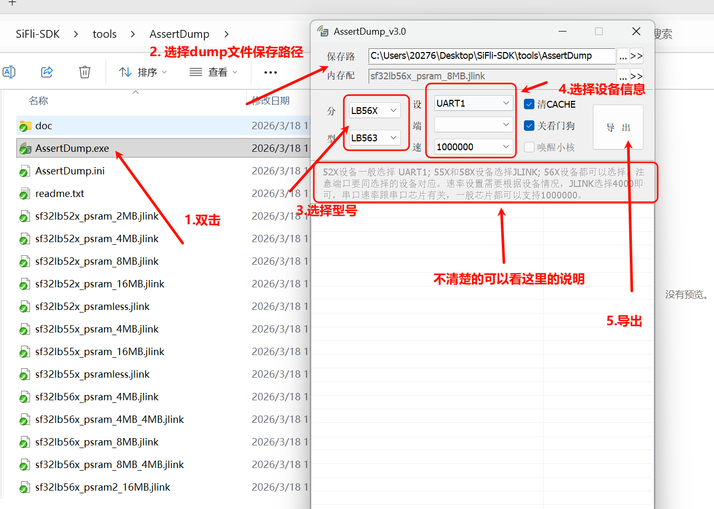
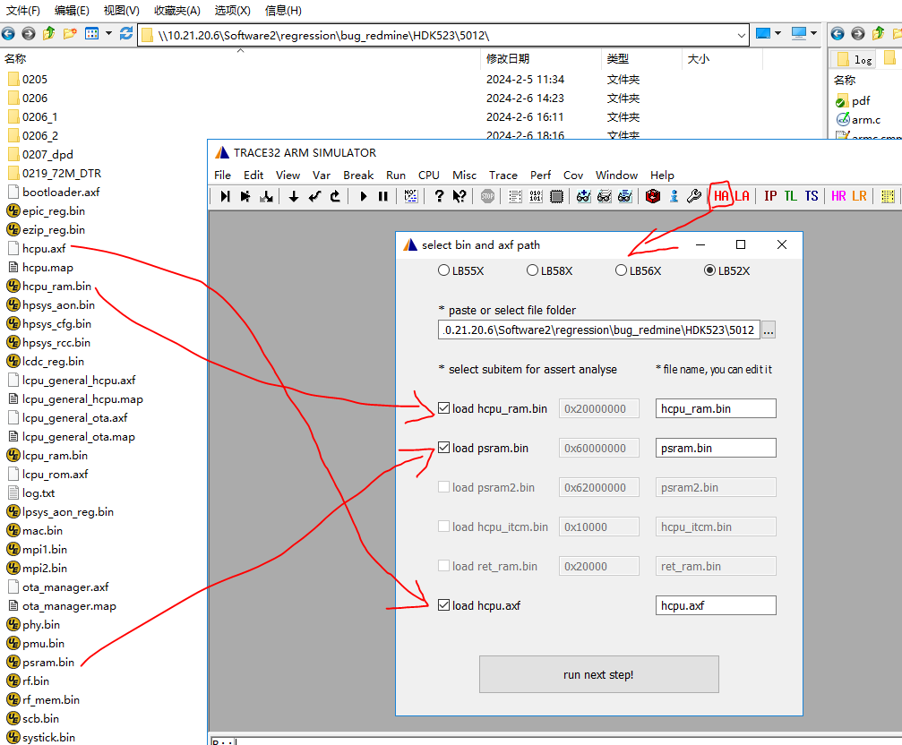
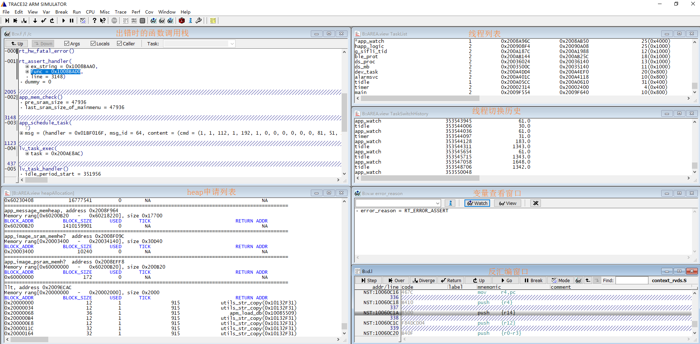
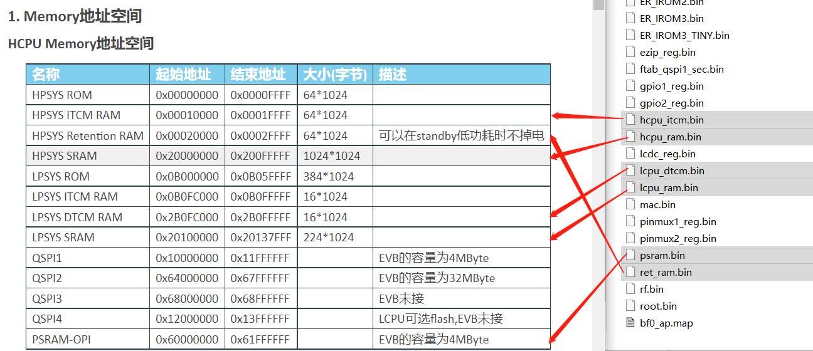
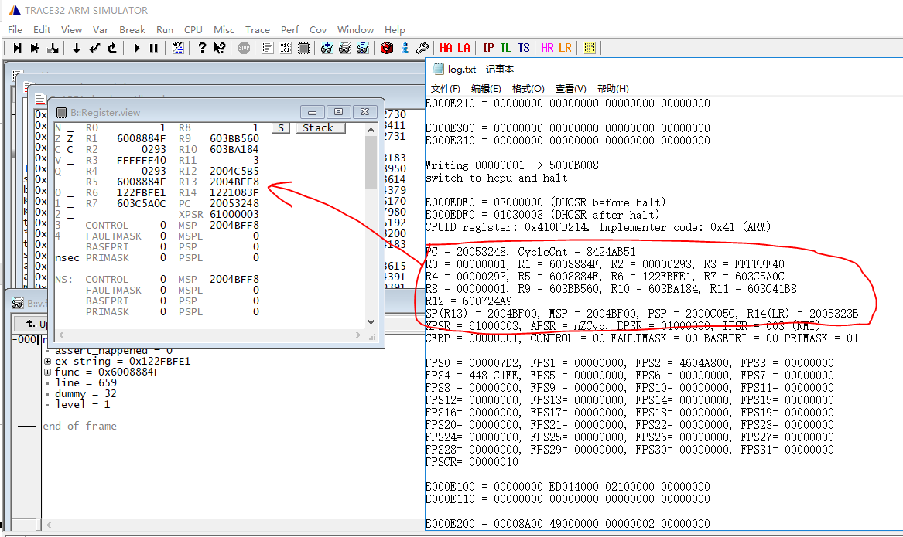
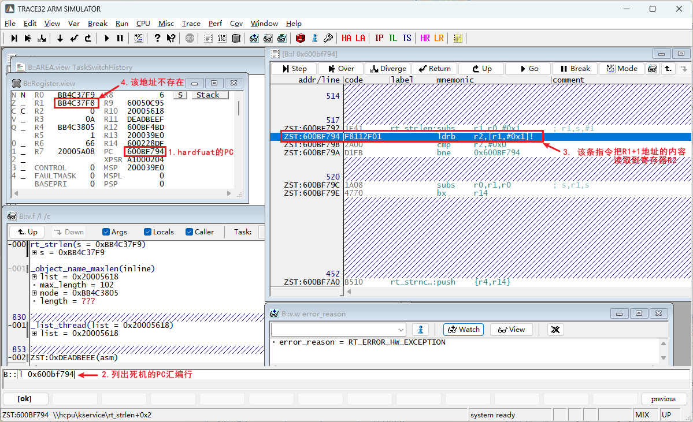
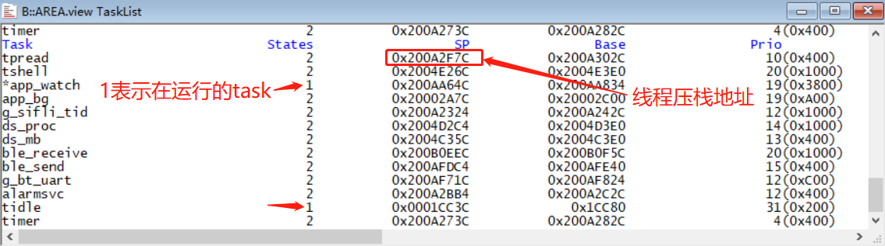

# dump 死机调试指南

本节介绍发生死机后如何导出现场并恢复，所用工具以 Trace32 为主。

## Dump 内存方法

:::{only} SF32LB52X or SF32LB56X or SF32LB57X

### 导出内存现场

在 `SIFLI-SDK\tools\AssertDump` 目录下运行 `AssertDump.exe`，按提示选择保存路径、内存配置、芯片型号 和导出方式，点击导出开始保存内存为 bin 文件。



导出成功后，在保存路径下将生成的所有 `*.bin`、`*.txt` 以及编译生成的 `*.axf` 文件放到同一目录，使用 Trace32 进行解析。

也可以使用 SDK 命令行导出兼容 AssertDump 的目录。示例：

```bash
sdk.py crash-dump capture-live \
  --transport uart \
  --chip SF32LB52 \
  --chip-model LB525 \
  --output /tmp/live-crash \
  --elf build_sf32lb52-lcd_n16r8_hcpu/main.elf
```

如果需要同时导出 PSRAM，增加 `--include-psram`，或使用 `--psram-size 8MB` 指定 PSRAM 大小。导出过程中会按文件显示进度。输出目录默认生成 Trace32/AssertDump 可直接使用的 `*.bin`、`hcpu.axf`、`log.txt` 和兼容格式 `manifest.json`；SDK/AI 分析使用的完整元数据保存在 `sdk_manifest.json`。

如果使用 SifliUsartServer 加 J-Link 的 IP 方式导出，使用 `--transport jlink --jlink-ip 127.0.0.1:19025`。只导出单个核心时可增加 `--core hcpu` 或 `--core lcpu`。示例：

```bash
sdk.py crash-dump capture-live \
  --transport jlink \
  --jlink-ip 127.0.0.1:19025 \
  --core hcpu \
  --chip SF32LB52 \
  --chip-model LB525 \
  --output /tmp/live-crash \
  --elf build_sf32lb52-lcd_n16r8_hcpu/main.elf
```

此时 SDK 会保留 `.jlink` 脚本中的 IP 连接方式，不会改成 USB J-Link；`--core hcpu` 会过滤 LCPU/LPSYS 导出项，并移除脚本中的切核命令。

如果需要生成 GDB 可直接读取的现场 ELF，可以在导出后执行：

```bash
sdk.py crash-dump readcore \
  --package /tmp/live-crash \
  --elf build_sf32lb52-lcd_n16r8_hcpu/main.elf \
  --output /tmp/live-crash/coredump.elf
```

之后可使用程序 ELF 和现场 ELF 进行离线分析：

```bash
sdk.py crash-dump analyze \
  --core /tmp/live-crash/coredump.elf \
  --elf build_sf32lb52-lcd_n16r8_hcpu/main.elf
```
:::

## Trace32 恢复与解析

### 用 Trace32 恢复 HCPU 死机现场

1. 参照上文的导出方法将导出的内存文件和对应的 axf 放到同一目录。更加详细的死机现场保存方法可以[查看保存现场方法](../../app_note/crash_analysis.md)
2. 运行 `SIFLI-SDK/tools/crash_dump_analyser/simarm/t32marm.exe`工具。如下图：


3. 打开工具后选择 HCPU assertion（HA）进行恢复。如果某些 bin 文件不存在（例如没有 PSRAM2），可取消勾选对应文件。



4. 点击 “run_next_step” 加载，加载完成后会显示现场信息：



:::{only} SF32LB52X or SF32LB57X
5. 如果内存与地址映射建立成功，可参考芯片手册的 Memory 地址空间查看现场。如果未恢复，请检查 bin 是否有效，或通过修改 jlink/dump 脚本增加或减少需要 dump 的地址空间（例如 `sf32lb52x_uart.jlink` / `sf32lb57x_uart.jlink`）。
:::

:::{only} SF32LB56X
5. 如果内存与地址映射建立成功，可参考芯片手册的 Memory 地址空间查看现场。如果未恢复，请检查 bin 是否有效，或通过修改 jlink/dump 脚本增加或减少需要 dump 的地址空间（例如 `sf32lb56x_uart.jlink`）。
:::

:::{only} SF32LB58X
5. 如果内存与地址映射建立成功，可参考芯片手册的 Memory 地址空间查看现场。如果未恢复，请检查 bin 是否有效，或通过修改 jlink/dump 脚本增加或减少需要 dump 的地址空间（例如 `sf32lb58x.jlink`）。
:::

:::{only} SF32LB55X
5. 如果内存与地址映射建立成功，可参考芯片手册的 Memory 地址空间查看现场。如果未恢复，请检查 bin 是否有效，或通过修改 jlink/dump 脚本增加或减少需要 dump 的地址空间（例如 `sf32lb55x.jlink`）。
:::



6. 在 Window 菜单中可以切换不同显示窗口。


`B::v.f /l /c `窗口是死机现场的函数调用栈

heapAllocation 窗口显示了系统中所有 heap pool 的分配情况，包括 system heap 以及各 `memheap_pool`：

- system heap：`rt_malloc` 和 `lv_mem_alloc` 使用的池
- 各 `memheap_pool`：由 `rt_memheap_init` 创建，分配/释放使用 `rt_memheap_alloc` / `rt_memheap_free`

分配信息字段含义：

```
BLOCK_ADDR: 分配的内存块的起始地址，包括管理项
BLOCK_SIZE: 申请的内存大小，不包括管理项长度
USED: 是否已分配，1 表示已分配，0 表示未分配
TICK: 申请时间，单位为 OS tick（通常 1 ms）
RETURN ADDR: 申请者地址
```

### 现场未显示异常栈的处理

如果无法显示死机时的调用栈，可能是 dump 中未保存寄存器或保存异常。可尝试以下方法：

1. 从 J-Link halt 的 log 信息加载现场寄存器（HR / HCPU Registers）。点击相应按钮，选择导出的 `log.txt`，工具会将其中 HCPU 的寄存器回填到 Trace32。



2. 手动将 log 中打印出的 16 个寄存器值回填到 Trace32 的寄存器窗口（ARM 寄存器对应关系：SP <-> R13，LR <-> R14，PC <-> R15）。


gcc编译的可以尝试将PC修改成和r14的值一样 

3. 在自动恢复现场不成功时，也可以直接按照 hardfault 现场手动恢复。恢复死机现场中断发生时（hardfault 也是中断）的中断函数：

```
HardFault_Handler->rt_hw_hard_fault_exception->handle_exception
```

函数内会把寄存器 R0-R4、R12、R14(LR)、PC 压栈到 `saved_stack_frame` 和 `saved_stack_pointer` 变量中。


压栈的寄存器可以看下图二。如下图一的死机现场，地址 0x20054998 上是 R0，地址 0x200549AC 是 LR，地址 0x200549B0 是 PC: 0x10CD6602。

- 寄存器 PC：存放死机前的程序 PC 指针。
- 寄存器 LR：存放程序执行完要返回的程序指针。
- 全局变量 `saved_stack_pointer` 存的是压栈的基地址。
- 全局变量 `saved_stack_frame` 存的是压栈的数据。


4. 在 hardfault `RT_ERROR_HW_EXCEPTION` 死机的情况下，要特别留意出问题的 PC 汇编指令，考虑是否出现异常地址或异常指令，如下图：



### 用 Trace32 恢复 LCPU 死机现场

LCPU 恢复与 HCPU 类似，需将 `lcpu.axf` 和对应的 `rom_axf` 文件拷贝到脚本目录中：


注意：

- Keil 编译生成的 LCPU 文件后缀为 `.axf`，GCC 编译生成的为 `.elf`。
:::{only} SF32LB52X
- 选择 `rom_axf` 时请根据板子型号选择正确文件（数字系列使用 `lcpu_rom_micro`，字母系列使用 `rev7`）。
:::

:::{only} SF32LB55X or SF32LB56X or SF32LB58X
- 选择 `rom_axf` 时请根据板子型号选择正确文件 。
:::


打开 Trace32 并选择 LA（LCPU assertion）执行对应配置：


## Trace32 常用脚本与命令

常用查看命令：

- `L <addr>`：例如 `L 0x10063c`，查看某处 PC 对应源码或反汇编。
- `v.v *`：打开变量窗口，支持通配符搜索全局变量。
- `data.dump <addr>`：查看内存地址。
- `frame /locals /caller`：查看调用栈与局部变量。
- 在控制台输入 `(struct rt_pm *)0x101fa2b9` 可把内存按结构体格式解析。

系统状态内置脚本（使用 `do` 运行）：

- `do show_tasks`：显示系统中所有线程及状态、栈地址和优先级。
- `do switch_to 0x200A2F7C`：在不同线程栈间强制切换上下文。
- `do show_timer` / `do show_switch_history`：查看定时器队列与线程切换历史。



---

## Heap 分析示例

下图为检测到 heap 泄漏的现场：callstack 窗口显示断言处的调用栈，heapAllocation 窗口的 system heap 列表显示由 `rt_malloc` 申请的内存块，RETURN ADDR 为调用 `rt_malloc` 的函数地址，TICK 为申请时间（`rt_tick_get`）。


System heap 管理项结构示意：第一个 uint16 为特殊标记 0x1EA0，若被修改则表示被非法改写；第二个 uint16 为 used 标志，1 表示已分配，0 表示未分配，其他值意味着内存项被破坏。


例如地址 `0x200A27EC` 的内存块由 `rt_serial_open` 前的指令申请，申请大小为 4108 字节。System heap 管理项长度为 28 字节，因此实际使用地址为 `block_addr + 28`。

在出现内存泄漏时，可结合申请者地址与申请时间定位未释放代码位置。


