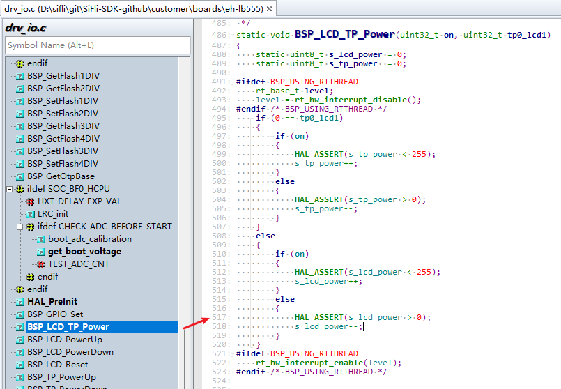
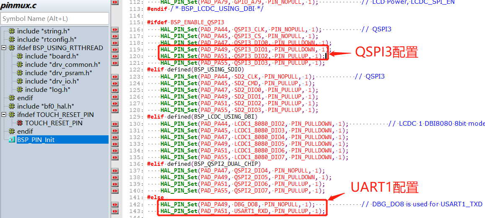
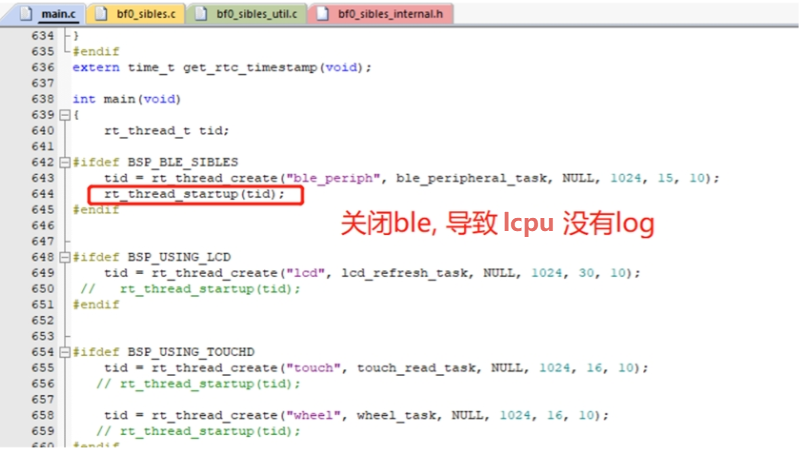

# Log 定位死机调试指南

本节主要讲述如何通过log来定位死机调试
## 1.死机状态下的一些log情况
###  情况 1. 提示对方核 crash

:::{only} SF32LB55X 
如下log表示 HCPU收到了LCPU的crash通知后触发的主动assert，需要查看LCPU的crash原因

```
07-11 10:31:55:616    [351767] E/mw.sys ISR: LCPU crash
07-11 10:31:55:617    Assertion failed at function:debug_queue_rx_ind, line number:221 ,(0)
07-11 10:31:55:617    Previous ISR enable 0
```
:::

:::{only} SF32LB58X or SF32LB56X or SF32LB57X 
如下log表示 HCPU收到了LCPU的crash通知后触发的主动assert，需要查看LCPU的crash原因

```
07-11 10:31:55:616    [351767] E/mw.sys ISR: LCPU Crash triggered, please check LCPU log for details.
07-11 10:31:55:617    Assertion failed at function:DBG_Trigger_IRQHandler, line number:377 ,(0)
07-11 10:31:55:617    Previous ISR enable 0
```
:::
**说明**：在双核开发时，当一边 CPU 已经死机，另一 CPU 的状态其实是未知的，可能还会持续跑很长一段时间，导致问题不容易发现。目前软件设计为：一边 CPU 出现已知的 assert 或 hardfault 的情况下，会通知对方核，对方核收到后会触发自身的 assert，便于查找问题。

### 情况 2. Assert 行号提示

如下 log 提示 Assert 发生在 drv_io.c 文件的 517 行。

```
07-10 16:41:16:382    [572392] I/drv.lcd lcd_task: HW close
07-10 16:41:16:385    HAL assertion failed in file:drv_io.c, line number:517
07-10 16:41:16:388    Assertion failed at function:HAL_AssertFailed, line number:616 ,(0)
07-10 16:41:16:389    Previous ISR enable 1
```

对应 drv_io.c 文件的 517 行如下图。`RT_ASSERT(0);` 或 `HAL_ASSERT(s_lcd_power > 0);` 括号内值为 0（False）时，就会出现死机；此处出现死机，代表 `s_lcd_power > 0` 为假（s_lcd_power 没有大于 0）。



###  情况 3. Log 提示死机 PC 指针信息

如下 log，在出现 hard fault 的情况下，PC 指针已经跳转异常中断 `HardFault_Handler` 或 `MemManage_Handler` 里面的 `rt_hw_mem_manage_exception` 或 `rt_hw_hard_fault_exception` 函数内。连接上看到的 PC 指针可能已经不是第一死机现场，此时 log 打印出来的 PC 等一系列地址就是第一死机现场，可以用于恢复死机第一现场。如下示例表示死在 PC `0x0007ef00` 这个地址，可以通过编译出来的对应 `*.asm` 文件查看为什么这条指令会死机，通常是访问的内存或者地址不可达，出现异常中断死机。

**说明**：函数 `handle_exception` 中，变量 `saved_stack_frame`、`saved_stack_pointer` 和 `error_reason` 在出现以上异常死机时，也会存储如下 log 内死机的堆栈、死机堆栈地址和死机的原因，可以对照源代码数据结构来分析死机原因。也可以拿到pc地址后去build固件下的反汇编文件中搜索该地址即可定位到触发崩溃的具体汇编指令
```
06-24 15:48:41:031     sp: 0x200195c8
06-24 15:48:41:037    psr: 0x80000000
06-24 15:48:41:041    r00: 0x00000000
06-24 15:48:41:042    r01: 0x2001960c
06-24 15:48:41:043    r02: 0x00000010
06-24 15:48:41:044    r03: 0x0007ef00
06-24 15:48:41:045    r04: 0x00000000
06-24 15:48:41:046    r05: 0x00000010
06-24 15:48:41:046    r06: 0x00000000
06-24 15:48:41:047    r07: 0x00000010
06-24 15:48:41:047    r08: 0x2001960c
06-24 15:48:41:048    r09: 0x2001965c
06-24 15:48:41:049    r10: 0x60000000
06-24 15:48:41:049    r11: 0x00000000
06-24 15:48:41:050    r12: 0x200001cd
06-24 15:48:41:051     lr: 0x12064845
06-24 15:48:41:052     pc: 0x0007ef00
06-24 15:48:41:052    hard fault on thread: mbox
06-24 15:48:41:053    
06-24 15:48:41:053    =====================
06-24 15:48:41:054    PSP: 0x20019534, MSP: 0x2001419c
06-24 15:48:41:055    ===================
```
## 2. 常见问题

###  HCPU 没有 log 输出
1. menuconfig → RTOS → RT-Thread Kernel → Kernel Device Object → uart1 配置为 uart1。
2. menuconfig → RTOS → RT-Thread Components → Utilities → Enable ulog 打开。
3. pinmux.c 中 UART1 的配置是否正确。常见问题是开启了 BSP_ENABLE_QSPI3，如下图：

TIPS: menuconfig 中可以按下 “？” 按键打开搜索框来精确搜索自己想看的配置。



:::{only} SF32LB55X
###  LCPU 没有 log 输出
如下配置后依然没有打印：

1. menuconfig → RTOS → RT-Thread Kernel → Kernel Device Object → uart3 配置为 uart3。
2. menuconfig → RTOS → RT-Thread Components → Utilities → Enable ulog 打开。
3. 确认 HCPU 中 menuconfig → RTOS → RT-Thread Kernel → Kernel Device Object → uart1 没有配置为 uart3，否则会冲突。
4. 确认 pinmux.c 中 UART3 的模式配置正确，默认配置如下：

`````c
HAL_PIN_Set(PAD_PB45, USART3_TXD, PIN_NOPULL, 0);           // USART3 TX/SPI3_INT
HAL_PIN_Set(PAD_PB46, USART3_RXD, PIN_PULLUP, 0);           // USART3 RX
`````
其他原因 1：ble 线程没有开启，导致 LCPU 程序没有加载。



解决方案：打开 ble 线程或者单独调用函数 `lcpu_power_on();` 启动 LCPU 的代码。

其他原因 2：

````
example\multicore\ipc_queue\
example\pm\coremark\
````

这些工程需要在 HCPU 的 console 里发送命令 `lcpu on` 启动 LCPU，启动成功后可以在 LCPU 的 console 上看到启动 log。

解决方案：相应工程下有 readme.txt 文件，可以参考里面的内容发命令打开 LCPU。

:::

:::{only} SF32LB58X or SF32LB56X or SF32LB57X 
### LCPU 没有 log 输出
如下配置后依然没有打印：
1. menuconfig → RTOS → RT-Thread Kernel → Kernel Device Object → uart4 配置为 uart4。
2. menuconfig → RTOS → RT-Thread Components → Utilities → Enable ulog 打开。
3. 确认 HCPU 中 menuconfig → RTOS → RT-Thread Kernel → Kernel Device Object → uart1 没有配置为 uart4，否则会冲突。
4. 确认 pinmux.c 中 UART3 的模式配置正确，默认配置如下：

`````c
HAL_PIN_Set(PAD_PB17, USART4_TXD, PIN_NOPULL, 0);           // USART4 TX
HAL_PIN_Set(PAD_PB16, USART4_RXD, PIN_PULLUP, 0);           // USART4 RX
`````
其他原因 1：ble 线程没有开启，导致 LCPU 程序没有加载。


解决方案：打开 ble 线程或者单独调用函数 `lcpu_power_on();` 启动 LCPU 的代码。

其他原因 2：

````
example\multicore\ipc_queue\
example\pm\coremark\
````

这些工程需要在 HCPU 的 console 里发送命令 `lcpu on` 启动 LCPU，启动成功后可以在 LCPU 的 console 上看到启动 log。

解决方案：相应工程下有 readme.txt 文件，可以参考里面的内容发命令打开 LCPU。
:::

### 代码中如何读写寄存器

直接地址读操作：
```c
static uint32_t pinmode19;
pinmode19= *(volatile uint32_t *)0x4004304c; //读取寄存器0x4004304c的值
uint32_t reg_printf= *(volatile uint32_t *)0x50016000; //打印寄存器0x50016000的值
rt_kprintf("0x50016000:0x%x\n",reg_printf);
```
直接地址写操作：
```c
#define _WWORD(reg,value) \
{ \
    volatile uint32_t * p_reg=(uint32_t *) reg; \
    *p_reg=value; \
}
_WWORD(0x40003050,0x200);  //PA01 pinmux寄存器写值0x00000200
```
寄存器定义读操作：
```c
rt_kprintf("hwp_hpsys_rcc->CFGR:0x%x\n",hwp_hpsys_rcc->CFGR);
uint32_t reg_printf= hwp_hpsys_rcc->CFGR; //打印寄存器
rt_kprintf("hwp_hpsys_rcc->CFGR:0x%x\n",reg_printf);
```
寄存器定义写操作：
```c
hwp_hpsys_rcc->CFGR = 0x40003050;//直接写值
MODIFY_REG(hwp_pmuc->LPSYS_SWR, PMUC_LPSYS_SWR_PSW_RET_Msk,
			MAKE_REG_VAL(1, PMUC_LPSYS_SWR_PSW_RET_Msk, PMUC_LPSYS_SWR_PSW_RET_Pos)); //只修改PMUC_LPSYS_SWR_PSW_RET_Msk的值为1，其他地方不变；

```
