# Ozone 在线断点调试指南

本节讲如何使用 Ozone 来打断点单步调试，使用到的工具为 Ozone。

## 1. 早期死机断点设置
如果系统在 Bootloader 阶段、Bootloader 刚结束、启动初始化初期（或休眠唤醒时）就发生死机，直接挂载 J-Link 往往来不及，可以通过代码直接打断点。

- **汇编层设置**：在 `drivers/cmsis/sf32lb5xx/Templates/arm/startup_bf0_hcpu.S`（注意替换对应芯片型号）的 `Reset_Handler` 中加入 `B .` 死循环。

**注意：** gcc编译的 `startup_bf0_hcpu.S` 路径和keil不一样，gcc的路径为：`drivers/cmsis/sf32lb5xx/Templates/gcc/startup_bf0_hcpu.S`

```assembly
Reset_Handler   PROC
                B        . ; // MCU 复位后第一条指令执行的位置，添加断点
```

- **C 语言层设置**：在 `SystemInit()` 或 `rtthread_startup()` 初期加入汇编级断点。

```c
__asm("B ."); // 设置断点
```

或者：

```c
HAL_sw_breakpoint(); // 设置断点
```

```{note}
不要使用 `while(1);` 作为断点，因为编译器优化可能会将它后面的语句全部丢弃。
```

设置后，系统将停留在该指令。连上 J-Link 和 Ozone 后，**通过命令 `setpc PC+2` 将 PC 寄存器向后移动 2 个字节跳过断点**，即可开始单步跟踪。

## 2. Ozone 调试指南
Ozone 是 SEGGER 官方推出的全功能调试器，在处理死机排查、多核调试时比 Keil 更加稳定。

````{only} SF32LB55X or SF32LB58X or SF32LB56X or SF32LB57X
J-Link 默认 connect 会连接到 HCPU，如果调试 HCPU，这一步可以跳过。
如果需要调试 LCPU，可以在 Windows CMD 窗口执行对应的批处理脚本，例如 `SIFLI-SDK\tools\segger\jlink_lcpu_a0.bat`（55 系列）、`jlink_lcpu_pro.bat`（58 系列）或 `jlink_lcpu_56x.bat`（56 系列）。
执行该批处理实际上是执行了几条底层指令，也可以直接在 J-Link 窗口依次输入这两条命令手动切换到 LCPU：

```bash
w4 0x4004f000 1
connect
w4 0x40070000 0
exit
```

（注：也可以在代码中直接写寄存器把 SWD 切到 LCPU 调试。）

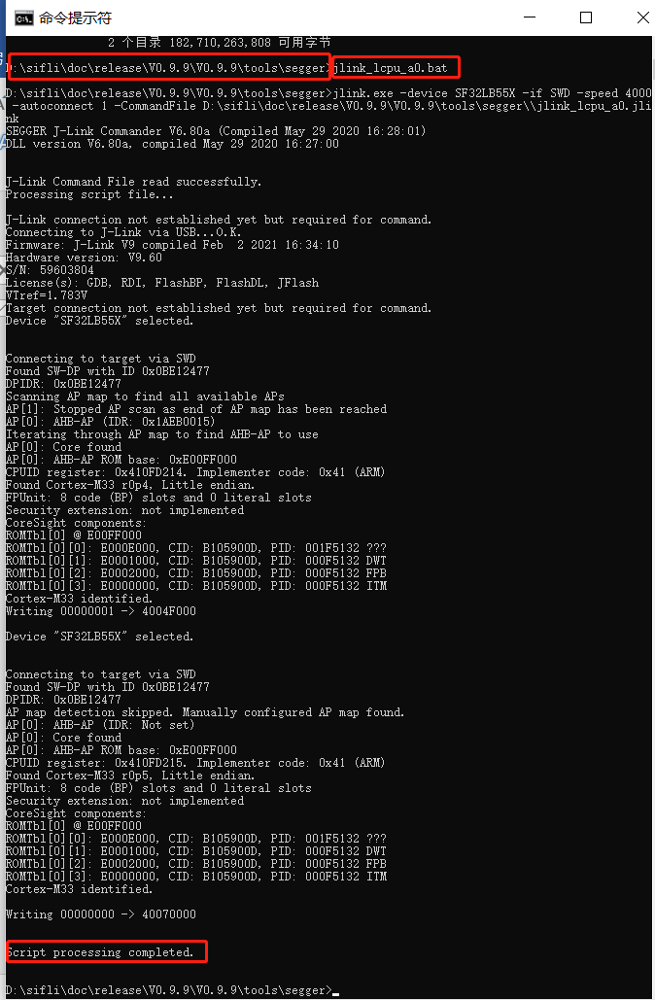
````

### 2.1 Ozone 工程建立与连接

```{only} SF32LB52X
52 系列 MCU 没有 SWD 接口，如果要用 Ozone 来调试，可以采用 SiFliUsartServer.exe 工具，使用方法如下图设置：

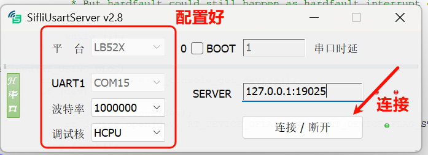
```

```{only} SF32LB55X
以 55 系列为例，演示 LCPU 单步运行。
```

**新建项目**：打开 Ozone，创建一个新项目。

:::{only} SF32LB55X
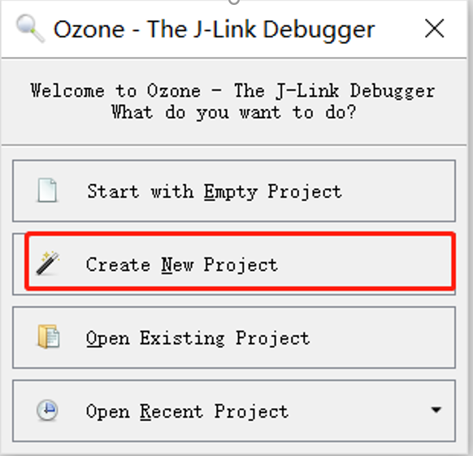
:::

:::{only} SF32LB52X or SF32LB56X or SF32LB57X or SF32LB58X
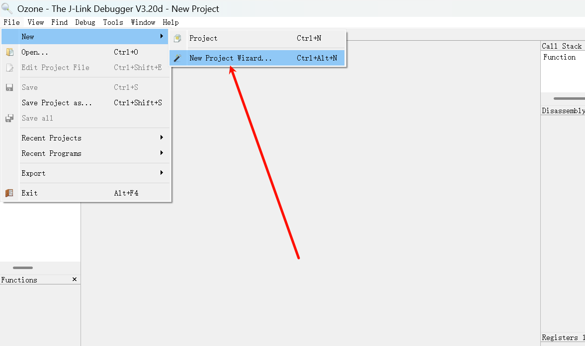
:::


**选择调试芯片**：在 `SIFLI-SDK\tools\svd_external` 路径下选择对应的芯片型号目录打开选择svd文件。

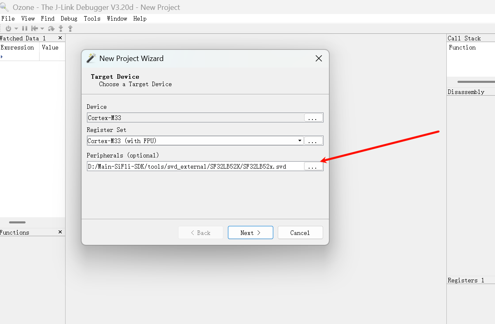


:::{only} SF32LB55X or SF32LB56X or SF32LB58X

**选择连接接口**：选择 J-Link (SWD/JTAG), 找不到时请检查连接和供电。

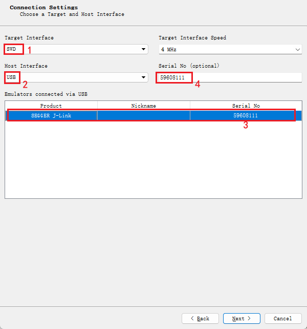
:::


:::{only} SF32LB52X
**选择连接接口**：将 SiFliUsartServer 虚拟的 IP 如图填入。

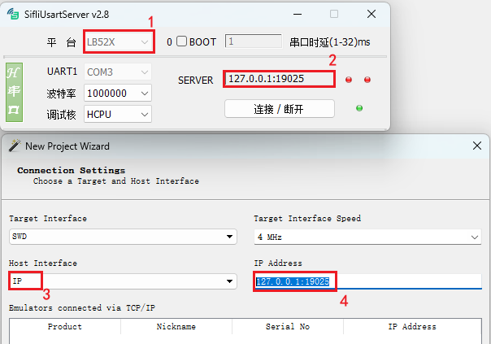
:::

**选择固件**：选择编译出的 `*.axf` 或 `*.elf` 文件。注意后缀名的区别，使用 Keil 编译的后缀名是 .axf，使用 GCC 编译的后缀名是 .elf。

:::{only} SF32LB55X
例如 `watch_demo` 工程的 LCPU axf 路径为 `\release\example\rom_bin\lcpu_general_ble_img\lcpu_general_551.axf`。

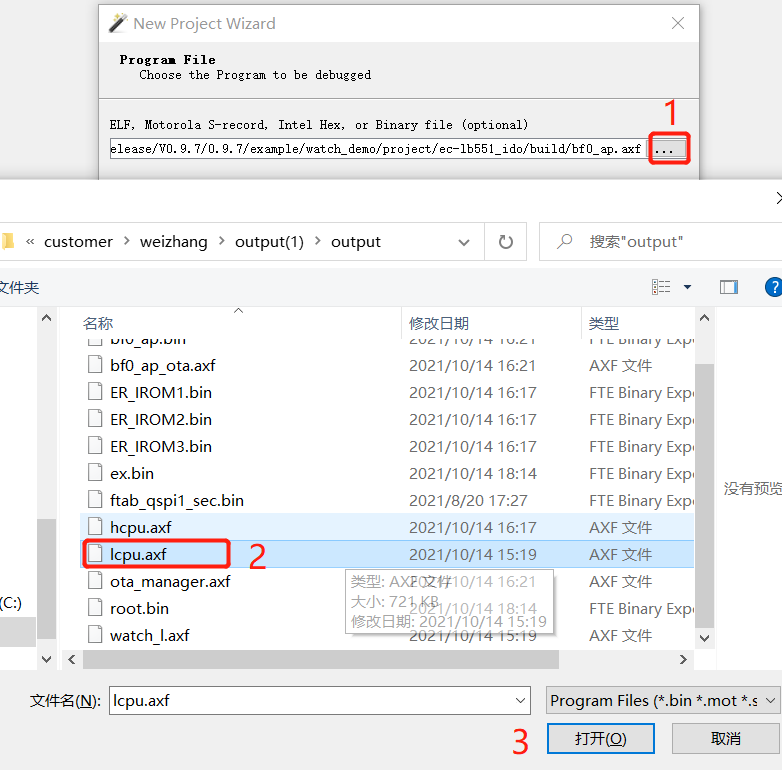
:::

:::{only} SF32LB52X or SF32LB56X or SF32LB57X or SF32LB58X
Ozone 中选择 file 之后再选择 open 的选项，随后找到自己想导入的固件选择导入。

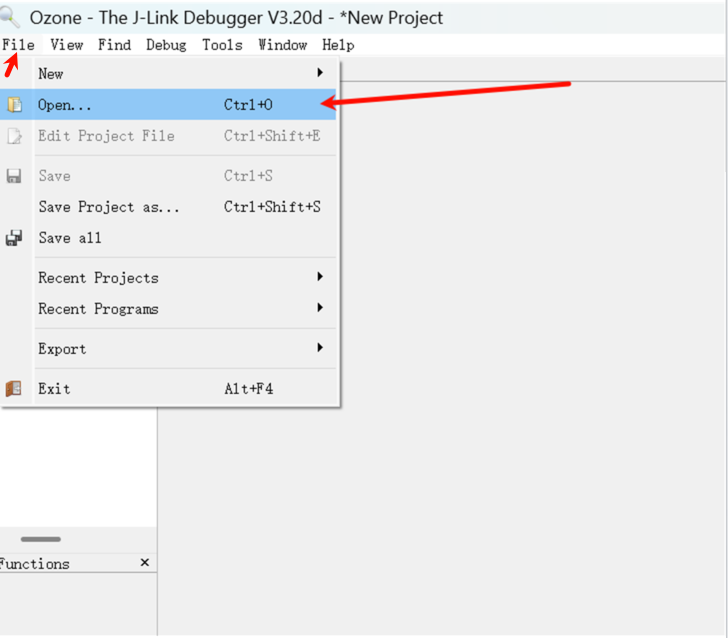

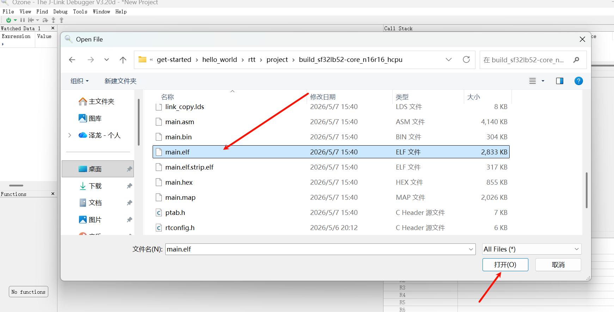
:::


**Attach 程序**：
- **Attach & Halt Program**：让 J-Link 连接到 CPU，并暂停在当前的 PC 指针（排查死机时推荐）。
- **Attach & Run Program**：连接到 CPU 并继续从当前 PC 运行。

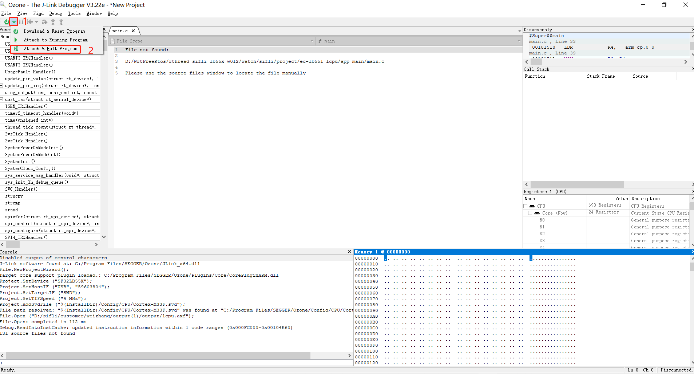

**开始调试**：点击运行程序箭头图标后，CPU 即可单步运行，可以添加断点、查看调用栈信息和寄存器状态。

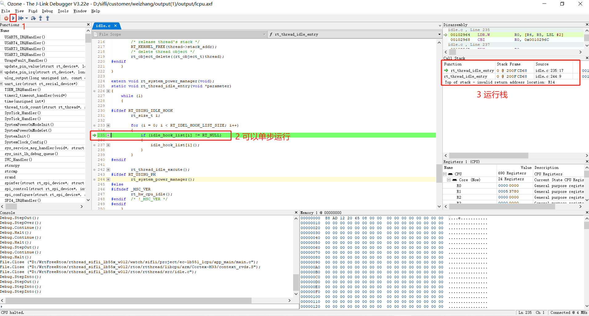

### 2.2 Ozone 常见调试问题排查

**问题 1：连接后出现 Target Connection Lost 频繁断连**

经常连接一会就会出现如下断连对话框，随后调试中断：

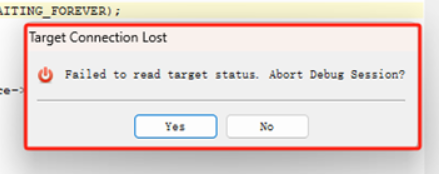

**原因与解决**：
这是因为连接 Ozone 进行调试时，默认开启了 `Memory` 窗口并读取了暂未初始化（如 PSRAM）或不存在的内存地址，读取失败导致断连。**连接调试前，请务必关闭 Ozone 的 Memory 窗口和其他不用的窗口。**

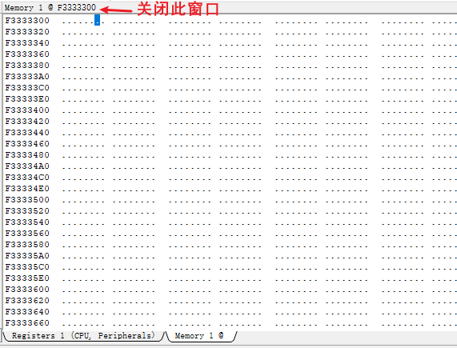

**问题 2：Ozone 使能 RT-Thread RTOS 线程感知**

如果在 Ozone 中希望查看系统线程，请将 SDK 下的插件 `\tools\segger\RtThreadOSPlugin.js` 复制到 Ozone 安装目录的 `Plugins\OS\` 下。重新打开工程，启用 `Project.SetOSPlugin("RtThreadOSPlugin");` 即可在线切换 RT-Thread 线程查看和调试。

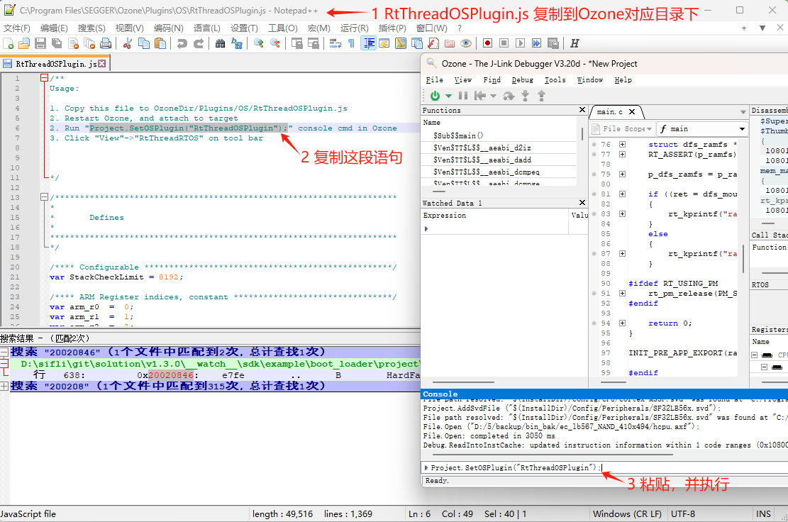
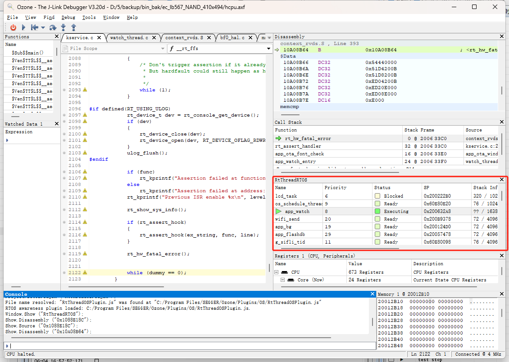

**问题 3：Ozone 提示 File not found（重定义源码路径）**

在烧录的 bin 不是本地编译（例如排查其他人发来的死机现场）的情况下，Ozone 提示 `File not found`，无法定位到 C 源代码进行单步跟踪。

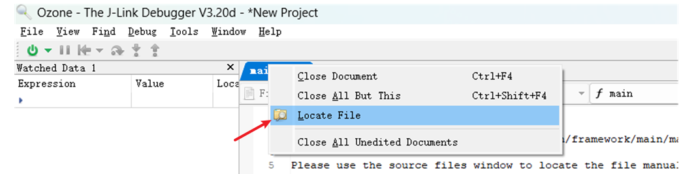

**解决方法**：
- **单个文件找不到**：右键该文件，选择 `Locate File` 并定位到本地对应的 C 源文件。
- **批量文件基地址不对**：在 Ozone 的命令窗口输入 `Project.AddPathSubstitute` 命令重定位路径，比如将 ELF 中的 Linux 编译路径替换为 Windows 的本地路径。

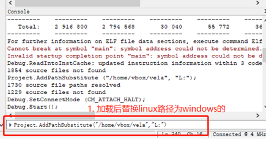

**问题 4：Ozone Debug 连接不成功**

提示：

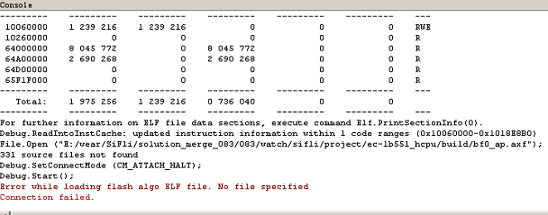

解决方法：你需要按照 J-Link 一样，添加好 flash 的驱动和 xml 配置文件，这样 Ozone 才支持。

```xml
C:\Program Files\SEGGER\Ozone\Devices\SiFli\SF32LB55X****.elf
C:\Program Files\SEGGER\Ozone\JLinkDevices.xml
# 不同 J-Link 或 Ozone 版本的路径可能如下：
C:\Users\yourname\AppData\Roaming\SEGGER\JLinkDevices.xml
C:\Users\yourname\AppData\Roaming\SEGGER\JLinkDevices\Devices\SF32LB55X****.elf
```
:::{only} SF32LB58X or SF32LB56X or SF32LB55X or SF32LB57X
**问题 5：Ozone 怎么调试 LCPU**

J-Link 默认 connect 会连接到 HCPU，调试 HCPU。

解决方法：如果要调试 LCPU，可以在 Windows CMD 命令窗口执行 SIFLI-\tools\segger\jlink_lcpu_a0.bat（55）、jlink_lcpu_pro.bat（58）、jlink_lcpu_56x.bat（56）。执行该批处理，执行的是 \tools\segger\jlink_lcpu_xxx.jlink 里面的几条命令：

```
w4 0x4004f000 1
connect
w4 0x40070000 0
exit
```

也可以直接在 J-Link 窗口依次输入这两条命令，切换到 LCPU。


:::