# 调试工具环境配置指南

本节主要讲述关于工具的下载和环境配置。

## 1 Trace32
### 1.1 Trace32 下载和配置方法
#### 1.1.1 下载 Trace32
可以直接在 Lauterbach 公司的官网下载，如下图所示。版本选择 ARM 版 [simarm.zip](https://repo.lauterbach.com/download_demo.html)，免费版本在线调试和 Script 长度有限制，SiFli 的全系列 MCU 目前只用到了离线调试功能。

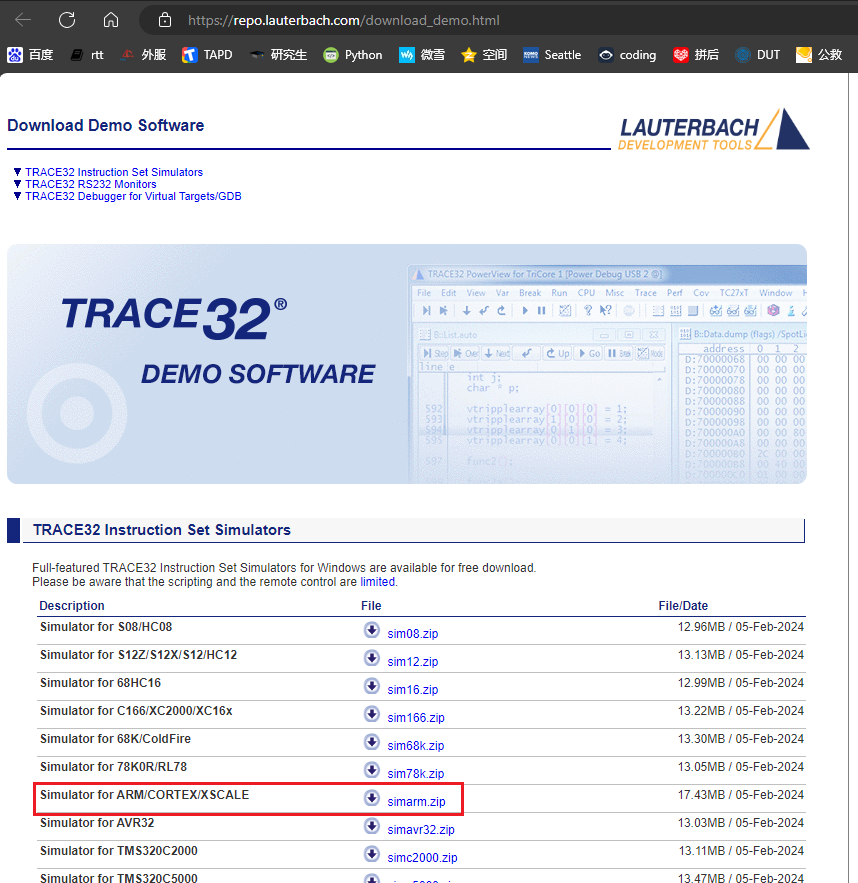

Lauterbach 公司的离线调试工具下载地址：
[Simulator for ARM/CORTEX/XSCALE simarm.zip](https://repo.lauterbach.com/download_demo.html)

#### 1.1.2 配置方法

下载的压缩包解压到 `SiFli-SDK\tools\crash_dump_analyser\` 目录内，再把此目录的 `patch` 内容复制到刚解压的 `simarm` 目录内，如下图所示：

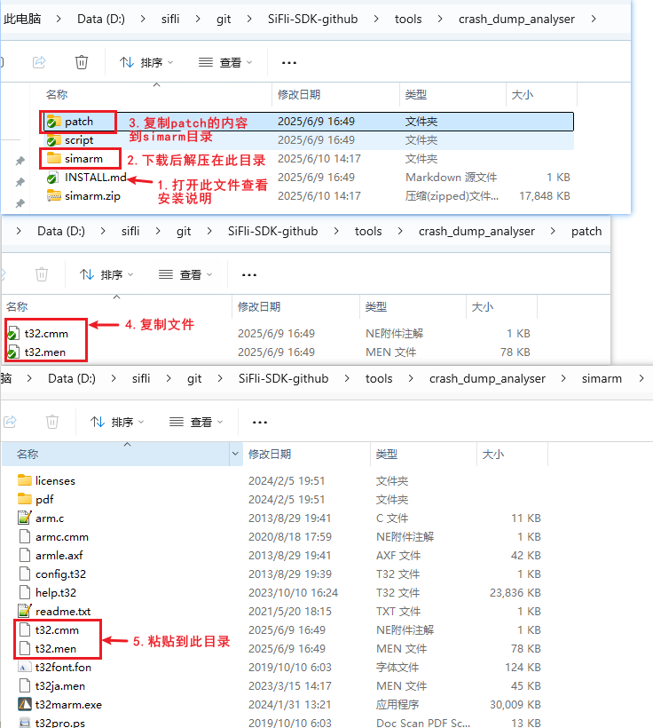

### 1.1.3 Trace32 运行方法
该软件免安装，鼠标双击 `simarm` 目录内 `t32marm.exe` 可执行文件，即可打开 Trace32。

## 2 Ozone
### 2.1 Ozone 下载和配置方法
#### 2.1.1 下载 Ozone
可以直接在 Segger 公司官网下载。如果是 Windows 系统，选择 Windows 版本。

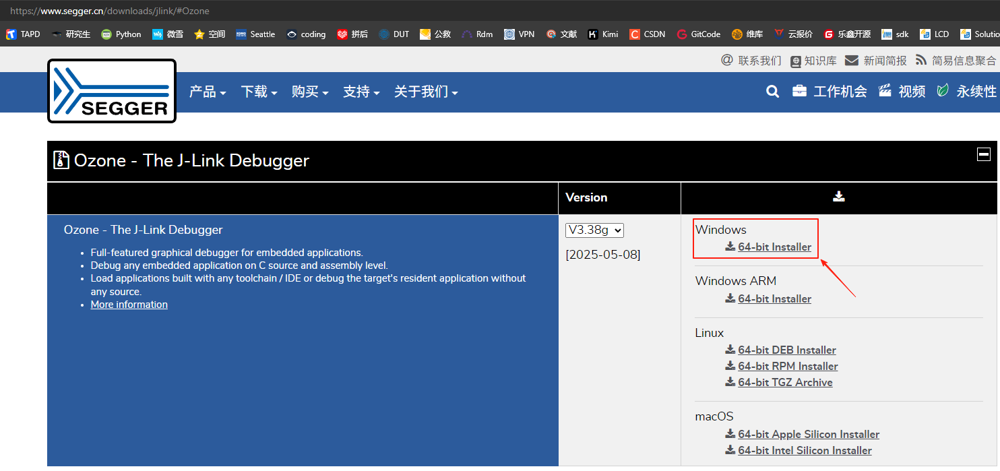

Segger 公司的在线调试工具下载地址：
[Ozone - The J-Link Debugger Windows 64-bit Installer](https://www.segger.cn/downloads/jlink/#Ozone)

**注意：**高版本 Ozone 和 J-Link 超过 V7.6 后，会对盗版 J-Link 调试器进行检查。学习用途可选用 [Ozone_Windows_V320d_x64.exe](https://www.segger.cn/downloads/jlink/Ozone_Windows_V320d_x64.exe) 和 [JLink_Windows_V758a_x86_64.exe](https://www.segger.cn/downloads/jlink/JLink_Windows_V758a_x86_64.exe)。

#### 2.1.2 配置 Device、MCU 外设寄存器和 RT-Thread OS 脚本
A. 把 `SiFli-SDK\tools\flash\jlink_drv\JLinkDevices.xml` 文件替换 Ozone 配置 `C:\Users\yourname\AppData\Roaming\SEGGER\JLinkDevices\JLinkDevices.xml`；另外在 `C:\Users\yourname\AppData\Roaming\SEGGER\JLinkDevices\Devices\` 目录下创建 `SiFli` 目录，并把 `SiFli-SDK-i\tools\flash\jlink_drv` 目录下的所有文件夹里的内容复制到创建好的SiFli文件夹中，对应目录和文件如下：

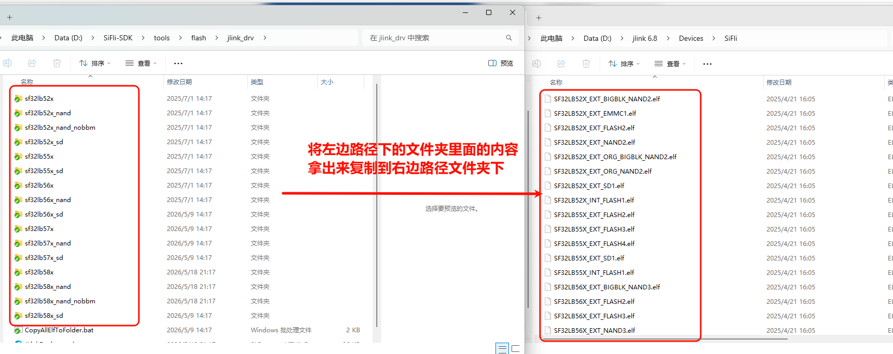

J-Link 烧录驱动对应关系见文件 JLinkDevices.xml 的内容：

```xml
<Device>
    <ChipInfo Vendor="SiFli" Name="SF32LB52X_NOR" Core="JLINK_CORE_CORTEX_M33" WorkRAMAddr="0x20000000" WorkRAMSize="0x60000" />
    <FlashBankInfo Name="Internal Flash1" BaseAddr="0x10000000" MaxSize="0x8000000"  Loader="Devices/SiFli/SF32LB52X_INT_FLASH1.elf" LoaderType="FLASH_ALGO_TYPE_OPEN" AlwaysPresent="1"/>
    <FlashBankInfo Name="External Flash2" BaseAddr="0x12000000" MaxSize="0x8000000" Loader="Devices/SiFli/SF32LB52X_EXT_FLASH2.elf" LoaderType="FLASH_ALGO_TYPE_OPEN" AlwaysPresent="1"/>
</Device>
```

B. 把 `SiFli-SDK\tools\svd_external` 目录下的所有文件夹里的内容复制到 `C:\Program Files\SEGGER\Ozone\Config\Peripherals` 目录下。

C. 把 `SiFli-SDK\tools\segger\RtThreadOSPlugin.js` 复制到 `C:\Program Files\SEGGER\Ozone\Plugins\OS\` 目录下，对应目录和文件如下：

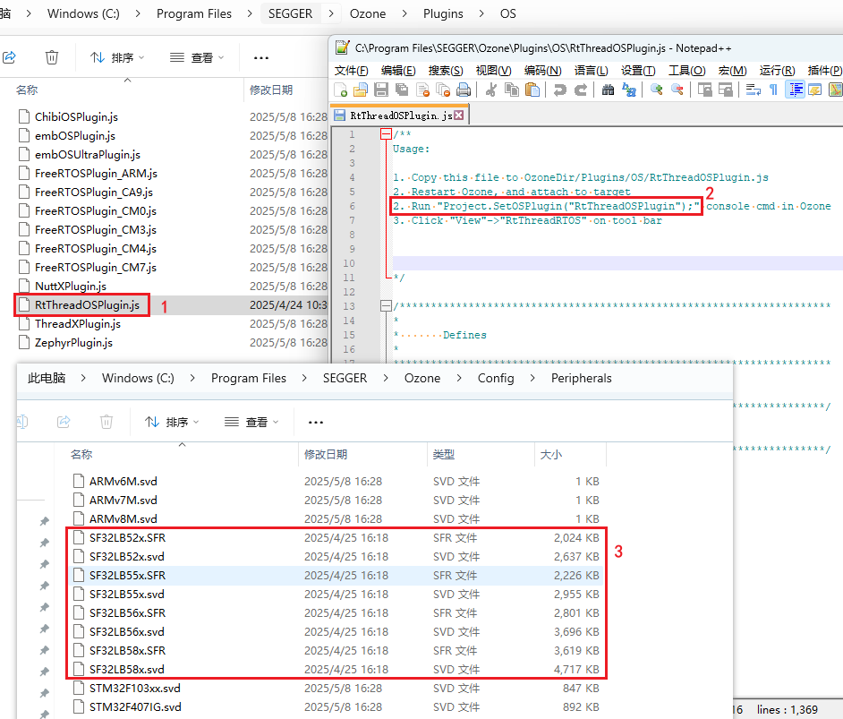

配置 A/B/C 三项后，打开 Ozone，就可以选择到需要调试的 Devices 和 MCU 外设寄存器：


配置好 MCU 外设寄存器和 RT-Thread OS 脚本后，进入 Ozone 界面，可以查看对应 MCU 外设寄存器和 OS 线程：

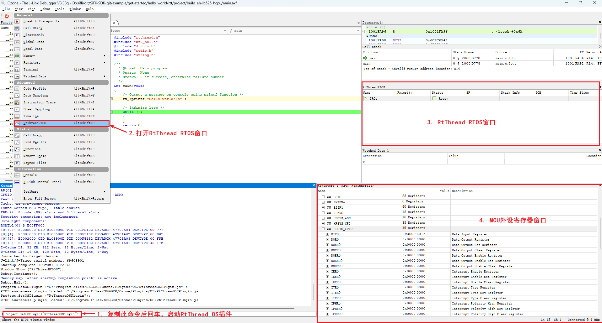

## 3 J-Link
J-Link 的安装可以去官方自行下载，请使用 JLink V7.62 或以上版本。安装完成后在 `jlink\Devices\` 目录下创建 SiFli 文件夹：

`D:\jlink 6.8\Devices\SiFli`

将 SDK 中的 `tools/flash/jlink_drv` 目录内容整体拷贝到该目录，拷贝后的目录应至少包含 `JLinkDevices.xml` 和 `sf32lb55x` 等子目录。

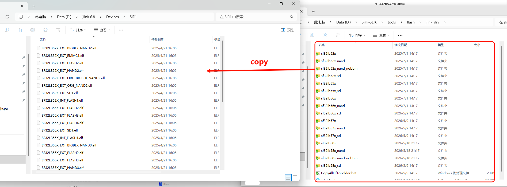

注意：
1. `tools/flash/jlink_drv` 是完整的 J-Link Device Support Kit (DSK) 包，根目录中的 `JLinkDevices.xml` 描述设备和 flash bank，各子目录中的 elf 文件是对应的 Open Flashloader algorithm。
2. J-Link V7.62 起会递归扫描 `JLinkDevices` 目录下的所有 `*.xml` 文件，因此不需要再修改 J-Link 安装目录中的 `JLinkDevices.xml`，也不需要手工将 elf 文件平铺复制到 `Devices\SiFli` 目录。
3. XML 中的 loader 路径相对 `JLinkDevices.xml` 解析，因此必须整体复制 `tools/flash/jlink_drv` 目录内容。

### 3.1 J-Link 的连接
:::{only} SF32LB55X or SF32LB58X or SF32LB56X or SF32LB57X
打开 J-Link Commander，输入 `connect` 连接，输入问号选择 SiFli 的 device：
:::
:::{only} SF32LB52X
打开 SiFliUsartServer 工具, 工具路径在 `SiFli-SDK\tools\SifliTrace\UsartServer`. 再打开 J-Link Commander，按如下图步骤连接设备

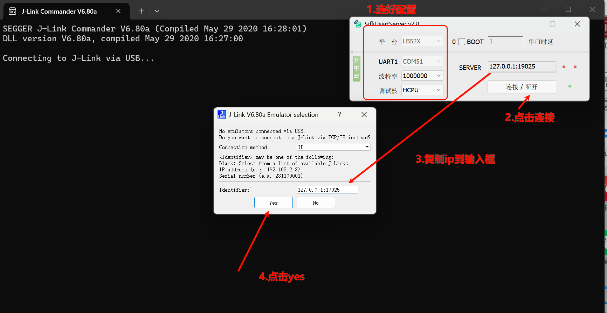
:::

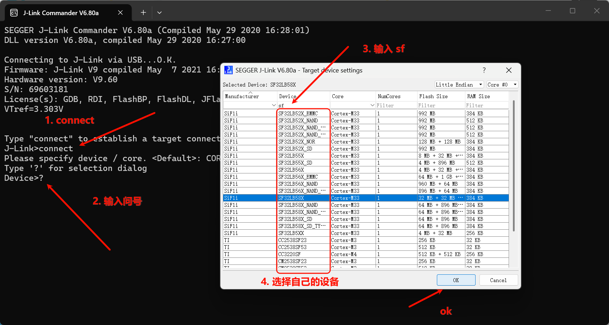

选择 SWD 接口，配置速度：

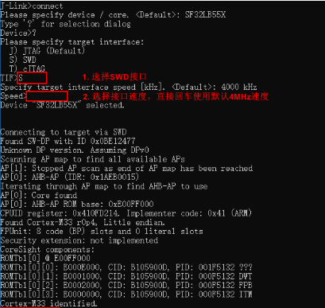


### 3.2 J-Link 使用相关问题

:::{only} SF32LB55X or SF32LB58X or SF32LB56X or SF32LB57X
#### 如何用 JLINK RTT 打印 log 信息
:::

:::{only} SF32LB55X
目前我们默认软件 HCPU 的 log 是从 UART1  输出；LCPU 的 log 是从 UART3 输出。假如客户只引出了 UART3 ，或者 UART1 被占用时，可以采用 menuconfig 改成 SWD 输出 log。
:::

:::{only} SF32LB58X or SF32LB56X
目前我们默认软件 HCPU 的 log 是从 UART1  输出；LCPU 的 log 是从 UART4 输出。客户只引出了 UART4 或者 UART1 被占用时，可以采用 menuconfig 改成 SWD 输出 log。
:::

:::{only} SF32LB55X or SF32LB58X or SF32LB56X or SF32LB57X
J-Link SWD 打印 HCPU 的 log 修改方法：
1. 进入需要修改的工程目录打开menuconfig

2. menuconfig -> Third party packages -> 选中 Segger RTT package。


3. menuconfig -> RTOS -> RT-Thread Kernel -> Kernel Device Object -> the devices name for console 改成 `segger`。


:::

####  Hcpu 的 log 通过 Jlink segger 打印不出来
根本原因：新版本 SDK 为了优化内存，J-Link 的 Control block address：`_SEGGER_RTT` 变量从 HPSYS SRAM `0x20000000` 改链接到了内存区域 HPSYS ITCM RAM `0x00010000 - 0x0001FFFF` (64 * 1024)，如下图所示：


而 J-Link 默认搜索内存从 `0x20000000` 开始，因而搜索不到，连接不成功。老版本 0.9.7 编译后的地址在 `0x20000000` 之后，J-Link 能自动连接搜索到。

解决方案 1：J-Link RTT Viewer.exe 内指定地址，该地址可以从 map 文件中搜索到，如下图：


解决方案 2：改用 Ozone.exe，Ozone.exe 能通过 axf 文件中找到该地址，如下图，存在 SetRTTAddr 地址命令：


解决方案 3：做一个 JLinkScript 命令，在 J-Link 启动时会自动调用设置或者搜索 Control block address 范围，如下图命令（可自行修改选择）：

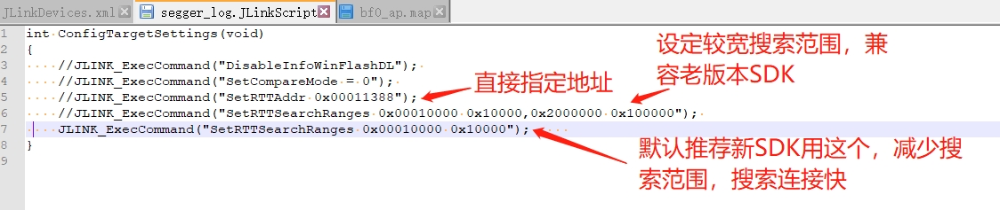

对应：xml 文件修改：


JLink.exe、J-Link RTT Viewer.exe 还是像之前一样自动能连接上，方便很多。推荐用 rttview.exe 和 `telnet 127.0.0.1` 查看 log 的使用。文件 patch 如附件，复制到 J-Link 对应安装目录：

`Program Files (x86).7z`

#### Jlink 怎么读写 flash 的内容
1) J-Link 连接成功后，用 `mem32` 读，用 `w4` 写，用 `erase` 擦写：

```
mem32 0x40014000 1 #读1个32bit的寄存器值
mem32 0x64000000 10 #读10个byte从flash2地址0x64000000开始
w4 0x64000000 0x2f 0x2f 0x2f 0x2f 0x2f 0x2f #写内存或寄存器值，从flash2地址0x64000000开始，写入后续数据
```

2) 用 J-Flash 读写：跟 jlink.exe 在一个目录，有一个 jflash 工具，如下图菜单读取 flash 内容：


3) `savebin` 命令读取：

```
savebin d:\1.bin 0x101b4000 0x100000
```

如上，`0x101b4000` 为内存地址，`0x100000` 为读写内存大小（单位为 byte）。save 出来的 bin 再烧写回去方法：

```
loadbin d:\1.bin 0x101b4000
```

#### Jlink 其他常用命令
1) `halt`、`go` 命令：输入 `h` 可以让 CPU 停下来查看 PC 指针所在位置；输入 `g` 可以让 CPU 继续跑起来。


2) 设置 PC 指针：常用于配合 `__asm("B .");` 指令使用，当代码中执行到该指令后会停住。如上图，如果此时 PC 指针在 `0x10140D28`，让 PC 指针加 2，输入 `setpc 0x10140D2A`，可以跳过 `__asm("B .");` 指令继续运行。

3) 其他指令：

```
erase 0x00000000.0x0000FFFF
loadbin <filename> <address> -- 下载 filename 文件到地址
usb -- 连接目标板
r -- 重启目标板
halt -- 停止 cpu 运行的程序
loadbin -- 加载可执行的二进制文件
g -- 跳到代码段地址执行
s -- 单步执行（调试用）
setpc -- 设置 pc 寄存器的值（调试用）
setbp -- 设置断点，断点停后可以指令 g 继续运行
Regs -- 读寄存器组织
wreg -- 写寄存器
mem -- 读内存
w4 -- 写内存
```

