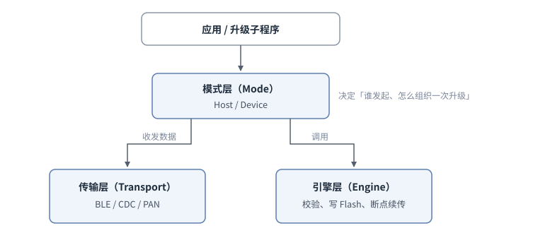
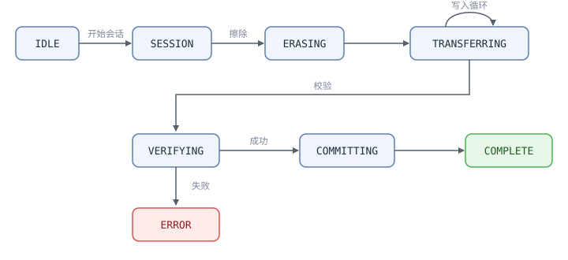

# DFU V2 固件升级中间件

DFU V2 是 SiFli SDK 中新一代的固件升级（Device Firmware Update，DFU）子系统，用于把新的固件下载到设备并写入 Flash，从而完成版本升级。它把原先分散在 BLE DFU 与 PAN DFU 两套实现中的能力统一到一套框架里，对外提供一致的接口，对内以「引擎 / 模式 / 传输」三层解耦的方式组织代码，方便在不同的下载通道（手机 BLE、PC 端 USB、蓝牙 PAN 网络）之间复用同一套升级流程。

DFU V2 的源码位于 _middleware/dfu_v2_ ，对外的公共接口在 _dfu_v2.h_ 中声明。它默认关闭，需要在配置中显式使能，并且与旧的 DFU（`BSP_USING_DFU`）、旧的 PAN DFU（`USING_DFU_PAN`）互斥，不能同时开启。

## 整体架构

DFU V2 按职责划分为三层，各层之间通过明确的接口交互。模式层是升级流程的组织者：它一边通过传输层在链路上收发数据，一边调用引擎层完成擦除、写入与校验；传输层与引擎层彼此独立、互不直接依赖：



- **引擎层（Engine）**：整个升级流程的核心状态机，负责把收到的数据写入目标 Flash、维护 CRC 校验、把下载进度持久化以支持断点续传，并统一封装 NOR / NAND 两种 Flash 的差异。无论使用哪种模式或传输通道，引擎层都会被编译进来。
- **模式层（Mode）**：决定一次升级由谁发起、如何组织。分为主机发起模式（Host Mode，即由上位机把固件推送给设备）和设备发起模式（Device Mode，即由设备主动从服务器拉取固件）。
- **传输层（Transport）**：负责具体链路上的数据收发。推送类传输（Push）服务于 Host Mode，包含 BLE 与 USB CDC；拉取类传输（Pull）服务于 Device Mode，目前为蓝牙 PAN 网络上的 HTTP 下载。

这种分层的好处是：换一条下载通道只需要替换传输层，升级的核心逻辑（写 Flash、校验、续传）在引擎层里只写一次。

## 系统组成

一个具备 DFU V2 升级能力的产品，其固件由三个相互配合的程序组成：

- **bootloader（二级引导）**：每次上电最先运行。它读取固件信息区，发现有效的升级标志（magic 与 `needs_update`）且升级子程序镜像有效时，把启动目标改为升级子程序；否则正常引导用户固件。
- **用户固件**：产品的主程序，运行在 HCPU 代码分区。平时不参与固件传输，需要升级时写入触发标志并重启；BLE 例程还演示了在用户固件里直接接收非自身镜像的用法（见「使用方法」一节）。
- **升级子程序（DFU loader）**：独立的小程序，烧录在专门的 `DFU_V2_LOADER` 分区，下载与写入都在它的上下文中完成。

三者通过 Flash 上的**固件信息区（fwinfo）**衔接：该区域固定占用 `DFU_V2_LOADER` 分区的最后 4KB（`DFU_FWINFO_BASE_ADDR`，见 _dfu_macro.h_）。用户固件在这里写触发标志或下载清单，bootloader 据此决定引导目标，升级子程序开机检查（`dfu_check_install()`）会清除遗留的标志，避免反复进入升级模式。

DFU V2 靠分区表生成的宏定位各个区域，使用它的工程必须在板级分区表（`ptab.json`）里把相关分区声明出来：

- `DFU_V2_LOADER_START_ADDR` / `DFU_V2_LOADER_SIZE`：由 ptab.json 中带 `DFU_V2_LOADER` 标签的区域生成。中间件用它推导固件信息区地址，bootloader 用它定位升级子程序；分区表里没有这个区域时两个宏回退为无效值，固件信息相关功能无法正常工作。
- `HCPU_FLASH_CODE_START_ADDR`、`LCPU_FLASH_CODE_START_ADDR`、`HCPU_FLASH2_FONT_START_ADDR` 等目标分区宏：BLE 传输把镜像编号映射到 Flash 地址时直接引用（见「镜像类型」一节），工程里没有定义对应宏的镜像无法下载。

各例程的 ptab.json 可作为声明模板（如 _example/dfu_v2/ble/app/project/sf32lb52-lcd_n16r8_hcpu/ptab.json_）。

## 使用方法

DFU V2 通常在两类程序里配合使用：

- **升级子程序**：运行在 `DFU_V2_LOADER` 分区，负责接收数据、写 Flash。它调用 `dfu_init()` 初始化中间件；主机发起模式下跑一个邮箱主循环，设备发起模式下则直接阻塞调用 `dfu_download()`。
- **用户固件**：负责在合适的时机触发一次升级，或在设备发起模式下预先写好待下载的文件清单。

两类程序与两种模式的常见组合如下：

| 场景 | 用户固件 | 升级子程序 |
|------|--------------|----------------|
| 主机发起（BLE / CDC） | 调用 `dfu_enter_dfu_mode()` 重启进入子程序（BLE 例程还可在不重启的情况下接收非自身镜像，见下文） | `dfu_init()` + 邮箱主循环，接收上位机推送的固件 |
| 设备发起（PAN） | 用 `dfu_fwinfo_set()` 写清单、`dfu_fwinfo_set_update_flags()` 置升级标志后重启 | 读回清单，用 `dfu_download()` 阻塞式拉取下载 |

### 主机发起模式（BLE / CDC）

#### 升级子程序：初始化与邮箱主循环

升级子程序的主体是「初始化 + 邮箱主循环」。`dfu_init()` 会按配置把引擎、传输、模式都准备好（传输层如 BLE、CDC 也在这里被初始化），但它不创建线程，主循环由子程序自己驱动：

```c
#include "dfu_v2.h"
#include "dfu_app.h"

/* 升级事件回调，在主循环线程上下文被调用 */
static int on_dfu_event(const dfu_event_param_t *param, void *user_data)
{
    switch (param->event)
    {
    case DFU_EVT_PROGRESS:
        LOG_I("升级进度 %d%%", param->progress.percent);
        break;
    case DFU_EVT_ALL_COMPLETE:
        LOG_I("全部镜像已写入");
        /* 镜像已写入 Flash。这里以直接重启回用户固件为例；是否[立即重启]由各 loader 自行决定（例如 CDC 例程只更新界面提示） */
        drv_reboot();
        break;
    case DFU_EVT_ERROR:
        LOG_E("升级失败，错误码 %d", param->err.error);
        break;
    default:
        break;
    }
    return 0;
}

void dfu_subprogram_main(void)
{
    dfu_config_t cfg = { .callback = on_dfu_event, .user_data = RT_NULL };

    /* 初始化子系统：创建邮箱，按配置初始化引擎 / 传输 / 模式 */
    if (dfu_init(&cfg) != 0)
    {
        LOG_E("dfu_init 失败");
        return;
    }

    /* 清除上一次会话遗留的升级标志 */
    dfu_check_install();

    /* 主循环：从邮箱取消息 */
    rt_mailbox_t mb = dfu_get_mailbox();
    rt_ubase_t   msg;
    while (1)
    {
        if (rt_mb_recv(mb, &msg, RT_WAITING_FOREVER) != RT_EOK)
            continue;

        /* 先交给 DFU：返回 0 表示这条消息已被中间件认领并处理 */
        if (dfu_process(msg) == 0)
            continue;

        /* 返回非 0 表示中间件不认识这条消息，交回子程序自行处理（例如子程序把 BLE 协议栈事件也投递到同一个邮箱） */
        handle_app_message(msg);
    }
}
```

这里有两个要点：

- **邮箱可以共用**。子程序可以把自己的消息（例如 BLE 连接、断开等协议栈事件）投递到 `dfu_get_mailbox()` 返回的同一个邮箱里。`dfu_process()` 返回 `0` 表示这条消息属于 DFU 并已处理，返回非 `0` 表示中间件不认识、应由子程序自己处理。这样一个主循环就能同时驱动升级和子程序自身的逻辑。消息本身就是一个 `rt_ubase_t` 数值：中间件保留 `dfu_msg_t` 的 `0x01`～`0x3F`（数据到达、连接断开、请求中止等，见 _dfu_v2.h_），子程序自定义的消息应使用 `0x100` 及以上的值以避免冲突。
- **数据到达不在接收上下文里处理**。数据到达发生在异步上下文（BLE 为协议栈回调，既不是中断也不是 DFU 线程；USB CDC 为 USB 中断回调），传输层在该上下文里只把「数据到达」之类的消息投递进邮箱，真正的处理都发生在主循环线程上下文，因此回调里可以安全地打日志、更新 UI、置标志。

#### 用户固件：触发一次升级

用户固件在需要升级时（例如收到升级指令）调用 `dfu_enter_dfu_mode()`。它写入升级触发标志并重启，重启后 bootloader 会跳转到升级子程序：

```c
#include "dfu_app.h"

void start_firmware_upgrade(void)
{
    dfu_enter_dfu_mode();   /* 写触发标志并重启，不会返回 */
}
```

#### 在用户固件里直接接收升级（BLE 例程的做法）

除了重启进入升级子程序，用户自己的程序（主程序）也可以调用 `dfu_init()`，在正常运行的同时运行 DFU Host 模式（BLE 例程即是如此），并用 `dfu_mode_host_set_self_img_id()` 声明自己正运行在哪个镜像编号上：用户固件运行在 HCPU 分区填 `0`；升级子程序运行在 DFU 分区填 `6`（即 OTA manager）。此后 Host 模式收到与该编号相同的镜像时自动跳过，只向上位机回应答，不创建引擎会话、不擦不写；以这种方式在用户固件里运行时，其余非 HCPU 镜像（资源、字体、DFU loader 等）将被直接写入目标分区。这样资源类镜像将可以在应用运行中直接升级、无需重启，只有升级 HCPU 自身时才需要调用 `dfu_enter_dfu_mode()` 切入升级子程序。

```{note}
这种用法下，如果升级包里包含自身镜像，该镜像会被跳过，上位机看到的是成功应答，但数据并没有写入。自身镜像必须通过升级子程序路径更新。

另外，在应用运行中直接覆盖资源、字体等分区有一个使用约束：升级期间应用不能同时使用这些分区里的内容（例如 GUI 正在从字体或资源分区读取渲染），否则会读到写了一半的数据。中间件不会检查也不会阻止这种情况，需要应用在升级期间自行停止使用相关资源。
```

### 设备发起模式（PAN）

设备发起模式下，下载分成「用户固件写清单」和「升级子程序拉取固件」两步。

#### 用户固件：写入待下载文件清单

用户固件先拿到要下载的固件列表（例如经 PAN 网络向 OTA 服务器查询，从响应或清单中解析出每个文件的 URL、目标地址、大小、CRC），逐条用 `dfu_fwinfo_set()` 写入 Flash，再调用 `dfu_fwinfo_set_update_flags()` 置位升级触发标志，最后重启进入升级子程序：

```c
#include "dfu_fwinfo.h"

struct dfu_fw_info info = {0};
strncpy(info.name, "hcpu", sizeof(info.name) - 1);
strncpy(info.url,  "http://ota.example.com/hcpu.bin", sizeof(info.url) - 1);
info.addr        = HCPU_FLASH_CODE_START_ADDR;   /* 目标 Flash 地址 */
info.size        = fw_size;                       /* 文件大小 */
info.crc32       = fw_crc;                         /* 期望 CRC32 */
info.region_size = HCPU_FLASH_CODE_SIZE;          /* 目标分区大小 */
info.file_id     = 0;                             /* 镜像编号 */

dfu_fwinfo_set(0, &info);   /* 写入第 0 条；每个文件写一条 */
/* ...对每个文件重复上面的步骤... */

/* 关键一步：置位升级标志（needs_update=1 并写入 magic）。该接口只跳过 name 首字节为 '\0' 的条目，已擦除的 0xFF 条目也会被置位，所以读清单一侧仍要过滤空白/擦除态表项；dfu_fwinfo_set() 只是原样写入、不设标志。
 * 缺了这一步，bootloader 检测不到升级请求，重启后会直接回到用户固件。 */
dfu_fwinfo_set_update_flags();

drv_reboot();               /* 重启进入 PAN 升级子程序 */
```

#### 升级子程序：拉取并写入

升级子程序启动后，用 `dfu_fwinfo_get()` 把清单读回来、跳过空白表项，转成下载请求，交给 `dfu_download()` 一次性阻塞下载所有文件。`dfu_download()` 在调用者线程内完成整个流程：从拉取类传输读取数据，交给引擎层校验并写入 Flash，全部文件处理完才返回；下载过程中的进度会通过事件回调上报。注意两个前提：工程需已使能 `DFU_V2_USE_DEVICE_MODE` 与 `DFU_V2_USE_PAN_TRANSPORT`，并且已经调用过 `dfu_init()`——否则 `dfu_download()` 直接返回失败：

```c
#include "dfu_v2.h"
#include "dfu_fwinfo.h"

/* 0. 先初始化中间件——设备发起模式不跑邮箱主循环，
 *    但 dfu_download() 要求子系统已初始化（回调定义参考前文） */
dfu_config_t cfg = { .callback = on_dfu_event, .user_data = RT_NULL };
if (dfu_init(&cfg) != 0)
    return;

struct dfu_fw_info fw_files[DFU_MAX_FW_FILES];
dfu_file_t         v2_files[DFU_MAX_FW_FILES];
int                count = 0;

/* 1. 从 Flash 读回用户固件写好的清单 */
for (int i = 0; i < DFU_MAX_FW_FILES; i++)
{
    if (dfu_fwinfo_get(i, &fw_files[i]) != 0)
        continue;
    /* dfu_fwinfo_get() 只做读取、不校验内容：空白或已擦除的表项
     * 同样返回 0，必须按 name 首字节过滤掉 */
    if (fw_files[i].name[0] == '\0' || (uint8_t)fw_files[i].name[0] == 0xFF)
        continue;
    v2_files[count].url         = fw_files[i].url;
    v2_files[count].flash_addr  = fw_files[i].addr;
    v2_files[count].file_size   = fw_files[i].size;
    v2_files[count].file_crc    = fw_files[i].crc32;
    v2_files[count].region_size = fw_files[i].region_size;
    v2_files[count].img_id      = (uint8_t)fw_files[i].file_id;
    count++;
}

/* 2. 阻塞式下载全部文件 */
dfu_download_req_t req = { .files = v2_files, .file_count = count };
if (dfu_download(&req) == 0)
{
    /* 各文件已直接写入目标分区，清掉清单后重启回到用户固件 */
    dfu_fwinfo_clear();
    drv_reboot();
}
```

### 查询进度与中止

无论哪种模式，都可以在其它线程里查询进度或请求中止：

- `dfu_get_progress(&received, &total)`：取当前已接收字节数与总字节数，可用于刷新进度条。
- `dfu_abort()`：请求中止当前升级。它向主循环邮箱投递一条 `DFU_MSG_ABORT` 消息（`rt_mb_send` 不阻塞，可以在中断里安全调用）；主循环的 `dfu_process()` 收到消息后调用 `dfu_engine_abort()` 置中止标志，实际的清理在引擎下一次被调用时完成。

### 完整例程

上面的片段展示了核心调用方式，完整可编译的工程示例见 SDK 中的下列例程及其 README：

- BLE 通道：_example/dfu_v2/ble_
- USB CDC 通道：_example/dfu_v2/cdc_
- 蓝牙 PAN 网络通道：_example/dfu_v2/bt_pan_

## 引擎层（Engine）

引擎层的接口定义在 _engine/dfu_engine.h_ 中，类型定义在 _engine/dfu_engine_types.h_ 中。它是一个显式的状态机，一次单镜像升级会依次经过下面几个状态：



对应到接口上：

| 接口 | 作用 |
|------|------|
| `dfu_engine_init` / `dfu_engine_deinit` | 初始化 / 反初始化引擎，内部会初始化 Flash 抽象层与用于持久化进度的 FlashDB |
| `dfu_engine_begin_session` | 开始一次镜像升级会话，并在 FlashDB 中查找是否有可续传的进度快照 |
| `dfu_engine_erase` | 擦除目标 Flash 区域，内部自动识别 NOR / NAND 并对齐擦除边界；若目标位于 NAND，在此阶段按目标地址初始化页缓存 |
| `dfu_engine_write_data` | 把一段固件数据写入 Flash，同时累计 CRC、更新计数、按间隔持久化进度 |
| `dfu_engine_verify` | 下载结束后校验数据完整性（比对 CRC32） |
| `dfu_engine_commit` | 提交本次镜像会话：清除 FlashDB 中的进度记录、释放 NAND 缓存，并把状态切换为升级完成（直写模型下数据已写在目标地址，此处不再写入固件信息） |
| `dfu_engine_abort` | 请求中止（仅置标志，可在中断中安全调用，实际清理发生在下一次引擎调用时） |
| `dfu_engine_get_status` | 查询当前状态、最近一次错误码与进度（可在任意上下文调用） |

### 直接写入模型

引擎收到数据后，会调用 Flash 抽象层把数据**直接写入目标分区**。目标地址与分区大小来自当前镜像描述符 `dfu_image_info_t` 中的 `flash_addr` 与 `flash_size`。写入的前提是目标分区不是当前正在运行的代码：既可以在独立的升级子程序（DFU loader）里写入 HCPU 代码区、资源等非当前运行分区的镜像，也可以在用户固件正常运行的同时接收、只写非自身镜像。写入方自身所在的分区都不能写：Host 模式提供自身镜像跳过机制，但它不是默认开启的——应用需要先调用 `dfu_mode_host_set_self_img_id()` 声明自身运行的镜像编号（默认值 `0xFF` 表示不做过滤），之后才会跳过对该镜像的写入（见「使用方法」一节）；设备发起模式（PAN）没有对应的保护，按清单里的地址直接写，需要由服务器清单或应用侧保证其中不包含当前正在运行的分区。

### 断点续传

引擎使用 FlashDB 把下载进度以快照的形式持久化。快照以 `(total_length, total_packets, file_crc)` 三元组作为匹配键：当一次升级被打断、重新开始会话时，如果新会话的这三个值与已保存的快照一致，`dfu_engine_begin_session` 会返回可续传标志以及已完成的字节数与包数，引擎便从断点处继续写入，而不必从头重传。进度默认每写入约 4096 字节保存一次，这个间隔可以通过配置调整。

### Flash 抽象与 NAND 缓存

NOR 与 NAND 在擦除粒度、写入对齐上的差异被统一封装在 _engine/dfu_engine_flash.c_ 中。引擎在擦除与写入时会自动识别目标地址属于 NOR 还是 NAND：对于 NAND，会启用一块页对齐的缓存，把未满一页的数据先按顺序缓存聚合，攒满一页时按页刷入，并在需要时用 `0xFF` 补齐页尾。上层的写入逻辑因此不需要关心底层是哪种 Flash。

## 模式层（Mode）

模式层决定一次升级由谁发起、如何驱动引擎。模式层通过回调向上层报告升级过程中的事件（开始、进度、单镜像完成、全部完成、出错、被中止），回调类型见 _mode/dfu_mode.h_ 中的 `dfu_mode_callback_t`。需要注意这是模式层与 DFU V2 对外接口层之间的内部接口：该回调由对外接口层（_dfu_v2.c_）注册并处理，其中「开始」事件不转发给应用（公共的 `dfu_event_t` 里没有对应事件，应用可通过 `DFU_EVT_STATE_CHANGED` 感知会话开始），应用收到的进度事件 `DFU_EVT_PROGRESS` 则来自引擎层的进度回调。应用真正收到的事件集合见「应用接口与运行模型」一节的 `dfu_event_cb_t`。

- **主机发起模式（Host Mode）**：由上位机（手机 App 或 PC 工具）通过协议帧把固件推送给设备，设备被动接收。这是 BLE 与 CDC 通道使用的模式，默认开启。
- **设备发起模式（Device Mode）**：由设备主动发起下载，通过拉取类传输从远端服务器把固件取回来。这是 PAN 通道使用的模式，默认关闭。

一个固件包可以包含多个镜像（例如 HCPU、LCPU、资源、字体等）。模式层负责编排镜像的先后顺序，每次只让引擎处理一个镜像——通常一个镜像对应一个 `dfu_engine_begin_session` 会话，逐个下载、校验、提交。有两个例外：Host 模式收到初始化请求时，会按顺序对多个镜像调用 `dfu_engine_begin_session` 来探测可续传的进度快照，未命中的探测会话随即用 `dfu_engine_reset_session` 关闭；被声明为自身镜像的镜像则完全不创建引擎会话（只应答、不写入）。

## 传输层（Transport）

传输层的通用接口定义在 _transport/dfu_transport.h_ 中，分为两类，各自是一张函数指针表（vtable）：

- **推送类传输（Push）**：只需实现一个 `send` 接口，负责把模式/协议层构造好的响应消息发给上位机。数据到达则由传输层在接收回调或中断等异步上下文里投递消息给主循环处理。目前包含：
  - **BLE 传输**（_transport/dfu_transport_ble.c_）：通过 BLE GATT 与手机通信，线上沿用旧版 BLE DFU 协议，因此既有的手机 OTA App 与出包工具无需改动即可使用。
  - **USB CDC 传输**（_transport/dfu_transport_cdc.c_）：把设备枚举为一个 USB 虚拟串口，供 PC 端 OTA 工具推送固件，响应帧原样发送。它直接基于 CherryUSB 实现。
- **拉取类传输（Pull）**：实现 `open` / `read` / `close` 三个接口，其中 `open` 带一个字节偏移参数以支持断点续传（HTTP Range）。目前包含：
  - **PAN HTTP 传输**（_transport/dfu_transport_pan.c_）：设备通过蓝牙 PAN 网络用 HTTP 从服务器下载固件。

同一时刻只能选用一种推送类传输（BLE 与 CDC 互斥）。

## 镜像类型

DFU V2 沿用旧协议的镜像编号，并根据 Flash 类型分为两套布局，由配置项 `OTA_55X`（NOR）与 `OTA_56X_NAND`（NAND）选择：

- **NOR 布局**：HCPU、LCPU、PATCH、资源、字体、扩展、OTA manager、小字体、资源升级、补丁暂存、控制包、bootloader 等。
- **NAND 布局**：HCPU、LCPU、HCPU 补丁、资源、LCPU 补丁、动态资源、音乐、图片、字体、铃声、语言等。

镜像的目标 Flash 地址来源因通道而异：BLE 传输在翻译旧协议控制包时，在传输层内把镜像编号映射到对应分区的 Flash 地址（例如 HCPU 代码区、LCPU 代码区、字体区等，上面两套布局的编号表也定义在 BLE 传输里）；CDC 通道的 Flash 地址与分区大小由 PC 端工具在初始化请求的镜像描述符里直接下发；设备发起模式（PAN）则来自应用传入的文件列表。三者最终都交给引擎写入。

## 升级触发与安装流程

DFU V2 采用「独立升级子程序」的安装模型。应用侧真正要启动一次升级时，调用 `dfu_enter_dfu_mode()`（见 _dfu_app.c_）：它通过 `dfu_fwinfo_set_update_flags()` 写入升级触发标志（该接口内部完成擦除、写入与 NAND 页缓存刷新，NOR 与 NAND 都适用），随后调用 `drv_reboot()` 重启。PAN 场景的触发方式等价，只是多一步：用户固件先用 `dfu_fwinfo_set()` 写入待下载清单，再调用同一个 `dfu_fwinfo_set_update_flags()` 置位升级标志后重启（见「使用方法」一节）。

重启后，bootloader 检测到升级标志，便跳转到 `DFU_V2_LOADER` 分区中的升级子程序。升级子程序在自己的上下文里完整地跑一遍下载流程：从传输层接收数据，经引擎层校验后写入目标分区（此时目标分区不是正在运行的代码）；完成后是否立即重启回用户固件由各 loader 自行决定。

由于 DFU V2 在下载阶段就把固件直接写入了目标分区，开机时并没有单独的「安装」动作。子程序或用户固件在启动时可以调用 `dfu_check_install()`：它检查是否有上一次会话（已完成或被中断）遗留的升级标志（`needs_update` 与 magic），若有则清除，随后返回。这个接口总是返回。

## 应用接口与运行模型

DFU V2 的公共接口在 _dfu_v2.h_ 中声明，核心接口如下：

| 接口 | 作用 |
|------|------|
| `dfu_init` | 初始化子系统：创建内部邮箱，按配置初始化引擎、传输与模式。注意它**不会创建线程** |
| `dfu_deinit` | 反初始化子系统 |
| `dfu_get_mailbox` | 获取内部邮箱句柄，升级子程序在自己的主循环里用它接收消息 |
| `dfu_process` | 处理一条邮箱消息（数据到达、连接断开、中止请求等） |
| `dfu_check_install` | 检查并清除上一次会话遗留的升级标志（`needs_update` 与 magic）；V2 在下载阶段已直写目标分区，本接口不执行安装，总是返回 |
| `dfu_download` | 设备发起模式下的阻塞式下载，在调用者线程内完成全部文件的下载与写入 |
| `dfu_set_install_flag` | 置位与后续启动流程相关的标志，具体动作由编译配置决定：编译进 PAN 传输（`DFU_V2_USE_PAN_TRANSPORT`）时固定走 PAN 中间件的标志机制，与本次实际使用的通道无关；未编译 PAN 时置固件信息升级标志并写 RTC 备份寄存器 |
| `dfu_abort` | 请求中止（可在中断中安全调用） |
| `dfu_get_progress` | 查询当前已接收字节数与总字节数 |

### 邮箱驱动的运行模型

DFU V2 本身不创建线程。在主机发起模式（BLE / CDC 等推送类传输）下，「主循环」交给使用它的升级子程序：`dfu_init()` 创建一个内部邮箱；传输层在接收回调或中断等异步上下文里收到数据后，并不直接处理，而是往这个邮箱投递一条消息（例如「BLE 数据到达」「CDC 数据到达」「连接断开」「请求中止」）。升级子程序在自己的线程里循环调用 `rt_mb_recv()` 取出消息，交给 `dfu_process()` 处理。这样所有实际的升级逻辑都运行在主循环线程上下文，异步上下文里只做最轻量的投递。设备发起模式（PAN）不走这套邮箱主循环：升级子程序在自己的线程里直接调用阻塞式的 `dfu_download()` 完成拉取（PAN 例程的主循环处理的是蓝牙协议栈事件，用的是它自己的邮箱）。

应用可以在配置中注册一个事件回调 `dfu_event_cb_t`，在升级过程中收到状态变化、进度、单镜像完成、全部完成、出错、被中止等事件（见 _dfu_v2.h_ 中的 `dfu_event_t` 与 `dfu_event_param_t`）。回调在主循环线程上下文被调用。

## 配置

在配置菜单中选中 DFU V2 后即可使能（对应配置项 `USING_DFU_V2`）。使能后可进一步配置：

| 配置项 | 说明 |
|--------|------|
| `OTA_55X` / `OTA_56X_NAND` | 选择 NOR / NAND 的镜像编号与分区布局；默认跟随各芯片常见的 Flash 类型，NOR 优先 |
| `DFU_V2_USE_HOST_MODE` | 使能主机发起模式（默认开启） |
| `DFU_V2_USE_DEVICE_MODE` | 使能设备发起模式（默认关闭） |
| Push Transport | 推送类传输，二选一：`DFU_V2_USE_CDC_TRANSPORT`（USB CDC）或 `DFU_V2_USE_BLE_TRANSPORT`（BLE） |
| `DFU_V2_USE_PAN_TRANSPORT` | 拉取类传输：蓝牙 PAN 上的 HTTP 下载（依赖设备发起模式与 WebClient） |
| `DFU_V2_ENGINE_PROGRESS_INTERVAL` | 进度回调 / 进度持久化的字节间隔（0 表示默认 4096 字节） |
| `DFU_V2_ENGINE_ERASE_VERIFY` | 擦除后回读校验（预留配置项，当前引擎尚未读取该配置，开启后不改变运行行为） |
| `DFU_V2_CDC_RINGBUF_SIZE` | CDC 接收环形缓冲大小（字节） |
| `DFU_V2_PAN_RESP_BUFSZ` / `DFU_V2_PAN_TIMEOUT_MS` | PAN HTTP 的响应缓冲大小与连接超时 |
| `DFU_V2_MB_SIZE` | 内部邮箱容量（消息条数） |

```{note}
DFU V2 与旧的 DFU（`BSP_USING_DFU`）、旧的 PAN DFU（`USING_DFU_PAN`）互斥，且仅在 HCPU（`BF0_HCPU`）上可用。使能 DFU V2 会自动选中 FlashDB（`PKG_USING_FLASHDB`）用于断点续传。
```
