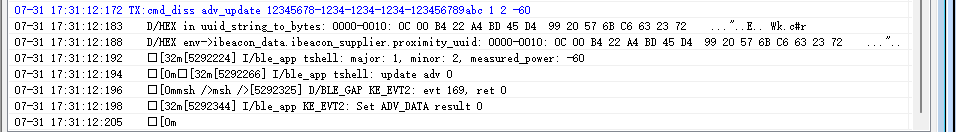

# BLE iBeacon广播示例

源码路径：example/ble/iBeacon

<a id="Platform_iBeacon_adv"></a>
## 支持的平台
<!-- 支持哪些板子和芯片平台 -->
+ eh-lb52x
+ eh-lb56x
+ eh-lb58x

## 概述
<!-- 例程简介 -->
本例程演示iBeacon广播的使用方式.


## 例程的使用
<!-- 说明如何使用例程，比如连接哪些硬件管脚观察波形，编译和烧写可以引用相关文档。
对于rt_device的例程，还需要把本例程用到的配置开关列出来，比如PWM例程用到了PWM1，需要在onchip菜单里使能PWM1 -->
1. 开机后会开启iBeacon广播, 可以参考ble_app_ibeacon_advertising_start()的实现. 默认iBeacon广播的内容为UUID: 95d0b422-a4bd-45d4-9920-576bc6632372, Major: 256, Minor: 258, RSSI at 1m: -50dBm.
2. 通过finsh命令"cmd_diss adv_update [UUID] [Major] [Minor] [RSSI_at_1m]"改变广播内容. 其中UUID的格式示例为"12345678-1234-1234-1234-123456789abc"; Major取值范围是0~65535; Minor取值范围是0~65535; RSSI_at_1m取值范围是-128~127.
3. 通过finsh命令"cmd_diss adv_start"和"cmd_diss adv_stop"使能和停止iBeacon广播.


### 硬件需求
运行该例程前，需要准备：
+ 一块本例程支持的开发板([支持的平台](#Platform_iBeacon_adv)).
+ 手机设备。

### menuconfig配置
1. 使能蓝牙(`BLUETOOTH`)：
    - 路径：Sifli middleware → Bluetooth
    - 开启：Enable bluetooth
        - 宏开关：`CONFIG_BLUETOOTH`
        - 作用：使能蓝牙功能
2. 使能NVDS：
    - 路径：Sifli middleware → Bluetooth → Bluetooth service → Common service
    - 开启：Enable NVDS synchronous
        - 宏开关：`CONFIG_BSP_BLE_NVDS_SYNC`
        - 作用：Bluetooth NVDS同步。当蓝牙配置为HCPU时，BLE NVDS可以同步访问，所以使能此选项；当蓝牙配置为LCPU时，此选项需要关闭。


### 编译和烧录
切换到例程project目录，运行scons命令执行编译：
```c
> scons --board=eh-lb525 -j32
```
切换到例程`project/build_xx`目录，运行`uart_download.bat`，按提示选择端口即可进行下载：
```c
$ ./uart_download.bat

     Uart Download

please input the serial port num:5
```
关于编译、下载的详细步骤，请参考[快速入门](https://docs.sifli.com/projects/sdk/latest/sf32lb52x/quickstart/build.html)的相关介绍。

## 例程的预期结果
例程启动后：
1. 能够产生iBeacon广播，无法被手机连接

2. 修改广播内容：在串口终端输入`cmd_diss adv_update <UUID> <Major> <Minor> <RSSI_at_1m>`，四个参数必须全部填写。例如：
    ```c
    msh />cmd_diss adv_update 12345678-1234-1234-1234-123456789abc 1 2 -60
    ```
    终端打印UUID的16字节内容以及解析出的数值，`update adv 0`表示广播数据更新成功：


3. 停止广播：在串口终端输入`cmd_diss adv_stop`，终端打印停止广播的原因和广播模式（`mode 2`即广播模式），手机端APP将扫描不到该设备：
    ```c
    msh />cmd_diss adv_stop
    ADV stopped reason 0, mode 2
    ```

4. 开启广播：在串口终端输入`cmd_diss adv_start`，终端打印开启广播的结果，`result 0`表示成功，手机端APP可再次扫描到该设备。


## 异常诊断


## 参考文档
<!-- 对于rt_device的示例，rt-thread官网文档提供的较详细说明，可以在这里添加网页链接，例如，参考RT-Thread的[RTC文档](https://www.rt-thread.org/document/site/#/rt-thread-version/rt-thread-standard/programming-manual/device/rtc/rtc) -->

## 更新记录
|版本 |日期   |发布说明 |
|:---|:---|:---|
|0.0.1 |09/2025 |初始版本 |
| | | |
| | | |
