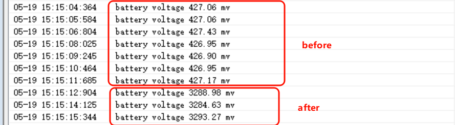
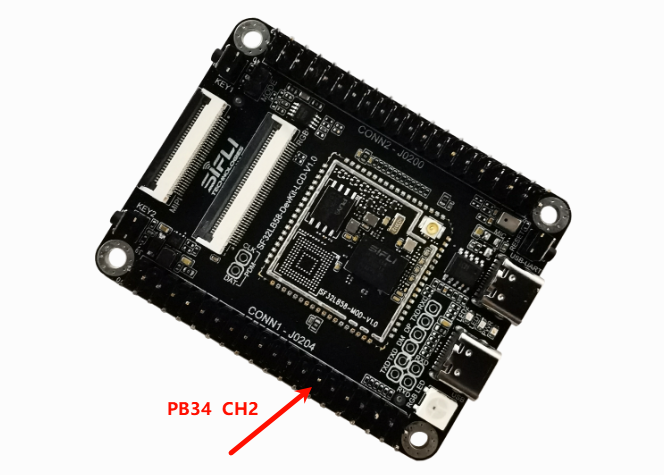
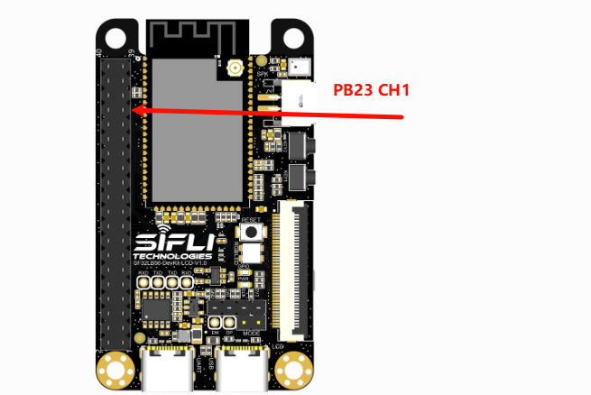
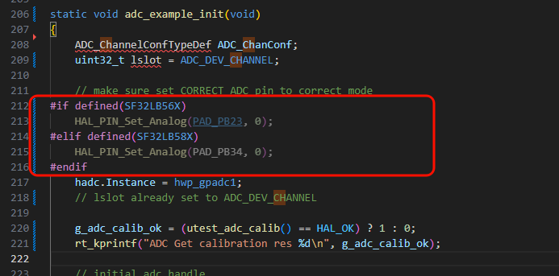

# ADC Battery Example
Source code path: example/hal/adc/adc_battery

## Supported Platforms
This example can run on the following development boards:
+ sf32lb52-lcd series
+ sf32lb56-lcd series
+ sf32lb58-lcd series
+ sf32lb57 series

## Overview
* Uses HAL APIs to read battery voltage through a single ADC channel

## Usage
### Build and Flash
The demo code defaults to single ADC sampling (triggers one conversion after startup and prints the result)

Navigate to the example project directory and run the scons command to build:

```
scons --board=sf32lb52-lcd_n16r8 -j8
```

Execute the flash command:
```
build_sf32lb52-lcd_n16r8_hcpu\uart_download.bat
```

Select the port as prompted to start downloading:

```none
please input the serial port num:5
```

#### Example Output:
Prints the voltage reading every second in a loop

* Comparison of voltage logs before and after connecting the battery



* Measurement pin locations for 58_lcd and 56_lcd:

58 measurement point:



56 measurement point:



#### ADC Configuration Flow

* Set the channel corresponding to the battery Vbat interface according to your board platform. This example uses channel 7 for SF32LB52


* Enable ADC device in menuconfig

```
sdk.py menuconfig --board=sf32lb52-lcd_n16r8
```


* Set the ADC channel pin to analog input mode (for non-52 platform channel 7)



**Note**: 
* Enable the corresponding ADC clock source (enabled by default in code, not mandatory)
```c
/* 2, open adc clock source  */
HAL_RCC_EnableModule(RCC_MOD_GPADC);
```

* ADC Calibration
1. To improve ADC accuracy, all SiFli series chips are factory-calibrated (calibration parameters written to the chip's OTP area). Different series may have different calibration methods.  
To ensure ADC accuracy, the calibration function must be called once after each power-up. Use a unified context structure to manage calibration parameters:

```c
/* Define calibration context */
static HAL_ADC_CalibContextTypeDef g_adc_calib_ctx;

/* Load calibration parameters */
static int utest_adc_calib(void)
{
    HAL_ADC_CalibFactoryInfoTypeDef factory_info;

    /* Load calibration context: initialize defaults + read factory configuration */
    if (HAL_ADC_CalibLoad(NULL,
                          &g_adc_calib_ctx,
                          HAL_ADC_CALIB_SOURCE_BSP,
                          HAL_ADC_CALIB_F_INIT) != HAL_OK)
    {
        rt_kprintf("Get ADC configure fail\n");
        return HAL_ERROR;
    }

    /* Get factory configuration info (for logging) */
    if (HAL_ADC_CalibGetFactoryInfo(HAL_ADC_CALIB_SOURCE_BSP, &factory_info) != HAL_OK)
    {
        rt_kprintf("Get ADC configure fail\n");
        return HAL_ERROR;
    }

    return HAL_OK;
}
```

2. After obtaining the raw register value from ADC, call the function `HAL_ADC_RegToVoltageFloat` to calculate the final voltage value based on the calibration context:

```c
/* Read register value */
dst = HAL_ADC_GetValue(&hadc, lslot);

/* Convert to voltage (mV) */
float voltage = HAL_ADC_RegToVoltageFloat((float)dst, &g_adc_calib_ctx);
```

3. For SF32LB52 series chips, Channel 7 is internally connected to Vbat through voltage divider resistors. To obtain the Vbat value, multiply by the calibration factor:

```c
/* Special handling for VBAT channel */
if (channel == 7)
{
    /* Actual battery voltage = ADC voltage × vbat_factor */
    voltage *= g_adc_calib_ctx.vbat_factor;
}
```

4. Apply calibration parameters to hardware (e.g., LDO Vref settings):

```c
/* Apply calibration parameters to hardware */
HAL_ADC_CalibApply(&hadc, &g_adc_calib_ctx);
```

## Calibration API Reference

### Data Structures

**HAL_ADC_CalibContextTypeDef** - Calibration context
```c
typedef struct 
{ 
    float    offset;              /* 0V offset (register value) */
    float    ratio;               /* Gain/slope (mV/bit × 1000) */
    uint32_t threshold_reg;       /* Overvoltage threshold (register value) */
    uint8_t  range_mode;          /* Range mode: 0=large range(X3), 1=small range(X1) */
    float    vbat_factor;         /* VBAT voltage divider correction factor */
    uint8_t  ldovref_sel;         /* LDO reference voltage selection value */
    uint8_t  flags;               /* Status flags */
} HAL_ADC_CalibContextTypeDef;
```

**HAL_ADC_CalibFactoryInfoTypeDef** - Factory configuration info
```c
typedef struct 
{ 
    uint32_t voltage1_mv;         /* Calibration point 1 voltage (mV) */
    uint32_t reg_value1;          /* Calibration point 1 register value */
    uint32_t voltage2_mv;         /* Calibration point 2 voltage (mV) */
    uint32_t reg_value2;          /* Calibration point 2 register value */
    uint16_t vbat_reg;            /* VBAT reference register value (SF32LB52X only) */
    uint16_t vbat_mv;             /* VBAT reference voltage (SF32LB52X only) */
    uint8_t  ldovref_flag;        /* LDO Vref calibrated flag (SF32LB52X only) */
    uint8_t  ldovref_sel;         /* LDO Vref selection value (SF32LB52X only) */
    uint8_t  range_mode;          /* Range mode */
} HAL_ADC_CalibFactoryInfoTypeDef;
```

### API Functions

| Function | Description |
|------|------|
| `HAL_ADC_CalibLoad()` | Load calibration context |
| `HAL_ADC_CalibInit()` | Initialize context to default values |
| `HAL_ADC_CalibApply()` | Apply calibration parameters to hardware |
| `HAL_ADC_CalibGetFactoryInfo()` | Get factory configuration info |
| `HAL_ADC_RegToVoltageFloat()` | Convert register value to voltage (float) |
| `HAL_ADC_RegToVoltage()` | Convert register value to voltage (integer) |
| `HAL_ADC_CalibSetCustom()` | Set custom calibration parameters |

## Troubleshooting
* Incorrect ADC voltage readings
1. Check if ADC hardware is connected correctly. ADC sampling channels are fixed to specific IO pins and cannot be arbitrarily assigned. Refer to the chip manual for CH0-7 IO mapping  
2. ADC input voltage range is 0V - reference voltage (default 3.3V for SF32LB52), do not exceed the input range  
3. Use debugging tools like Ozone or LightWork to connect online after starting ADC sampling, and check the corresponding register configuration status against the chip manual
* Insufficient ADC accuracy
1. Check if ADC calibration parameters are obtained and used
2. Check if voltage divider resistor accuracy meets requirements
3. Check if ADC reference voltage is stable and has excessive ripple (refer to chip manual for ADC voltage reference) 

  
## Reference Documents
* EH-SF32LB52X_Pin_config_V1.3.0_20231110.xlsx
* DS0052-SF32LB52x-Chip Technical Specification V0p3.pdf

## Revision History
|Version |Date   |Release Notes |
|:---|:---|:---|
|0.0.1 |10/2024 |Initial version |
|0.0.2 |03/2025 |Updated to new HAL calibration API |
|0.0.3 |05/2026 |Added descriptions for 56 and 58 series |
| | | |
