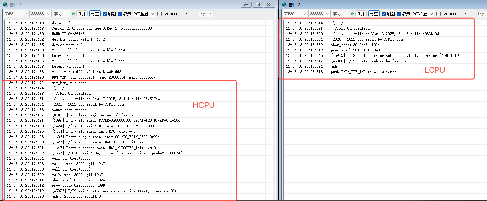
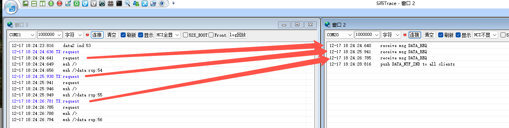
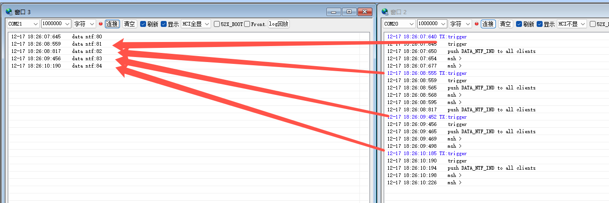

# Data Service Example

(For an overview of examples and their usage, please refer to the `README.md` file in the parent "examples" directory.)

Source Code Path: example/multicore/data_service

This is an example demonstrating data service communication between HCPU and LCPU in a multi-core system. Its core features include:
- Platform UART Configuration: For 55x platforms, HCPU uses UART1 (second enumerated UART) as console, LCPU uses UART3 (first enumerated UART); For 58x platforms, HCPU uses UART1 (first enumerated UART) as console, LCPU uses UART4 (third enumerated UART)
- Service Communication Mechanism: LCPU registers a "test" service, and HCPU subscribes to this service to achieve bidirectional communication
- Command Interaction Flow: HCPU sends `request` command to obtain responses with count values, LCPU sends `trigger`/`trigger2` commands to trigger notification messages with count values

This example uses the multi-core communication framework and service registration/subscription mechanism of SiFli-SDK, serving as a basic reference for developing inter-process communication in multi-core heterogeneous systems.
## Usage

### Supported Development Boards
This example can run on the following development boards:
- eh-lb551
- eh-lb555
- ec-lb583
- ec-lb587
- eh-lb561
- eh-lb563

### Hardware Requirements
The supported development boards mentioned above are required; no additional hardware is needed.

### Compilation Method
Navigate to the hcpu directory and execute the following command to compile:
```bash
scons --board=<board_name> -j8
```
The compiled image files are stored in the HCPU's build_<board_name> directory.

## Project Implementation Details
- Supported development boards:
    - eh-lb551
    - eh-lb555
    - ec-lb583
    - ec-lb587
    - eh-lb561
    - eh-lb563
- Compilation method: Navigate to the hcpu directory and execute the command `scons --board=<board_name> -j8`, where board_name is the board model. For example, to compile for the eh-lb561 board, use the complete command `scons --board=eh-lb561 -j8`
  The compiled image files are stored in the HCPU's build_<board_name> directory. For project usage, refer to the <<General Project Construction Method>>
- Custom message IDs and structures for the test service are defined in `src/common/test_service.h`
  - `test_service_data_rsp_t`: Structure for `MSG_SERVICE_TEST_DATA_RSP` message body
  - `test_service_data_ntf_ind_t`: Structure for `MSG_SERVICE_DATA_NTF_IND` message body
  - `test_service_data2_ind_t`: Structure for `MSG_SERVICE_TEST_DATA2_IND` message body
- Code implementation locations
  - HCPU: `src/hcpu/main.c`
  - LCPU: `src/lcpu/main.c`

## Example Output
Interact with the service through console commands:
- Send the `request` command in the HCPU console to send a request message
- Send the `trigger` or `trigger2` command in the LCPU console to trigger notification messages

The logs of HCPU and LCPU are as follows:

HCPU发送request命令

LCPU发送trigger命令

LCPU发送trigger2命令


## Troubleshooting
No specific troubleshooting information is available. If you encounter issues, please refer to the SiFli-SDK official documentation or submit an issue.

## Reference Documentation
- [SiFli-SDK Official Documentation](https://docs.sifli.com)