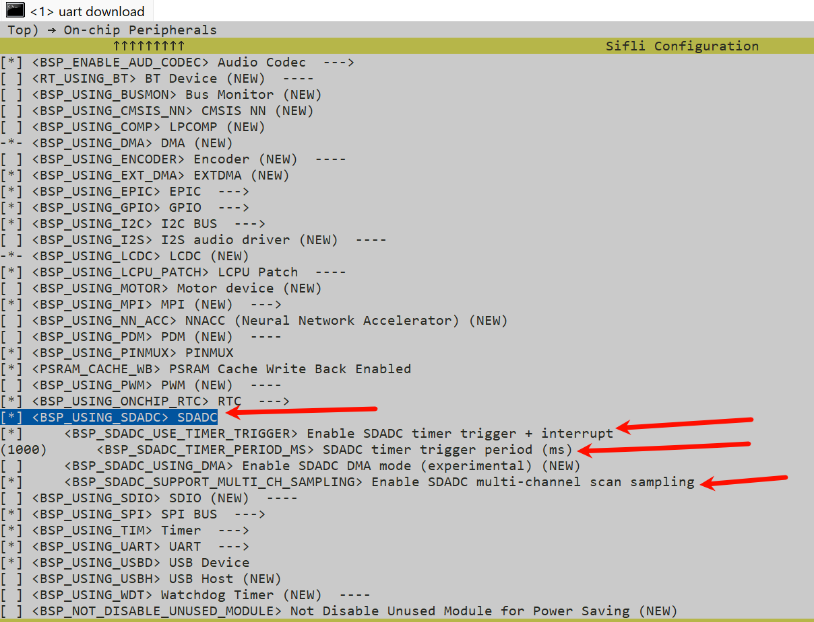

# SDADC Example
Source code path: example/rt_device/adc/sdadc

## Overview
* Under the RT-Thread operating system, the SDADC peripheral is virtualized as an `rt_device`. It is accessed
  through the standard RT ADC framework (`rt_device_find` + `rt_adc_enable` + `rt_adc_read`) via the `"sdadc"`
  device to perform voltage sampling.

* This example demonstrates the complete chain of **multi-channel scanning + timer trigger + interrupt notification (event-driven)**:
  GPTIM3 periodically triggers a scan round → the hardware refreshes each channel's result into its corresponding
  output register → the conversion-complete interrupt fires → the driver callback `rx_indicate` wakes up the
  application → the application reads the latest voltage of each channel one by one.

## Supported Platforms
The example can run on the following development board.
+ sf32lb58 HDK

> **Note**: The SDADC IP is only available on SF32LB55X and SF32LB58X chips. This example was debugged on the 58 series.

## Sampling Modes Supported by the SDADC Driver
The SDADC driver supports two orthogonal dimensions, which are combined through Kconfig:

| Dimension | Option | Description |
|------|------|------|
| Channel count | `BSP_SDADC_SUPPORT_MULTI_CH_SAMPLING` | Off: single channel; On: multi-channel scanning (configure once, sample multiple channels separately) |
| Trigger source | `BSP_SDADC_USE_TIMER_TRIGGER` | Off: software trigger (actively starts a conversion on read); On: GPTIM3 timer trigger, with conversion-complete interrupt enabled |

All four combinations are available: single channel + software trigger, single channel + timer trigger,
multi-channel + software trigger, multi-channel + timer trigger.
This example uses **multi-channel + timer trigger + interrupt notification** by default.


## Hardware Connection
Mapping between SDADC channels and pins (driver channel numbers 1~4):

| Chip | CH1 | CH2 | CH3 | CH4 |
|------|-----|-----|-----|-----|
| SF32LB55X | PB_23 | PB_24 | PB_25 | PB_26 |
| SF32LB58X | PB_40 | PB_41 | PB_42 | PB_43 |

Connect the target SDADC pin to an external voltage source (0 ~ reference voltage). **GND must share a common
ground with the development board.** A channel with no signal connected will read floating noise, which is normal.

## Usage
### Build and Flash
* This example uses the SDADC RT driver. Make sure `rtconfig.h` contains the following macros:

```c
#define BSP_USING_SDADC 1
#define RT_USING_ADC 1
```

Only when these macros are present will the `sifli_sdadc_init` function register the `"sdadc"` device through
`rt_hw_adc_register`, allowing subsequent `rt_device_find` and `rt_adc_read` calls to succeed.

* The `proj.conf` of this example already enables the required configuration:

```
CONFIG_BSP_USING_SDADC=y
CONFIG_BSP_SDADC_USE_TIMER_TRIGGER=y       # Timer trigger + conversion-complete interrupt
CONFIG_BSP_SDADC_TIMER_PERIOD_MS=1000      # Timer period (ms)
CONFIG_BSP_SDADC_SUPPORT_MULTI_CH_SAMPLING=y   # Multi-channel scanning
```

* For manual configuration, use `menuconfig` (replace `your_board` with the board name you actually use):

```
sdk.py menuconfig --board=your_board
```

Select the SDADC, multi-channel sampling, timer trigger and other options as shown, then save and exit.


* Switch to the example project directory and run scons to build (using ec-lb587 as an example):

```
scons --board=ec-lb587_hcpu -j8
```

* Run `build_ec-lb587_hcpu\uart_download.bat` and follow the prompts to select the serial port for download.

### Example Output:
Each time a conversion-complete interrupt notification is received (approximately equal to the timer period),
a set of 4-channel voltage values is printed (in 0.1mV units; `ch1: 6580 (658.0 mV)` means 658.0mV):

```
======== SDADC Multi-Channel (IRQ-driven) Example ========
I/sdadc: SDADC ch1 enabled
I/sdadc: SDADC ch2 enabled
I/sdadc: SDADC ch3 enabled
I/sdadc: SDADC ch4 enabled
I/sdadc: SDADC multi-channel + timer trigger + interrupt, 4 channels
msh />
I/sdadc: ch1: 7025 (702.5 mV)
I/sdadc: ch2: 4761 (476.1 mV)
I/sdadc: ch3: 6618 (661.8 mV)
I/sdadc: ch4: 6391 (639.1 mV)

```

> If `SDADC conversion-complete notification timeout` is printed continuously, it means no interrupt
> notification was received. Check whether the timer trigger and the SDADC interrupt are working properly.

## Example Flow
1. Configure pinmux for each channel to be sampled (`HAL_PIN_Set` + `HAL_PIN_Select` to switch to the SDADC analog function)
2. `rt_device_find("sdadc")` to find the SDADC device
3. For each channel, `rt_adc_enable(dev, channel)` to enable the corresponding sampling slot.
4. Initialize the semaphore and register the conversion-complete callback with `rt_device_set_rx_indicate`
5. In the main loop, `rt_sem_take` waits to be woken by the interrupt notification, then `rt_adc_read` reads the voltage of each channel

## Switching to Other Sampling Modes
* **Single channel**: In `proj.conf`, remove `CONFIG_BSP_SDADC_SUPPORT_MULTI_CH_SAMPLING=y`, and change
  `g_sdadc_channels` in `main.c` to a single channel (e.g. `{3}`).
* **Software trigger**: Remove `CONFIG_BSP_SDADC_USE_TIMER_TRIGGER=y`. In this case there is no timer or
  conversion-complete interrupt; each `rt_adc_read` actively starts a conversion (blocking until complete).
  The application side should revert to the `rt_thread_mdelay` + `rt_adc_read` polling approach and no longer
  wait for `rx_indicate`.
* **Timer without interrupt notification**: Keep the timer trigger, but do not call `rt_device_set_rx_indicate`.
  The main loop can simply poll with `rt_thread_mdelay` + `rt_adc_read`.

## Troubleshooting
* `find sdadc failed` — `BSP_USING_SDADC` is not enabled, the SDADC driver is not compiled, and the `"sdadc"` device is not registered.
* `rt_adc_enable chN failed` — the channel number is out of range (valid 1~4), or SDADC hardware initialization failed.
* `SDADC conversion-complete notification timeout` — no interrupt notification received: confirm that
  `BSP_SDADC_USE_TIMER_TRIGGER` is enabled (the driver enables both the timer trigger and the conversion-complete
  interrupt), and check whether GPTIM3 is running properly.
* A channel always reads 0 or abnormal values —
  1. Check whether the channel pin has a signal connected and shares a common ground with the board;
  2. Check whether the `HAL_PIN_Select` function selection value for the pad is correct (this example uniformly
     uses `10`; if a channel does not match, refer to the pin configuration table to confirm);
  3. In multi-channel mode, confirm that the channel has been `rt_adc_enable`d (a slot that has not been enabled will not be scanned).
  4. Check whether the chip's SDADC has been factory-calibrated. Check whether the `Get SDADC configure fail, use default calibration` log appears in the boot log.

## Revision History
|Version |Date   |Release Notes |
|:---|:---|:---|
|0.0.1 |07/2026 |Initial version |
